# Handover – Analise & Engenharia de Dados
## Barra Mansa Alimentos | Controladoria Financeira

---

### Metadados do Documento

| Campo | Valor |
|-------|-------|
| **Responsável** | João Lima |
| **Cargo** | Analista Contábil Jr |
| **Período** | Mar/2025 - Jan/2026 |
| **Última Atualização** | 14/01/2026 |
| **Versão** | 1.0 |
| **Status** | ✅ Final |

---

### Objetivo

Transferir conhecimento operacional do pipeline de dados para garantir continuidade das operações e possibilitar onboarding eficiente do sucessor.

**Escopo:** Pipeline completo de dados, da extração do ERP até dashboards de BI.

---

### Visão Geral da Arquitetura


*Pipeline completo: extração, camadas de transformação e visualização*

**Volume Diário:** ~7.000 execuções | **Cobertura:** 8 anos de histórico

---

### Conteúdo

| Seção | Tópico | Páginas |
|-------|--------|---------|
| 1-2 | Fundamentos (SQL, Python, conceitos) | ~15 |
| 3 | Ambiente e Ferramentas (setup técnico) | ~10 |
| 4 | Stack de Dados (AWS, dbt, Airflow, Power BI) | ~30 |
| 5-6 | Qualidade e Prática (75 exercícios) | ~15 |

**Total:** ~70 páginas

---

### Navegação Rápida

**Onboarding de novo analista:**  
→ Seções 1-3 (fundamentos + ambiente)  
→ [Criar ambiente Python](#321-criar-e-ativar-ambiente-virtual) (3.2.1)  
→ [Fluxo Git-dbt-GitHub](#351-git--dbt--github-passo-a-passo) (3.5.1)

**Tarefas operacionais:**  
→ [Adicionar nova tabela](#437-como-adicionar-nova-tabela) (4.3.7)  
→ [Conectar fontes Power BI](#441-conexao-com-fontes) (4.4.1)  
→ [Validação cruzada](#513-recomendacao) (5.1.3)

---

## 1. Linguagens de Programacao

### 1.1. SQL
- [1.1.1. SQL Basico (SELECT, WHERE, FROM)](#111-sql-basico-select-where-from)
- [1.1.2. SQL Intermediario (JOINs, Agregacoes, CTEs, Window Functions, UNION)](#112-sql-intermediario-joins-agregacoes-ctes-window-functions-union)
- [1.1.3. SQL Aplicado - COFINS a Recuperar (exemplo real)](#113-sql-aplicado---cofins-a-recuperar-exemplo-real)

### 1.2. Python
- [1.2.1. Sintaxe Basica (tipos, colecoes, operadores, controle)](#121-sintaxe-basica-tipos-colecoes-operadores-controle)
- [1.2.2. Recursos da Linguagem (comprehension, decorators, context manager)](#122-recursos-da-linguagem-comprehension-decorators-context-manager)
- [1.2.3. Pandas para Analise Exploratoria](#123-pandas-para-analise-exploratoria)

---

## 2. Conceitos e Ciclo de Vida

### 2.1. Ciclo de Vida da Analise de Dados
- [2.1.1. Etapas do Ciclo (6 etapas)](#211-etapas-do-ciclo-6-etapas)
- [2.1.2. Detalhamento das Etapas](#212-detalhamento-das-etapas)

### 2.2. Arquitetura ELT
- [2.2.1. Visao Geral do Processo](#221-visao-geral-do-processo)
- [2.2.2. Componentes Principais (fontes, EL, transformacao, camadas, visualizacao)](#222-componentes-principais-fontes-el-transformacao-camadas-visualizacao)

---

## 3. Ambiente e Ferramentas

### 3.1. WSL/Linux
- [3.1.1. Navegacao](#311-navegacao)
- [3.1.2. Gerenciamento de Arquivos](#312-gerenciamento-de-arquivos)
- [3.1.3. Gerenciamento de Pacotes](#313-gerenciamento-de-pacotes)

### 3.2. Python (Ambiente)
- [3.2.1. Criar e Ativar Ambiente Virtual](#321-criar-e-ativar-ambiente-virtual)
- [3.2.2. Gerenciar Dependencias](#322-gerenciar-dependencias)

### 3.3. VS Code
- [3.3.1. Extensoes Recomendadas](#331-extensoes-recomendadas)
- [3.3.2. Atalhos Principais](#332-atalhos-principais)

### 3.4. Git
- [3.4.1. Comandos Basicos](#341-comandos-basicos)
- [3.4.2. Desfazer Alteracoes](#342-desfazer-alteracoes)
- [3.4.3. Resolucao de Conflitos](#343-resolucao-de-conflitos)
- [3.4.4. Boas Praticas](#344-boas-praticas)

### 3.5. Fluxo de Desenvolvimento
- [3.5.1. Git → dbt → GitHub (passo a passo)](#351-git--dbt--github-passo-a-passo)

---

## 4. Stack de Dados

### 4.1. AWS
- [4.1.1. Visao Geral](#411-visao-geral)
- [4.1.2. S3 (staging)](#412-s3)
- [4.1.3. EC2 (Airflow)](#413-ec2)
- [4.1.4. Redshift (DW)](#414-redshift)

### 4.2. dbt
- [4.2.1. Estrutura do Projeto](#421-estrutura-do-projeto)
- [4.2.2. Camadas de Dados](#422-camadas-de-dados)
- [4.2.3. Materializacoes](#423-materializacoes)
- [4.2.4. Sources e Refs](#424-sources-e-refs)
- [4.2.5. Testes](#425-testes)
- [4.2.6. Jinja Basico](#426-jinja-basico)
- [4.2.7. Comandos dbt](#427-comandos-dbt)

### 4.3. Airflow
- [4.3.1. Conceitos Essenciais](#431-conceitos-essenciais)
- [4.3.2. Operadores](#432-operadores)
- [4.3.3. Anatomia de uma DAG](#433-anatomia-de-uma-dag)
- [4.3.4. Hooks e Conexoes](#434-hooks-e-conexoes)
- [4.3.5. Recursos Intermediarios](#435-recursos-intermediarios)
- [4.3.6. Airflow na Barra Mansa](#436-airflow-na-barra-mansa)
- [4.3.7. Como Adicionar Nova Tabela](#437-como-adicionar-nova-tabela)
- [4.3.8. Operacao](#438-operacao)

### . Power BI
- [4.4.1. Conexao com Fontes](#441-conexao-com-fontes)
- [4.4.2. Modelagem de Dados](#442-modelagem-de-dados)
- [4.4.3. DAX Intermediario](#443-dax-intermediario)
- [4.4.4. Design de Layouts](#444-design-de-layouts)
- [4.4.5. Criacao de Visuais](#445-criacao-de-visuais)
- [4.4.6. Interatividade](#446-interatividade)
- [4.4.7. Boas Praticas](#447-boas-praticas)
- [4.4.8. Exemplos Contextualizados](#448-exemplos-contextualizados)

### 4.5. Power BI Service
- [4.5.1. Introdução e Conceitos](#451-introducao-e-conceitos)
- [4.5.2. Estrutura: Workspaces e Componentes](#452-estrutura-workspaces-e-componentes)
- [4.5.3. Infraestrutura: Gateway de Dados](#453-infraestrutura-gateway-de-dados)
- [4.5.4. Operação Básica: Publicação e Atualização](#454-operacao-basica-publicacao-e-atualizacao)
- [4.5.5. Operação Básica: Gestão de Acessos](#455-operacao-basica-gestao-de-acessos)
- [4.5.6. Operação Geral: Monitoramento e Validação](#456-operacao-geral-monitoramento-e-validacao)
- [4.5.7. Operação Geral: Import vs Direct Query](#457-operacao-geral-import-vs-direct-query)
- [4.5.8. Recursos Avançados](#458-recursos-avancados)

### 4.6. DBT Cloud
- [4.6.1. Conceitos Fundamentais](#461-conceitos-fundamentais)
- [4.6.2. Operacional Básico](#462-operacional-basico)
- [4.6.3. Operacional Avançado](#463-operacional-avancado)
- [4.6.4. Troubleshooting Comum](#464-troubleshooting-comum)

---

## 5. Qualidade e Validação
### 5.1. Pontos de Validação no Pipeline
- [5.1.1. O que é Qualidade de Dados?](#511-o-que-é-qualidade-de-dados)
- [5.1.2. Atributos de Qualidade de Dados](#512-atributos-de-qualidade-de-dados)
- [5.1.3. Por que Validar em Múltiplos Pontos?](#513-por-que-validar-em-múltiplos-pontos)
- [5.1.4. Princípio: Validar Onde o Dado Muda de Forma](#514-princípio-validar-onde-o-dado-muda-de-forma)
- [5.1.5. Contexto BM: As Camadas do Pipeline](#515-contexto-bm-as-camadas-do-pipeline)
- [5.1.6. Regra Prática](#516-regra-prática)

### 5.2. Validação Cruzada: Origem × Destino
- [5.2.1. O que é Validação Cruzada?](#521-o-que-é-validação-cruzada)
- [5.2.2. Princípio da Reconciliação](#522-princípio-da-reconciliação)
- [5.2.3. Métricas de Validação](#523-métricas-de-validação)
- [5.2.4. Tolerâncias: Quando Divergência é Aceitável](#524-tolerâncias-quando-divergência-é-aceitável)
- [5.2.5. Contexto BM: Pontos de Reconciliação](#525-contexto-bm-pontos-de-reconciliação)
- [5.2.6. Regra Prática](#526-regra-prática)

### 5.3. Investigação de Problemas
- [5.3.1. Mentalidade de Investigação](#531-mentalidade-de-investigação)
- [5.3.2. Princípio: Investigar de Trás para Frente](#532-princípio-investigar-de-trás-para-frente)
- [5.3.3. Categorias de Falha](#533-categorias-de-falha)
- [5.3.4. Perguntas-Chave para Diagnóstico](#534-perguntas-chave-para-diagnóstico)
- [5.3.5. Contexto BM: Onde Olhar](#535-contexto-bm-onde-olhar)
- [5.3.6. Regra Prática](#536-regra-prática)

---

## 6. Pratica

### 6.1. Exercicios SQL Analiticos
- [6.1.1. Basico (SELECT + WHERE)](#611-basico-select--where)
- [6.1.2. JOINs](#612-joins)
- [6.1.3. Agregacoes](#613-agregacoes)
- [6.1.4. CTEs](#614-ctes)
- [6.1.5. Window Functions](#615-window-functions)
- [6.1.6. UNION + Subconsultas + DML](#616-union--subconsultas--dml)

### 6.2. Exercicios Python para Analise de Dados
- [6.2.1. Sintaxe Basica](#621-sintaxe-basica)
- [6.2.2. Recursos da Linguagem](#622-recursos-da-linguagem)
- [6.2.3. Pandas para Analise Exploratoria](#623-pandas-para-analise-exploratoria)

### 6.3. Exercicios DAX
- [6.3.1. Medidas Basicas com Filtros](#631-medidas-basicas-com-filtros)
- [6.3.2. Comparacoes Temporais](#632-comparacoes-temporais)
- [6.3.3. Totalizadores e Contextos](#633-totalizadores-e-contextos)
- [6.3.4. Indicadores e Logica Condicional](#634-indicadores-e-logica-condicional)
- [6.3.5. Logica Avancada e Iteracao](#635-logica-avancada-e-iteracao)

### 6.4. Exercicios Linguagem M (Power Query)
- [6.4.1. Transformacoes Basicas](#641-transformacoes-basicas)
- [6.4.2. Transformacoes Intermediarias](#642-transformacoes-intermediarias)
- [6.4.3. Analise de Pipeline Completo](#643-analise-de-pipeline-completo)

---

# 1. Linguagens de Programacao

## 1.1. SQL

Guia visual e pratico para construcao de consultas SQL no ambiente Barra Mansa Alimentos.

### 1.1.1. SQL Basico (SELECT, WHERE, FROM)

#### Estrutura de uma Consulta SQL


*Fluxo SELECT → FROM → WHERE com exemplos práticos*

O processo segue tres passos sequenciais:

- Liste as colunas que deseja exibir
- Use o alias da tabela (N.) antes de cada coluna

**Exemplo:**
```sql
SELECT N.codemp, N.codfil, N.numnfi, N.datent
```

### 2º Passo: FROM - DE ONDE vem os dados

- Especifique a tabela e crie um alias para facilitar referencias

**Exemplo:**
```sql
FROM e660nfc N
-- e660nfc = tabela | N = alias/apelido
```

### 3º Passo: WHERE - QUAIS dados filtrar

- Defina condicoes para limitar os resultados
- Use AND/OR para combinar múltiplas condicoes

**Exemplo:**
```sql
WHERE N.codemp = 1 
  AND N.datent >= '20250615' 
  AND N.vlrtot > 1000
```

### Consulta Completa de Exemplo

```sql
SELECT N.codemp, N.codfil, N.numnfi, N.datent
FROM e660nfc N
WHERE N.codemp = 1 
  AND N.datent >= '20250615' 
  AND N.vlrtot > 1000
```

**Ambiente de execucao:** SSMS (SQL Server Management Studio) no Banco de Dados `sapiens_prod`


*Interface SSMS conectado ao sapiens_prod*

---

### 1.1.2. SQL Intermediario (JOINs, Agregacoes, CTEs, Window Functions, UNION)

---

#### JOINs - Combinando Dados de Múltiplas Tabelas

##### LEFT JOIN
Retorna todos os registros da tabela principal (esquerda) e os correspondentes da tabela secundaria. Se nao houver correspondencia, retorna NULL.

**Exemplo do contexto:**
```sql
FROM E640LCT L
LEFT JOIN e045pla P
    ON P.codemp = L.codemp
   AND P.ctared = L.ctadeb
```
- Busca **todos** os lancamentos da E640LCT
- Traz descricoes do plano de contas quando houver correspondencia
- Se nao houver conta correspondente, P.descta sera NULL

##### INNER JOIN
Retorna apenas registros que tem correspondencia em ambas as tabelas.
```sql
FROM E640LCT L
INNER JOIN e045pla P
    ON P.codemp = L.codemp
   AND P.ctared = L.ctadeb
```
- Retornaria apenas lancamentos que tem conta no plano de contas

##### RIGHT JOIN
Retorna todos os registros da tabela secundaria (direita) e os correspondentes da tabela principal.
```sql
FROM E640LCT L
RIGHT JOIN e045pla P
    ON P.codemp = L.codemp
   AND P.ctared = L.ctadeb
```

##### FULL OUTER JOIN
Retorna todos os registros quando ha correspondencia em qualquer uma das tabelas.
```sql
FROM E640LCT L
FULL OUTER JOIN e045pla P
    ON P.codemp = L.codemp
   AND P.ctared = L.ctadeb
```

---

#### UNION - Combinando Resultados de Múltiplas Consultas

Combina os resultados de duas ou mais queries em um único conjunto de dados.

##### UNION vs UNION ALL

**UNION** - Remove duplicatas automaticamente:
```sql
SELECT ctadeb, vlrlct FROM E640LCT WHERE ctadeb = '10530'
UNION
SELECT ctacre, vlrlct FROM E640LCT WHERE ctacre = '10530'
```

**UNION ALL** - Mantém todas as linhas, incluindo duplicatas (mais rapido):
```sql
SELECT ctadeb, vlrlct FROM E640LCT WHERE ctadeb = '10530'
UNION ALL
SELECT ctacre, vlrlct FROM E640LCT WHERE ctacre = '10530'
```

##### Exemplo Pratico - COFINS a Recuperar
```sql
-- Lancamentos a CRÉDITO (conta 10.530 recebendo)
SELECT
    L.codemp,
    L.codfil,
    L.numlct,
    CAST(L.datlct AS DATE) AS datlct,
    (L.vlrlct * -1) AS vlrlct,  -- Inverte o sinal
    'CRÉDITO' AS tipo_lancamento
FROM E640LCT L
WHERE L.ctacre = '10530'
  AND L.datlct BETWEEN DATEADD(DAY, -90, GETDATE()) AND GETDATE()
  AND L.sitlct = 2

UNION

-- Lancamentos a DÉBITO (conta 10.530 pagando)
SELECT
    L.codemp,
    L.codfil,
    L.numlct,
    CAST(L.datlct AS DATE) AS datlct,
    L.vlrlct,  -- Mantém o sinal positivo
    'DÉBITO' AS tipo_lancamento
FROM E640LCT L
WHERE L.ctadeb = '10530'
  AND L.datlct BETWEEN DATEADD(DAY, -90, GETDATE()) AND GETDATE()
  AND L.sitlct = 2
```

**Por que usar UNION?**
- Conta contabil pode aparecer tanto no débito quanto no crédito
- UNION consolida ambas as movimentacoes em uma única visao
- Permite padronizar valores (invertendo sinal quando necessario)

**Regras do UNION:**
- Todas as queries devem ter o **mesmo número de colunas**
- Colunas correspondentes devem ter **tipos de dados compativeis**
- Nomes das colunas vem da **primeira query**

---

#### Agregacoes - Sumarizando Dados

Funcoes que calculam valores sobre grupos de registros.

##### Funcoes de Agregacao Principais
```sql
-- Soma total de COFINS por filial
SELECT 
    L.codfil,
    SUM(L.vlrlct) AS total_cofins,
    COUNT(*) AS qtd_lancamentos,
    COUNT(DISTINCT L.numlct) AS qtd_lancamentos_unicos,
    AVG(L.vlrlct) AS media_valor,
    MAX(L.vlrlct) AS maior_valor,
    MIN(L.vlrlct) AS menor_valor
FROM E640LCT L
WHERE L.ctacre = '10530'
  AND L.datlct BETWEEN DATEADD(DAY, -90, GETDATE()) AND GETDATE()
GROUP BY L.codfil
```

**Funcoes disponiveis:**
- `SUM()` - Soma valores
- `COUNT()` - Conta registros
- `COUNT(DISTINCT)` - Conta valores únicos
- `AVG()` - Calcula média
- `MAX()` / `MIN()` - Valores maximo/minimo

##### HAVING - Filtro Apos Agregacao
```sql
SELECT 
    L.codfil,
    SUM(L.vlrlct) AS total_cofins,
    COUNT(*) AS qtd_lancamentos
FROM E640LCT L
WHERE L.ctacre = '10530'
GROUP BY L.codfil
HAVING SUM(L.vlrlct) > 10000  -- Filtra apos agregacao
```

**Diferenca entre WHERE e HAVING:**
- `WHERE` - Filtra **antes** da agregacao (registros individuais)
- `HAVING` - Filtra **depois** da agregacao (grupos)

---

#### CTEs (Common Table Expressions) - Consultas Temporarias

Cria "tabelas temporarias" nomeadas para organizar queries complexas de forma legivel.

##### Sintaxe Basica
```sql
WITH nome_cte AS (
    SELECT coluna1, coluna2
    FROM tabela
    WHERE condicao
)
SELECT * FROM nome_cte
```

##### Exemplo Pratico - Analise de COFINS
```sql
WITH cofins_debito AS (
    -- Totaliza lancamentos a débito
    SELECT 
        codemp, 
        codfil, 
        SUM(vlrlct) AS total_debito,
        COUNT(*) AS qtd_debito
    FROM E640LCT
    WHERE ctadeb = '10530'
      AND datlct BETWEEN DATEADD(DAY, -90, GETDATE()) AND GETDATE()
      AND sitlct = 2
    GROUP BY codemp, codfil
),
cofins_credito AS (
    -- Totaliza lancamentos a crédito
    SELECT 
        codemp, 
        codfil, 
        SUM(vlrlct) AS total_credito,
        COUNT(*) AS qtd_credito
    FROM E640LCT
    WHERE ctacre = '10530'
      AND datlct BETWEEN DATEADD(DAY, -90, GETDATE()) AND GETDATE()
      AND sitlct = 2
    GROUP BY codemp, codfil
)
-- Consolida débito e crédito
SELECT 
    COALESCE(D.codfil, C.codfil) AS codfil,
    COALESCE(D.total_debito, 0) AS total_debito,
    COALESCE(C.total_credito, 0) AS total_credito,
    (COALESCE(D.total_debito, 0) - COALESCE(C.total_credito, 0)) AS saldo_liquido,
    COALESCE(D.qtd_debito, 0) AS lancamentos_debito,
    COALESCE(C.qtd_credito, 0) AS lancamentos_credito
FROM cofins_debito D
FULL OUTER JOIN cofins_credito C
    ON D.codemp = C.codemp
   AND D.codfil = C.codfil
```

**Vantagens das CTEs:**
- Codigo mais legivel e organizado
- Reutilizacao de resultados intermediarios
- Substituicao elegante de subqueries complexas
- Facilita debugging (pode testar cada CTE separadamente)
- **Alternativa ao UNION** quando voce quer manter os dados separados para analise

##### CTEs Recursivas
```sql
WITH hierarquia_contas AS (
    -- ancora: contas de nivel superior
    SELECT ctared, descta, ctasup, 1 AS nivel
    FROM e045pla
    WHERE ctasup IS NULL
    
    UNION ALL
    
    -- Recursao: contas subordinadas
    SELECT p.ctared, p.descta, p.ctasup, h.nivel + 1
    FROM e045pla p
    INNER JOIN hierarquia_contas h
        ON p.ctasup = h.ctared
)
SELECT * FROM hierarquia_contas
ORDER BY nivel, ctared
```

---

#### Window Functions - Calculos Analiticos
Realizam calculos mantendo o detalhamento de cada linha (diferente do GROUP BY que agrupa).

##### O que sao e quando usar
**Definicao:** Funcoes que calculam valores sobre um conjunto de linhas relacionadas, mantendo todas as linhas no resultado.

**Diferenca do GROUP BY:**
- **GROUP BY**: Agrupa linhas → Reduz registros
- **Window Functions**: Calcula sobre grupos → Mantem todas as linhas

**Quando usar:**
- Rankings de produtos/vendas mantendo detalhes
- Percentuais de participacao sobre totais
- Comparacoes com medias ou totais
- Calculos acumulados progressivos

##### Estrutura Basica
```sql
FUNCAO() OVER (
    [PARTITION BY coluna]  -- Divide em grupos independentes
    [ORDER BY coluna]      -- Define ordem de calculo
    [ROWS BETWEEN...]      -- Define janela de linhas
)
```

##### Exemplo Base - Tabela E140IPV (Vendas)
```sql
-- Principais colunas
NUMNFV  -- Numero da NF
CODPRO  -- Codigo do produto
CODFIL  -- Codigo da filial
QTDFAT  -- Quantidade vendida
VLRBRU  -- Valor da venda
```

##### OVER() - Abrindo a Janela
**O que faz:** Abre a "janela" para realizar calculos sobre conjunto de linhas.
```sql
-- Total geral em cada linha
SELECT 
    CODPRO,
    VLRBRU,
    SUM(VLRBRU) OVER () AS total_geral,
    VLRBRU * 100.0 / SUM(VLRBRU) OVER () AS perc_do_total
FROM E140IPV
```

**Resultado:**
```
CODPRO | VLRBRU | total_geral | perc_do_total
-------|--------|-------------|---------------
A001   | 50000  | 250000      | 20.00%
A002   | 30000  | 250000      | 12.00%
A003   | 45000  | 250000      | 18.00%
```
- Cada linha mantem seus dados originais
- Total geral calculado e repetido em todas as linhas
- Permite calcular percentuais sem subqueries

##### ORDER BY - Definindo Ordem de Calculo
**O que faz:** Define ordem de processamento das linhas. **IMPORTANTE:** Afeta o calculo, nao a exibicao final.
```sql
-- Ranking simples de vendas
SELECT 
    CODPRO,
    VLRBRU,
    ROW_NUMBER() OVER (ORDER BY VLRBRU DESC) AS ranking
FROM E140IPV
```

**Resultado:**
```
CODPRO | VLRBRU | ranking
-------|--------|--------
A001   | 50000  | 1      ← Maior venda
A003   | 45000  | 2
A004   | 40000  | 3
A002   | 30000  | 4      ← Menor venda
```

**Impacto em agregacoes:**
```sql
SELECT 
    CODPRO,
    VLRBRU,
    -- Sem ORDER BY: total de tudo
    SUM(VLRBRU) OVER () AS total_geral,
    -- Com ORDER BY: soma acumulada
    SUM(VLRBRU) OVER (ORDER BY NUMNFV) AS soma_acumulada
FROM E140IPV
```

**Resultado:**
```
CODPRO | VLRBRU | total_geral | soma_acumulada
-------|--------|-------------|----------------
A001   | 50000  | 250000      | 50000    ← Primeira
A002   | 30000  | 250000      | 80000    ← 50k + 30k
A003   | 45000  | 250000      | 125000   ← 80k + 45k
A004   | 40000  | 250000      | 165000   ← Acumulando...
```

##### PARTITION BY - Dividindo em Grupos
**O que faz:** Cria grupos independentes onde os calculos reiniciam.
```sql
-- Ranking geral vs ranking por filial
SELECT 
    CODFIL,
    CODPRO,
    VLRBRU,
    -- Ranking GERAL (todas as filiais)
    ROW_NUMBER() OVER (ORDER BY VLRBRU DESC) AS ranking_geral,
    -- Ranking POR FILIAL (reinicia em cada filial)
    ROW_NUMBER() OVER (PARTITION BY CODFIL ORDER BY VLRBRU DESC) AS ranking_filial
FROM E140IPV
```

**Resultado:**
```
CODFIL | CODPRO | VLRBRU | ranking_geral | ranking_filial
-------|--------|--------|---------------|----------------
01     | A001   | 50000  | 1             | 1    ← Melhor da Filial 01
01     | A003   | 45000  | 2             | 2
01     | A002   | 30000  | 4             | 3    ← Pior da Filial 01
02     | A004   | 48000  | 3             | 1    ← Melhor da Filial 02 (reiniciou)
02     | A005   | 25000  | 5             | 2    ← Pior da Filial 02
```
- `ranking_geral`: considera tudo junto
- `ranking_filial`: reinicia (1,2,3...) a cada nova filial
- Util para comparar dentro e entre grupos

**Uso pratico - Total e percentual por grupo:**
```sql
SELECT 
    CODFIL,
    CODPRO,
    VLRBRU,
    -- Total da filial
    SUM(VLRBRU) OVER (PARTITION BY CODFIL) AS total_filial,
    -- Percentual dentro da filial
    VLRBRU * 100.0 / SUM(VLRBRU) OVER (PARTITION BY CODFIL) AS perc_filial
FROM E140IPV
```

##### Funcoes de Ranking
**Quatro tipos principais para classificar registros:**
```sql
SELECT 
    CODPRO,
    VLRBRU,
    -- ROW_NUMBER: Numeracao sequencial UNICA (1,2,3,4,5)
    ROW_NUMBER() OVER (ORDER BY VLRBRU DESC) AS row_num,
    -- RANK: Empates = mesmo numero, PULA posicoes (1,2,2,4,5)
    RANK() OVER (ORDER BY VLRBRU DESC) AS rank_pula,
    -- DENSE_RANK: Empates = mesmo numero, NAO pula (1,2,2,3,4)
    DENSE_RANK() OVER (ORDER BY VLRBRU DESC) AS rank_denso,
    -- NTILE: Divide em N grupos iguais (quartis, decis)
    NTILE(4) OVER (ORDER BY VLRBRU DESC) AS quartil
FROM E140IPV
```

**Resultado comparativo:**
```
CODPRO | VLRBRU | row_num | rank_pula | rank_denso | quartil
-------|--------|---------|-----------|------------|--------
A001   | 50000  | 1       | 1         | 1          | 1
A004   | 50000  | 2       | 1         | 1          | 1  ← Mesmo valor
A003   | 45000  | 3       | 3         | 2          | 2  ← RANK pulou o 2
A005   | 40000  | 4       | 4         | 3          | 2
A002   | 35000  | 5       | 5         | 4          | 3
A006   | 30000  | 6       | 6         | 5          | 4
```

**Quando usar cada uma:**
- **ROW_NUMBER**: Numeracao unica sempre (ex: numerar vendas)
- **RANK**: Aceita empates, pula numeros (ex: ranking de vendedores)
- **DENSE_RANK**: Aceita empates, nao pula (ex: categorias de produtos)
- **NTILE**: Dividir em grupos iguais (ex: quartis de vendas)

##### Funcoes de Agregacao com OVER
**Permitem calcular totais mantendo detalhamento:**
```sql
SELECT 
    CODPRO,
    CODFIL,
    VLRBRU,
    -- Total geral (sem particao)
    SUM(VLRBRU) OVER () AS total_geral,
    -- Total por filial
    SUM(VLRBRU) OVER (PARTITION BY CODFIL) AS total_filial,
    -- Soma acumulada
    SUM(VLRBRU) OVER (ORDER BY NUMNFV) AS soma_acumulada,
    -- Soma acumulada por filial
    SUM(VLRBRU) OVER (PARTITION BY CODFIL ORDER BY NUMNFV) AS soma_acum_filial,
    -- Media movel de 3 registros
    AVG(VLRBRU) OVER (ORDER BY NUMNFV ROWS BETWEEN 2 PRECEDING AND CURRENT ROW) AS media_movel_3
FROM E140IPV
```

##### Funcoes de Acesso a Linhas
**Permitem acessar valores de outras linhas:**
```sql
SELECT 
    CODPRO,
    NUMNFV,
    VLRBRU,
    -- Valor da linha ANTERIOR
    LAG(VLRBRU, 1) OVER (ORDER BY NUMNFV) AS valor_anterior,
    -- Valor da PROXIMA linha
    LEAD(VLRBRU, 1) OVER (ORDER BY NUMNFV) AS valor_proximo,
    -- Variacao em relacao ao anterior
    VLRBRU - LAG(VLRBRU, 1) OVER (ORDER BY NUMNFV) AS variacao,
    -- Primeiro valor do periodo
    FIRST_VALUE(VLRBRU) OVER (ORDER BY NUMNFV) AS primeiro_valor,
    -- Ultimo valor (requer UNBOUNDED FOLLOWING)
    LAST_VALUE(VLRBRU) OVER (ORDER BY NUMNFV ROWS BETWEEN UNBOUNDED PRECEDING AND UNBOUNDED FOLLOWING) AS ultimo_valor
FROM E140IPV
```

**Resultado:**
```
CODPRO | NUMNFV | VLRBRU | valor_anterior | valor_proximo | variacao
-------|--------|--------|----------------|---------------|----------
A001   | 1001   | 50000  | NULL           | 30000         | NULL
A002   | 1002   | 30000  | 50000          | 45000         | -20000
A003   | 1003   | 45000  | 30000          | 40000         | 15000
A004   | 1004   | 40000  | 45000          | NULL          | -5000
```

##### Window Frame - Definindo Janela de Linhas
**Especifica quais linhas incluir no calculo:**
```sql
SELECT 
    NUMNFV,
    VLRBRU,
    -- Media movel dos ultimos 3 registros (incluindo atual)
    AVG(VLRBRU) OVER (
        ORDER BY NUMNFV 
        ROWS BETWEEN 2 PRECEDING AND CURRENT ROW
    ) AS media_movel_3,
    -- Soma acumulada (do inicio ate atual)
    SUM(VLRBRU) OVER (
        ORDER BY NUMNFV 
        ROWS BETWEEN UNBOUNDED PRECEDING AND CURRENT ROW
    ) AS soma_acumulada,
    -- Total da janela inteira
    SUM(VLRBRU) OVER (
        ROWS BETWEEN UNBOUNDED PRECEDING AND UNBOUNDED FOLLOWING
    ) AS total_completo
FROM E140IPV
```

**Opcoes de delimitacao:**
- `UNBOUNDED PRECEDING`: desde o inicio
- `N PRECEDING`: N linhas antes
- `CURRENT ROW`: linha atual
- `N FOLLOWING`: N linhas depois
- `UNBOUNDED FOLLOWING`: ate o fim

##### Exemplos Praticos - Analise de Vendas

**Top 5 Produtos por Filial:**
```sql
WITH ProdutosRankeados AS (
    SELECT 
        CODFIL,
        CODPRO,
        SUM(VLRBRU) AS total_vendas,
        ROW_NUMBER() OVER (PARTITION BY CODFIL ORDER BY SUM(VLRBRU) DESC) AS ranking
    FROM E140IPV
    GROUP BY CODFIL, CODPRO
)
SELECT *
FROM ProdutosRankeados
WHERE ranking <= 5  -- Apenas Top 5 de cada filial
ORDER BY CODFIL, ranking
```

**Analise ABC de Produtos:**
```sql
WITH VendasPorProduto AS (
    SELECT 
        CODPRO,
        SUM(VLRBRU) AS total_vendas
    FROM E140IPV
    GROUP BY CODPRO
),
Analise AS (
    SELECT 
        CODPRO,
        total_vendas,
        total_vendas * 100.0 / SUM(total_vendas) OVER () AS perc_individual,
        SUM(total_vendas) OVER (ORDER BY total_vendas DESC) * 100.0 
            / SUM(total_vendas) OVER () AS perc_acumulado
    FROM VendasPorProduto
)
SELECT 
    CODPRO,
    total_vendas,
    CAST(perc_individual AS DECIMAL(5,2)) AS perc_individual,
    CAST(perc_acumulado AS DECIMAL(5,2)) AS perc_acumulado,
    CASE 
        WHEN perc_acumulado <= 80 THEN 'A'  -- 80% do faturamento
        WHEN perc_acumulado <= 95 THEN 'B'  -- 15% do faturamento
        ELSE 'C'                             -- 5% do faturamento
    END AS classe_abc
FROM Analise
ORDER BY total_vendas DESC
```

**Comparacao com Media:**
```sql
SELECT 
    CODFIL,
    CODPRO,
    SUM(VLRBRU) AS total_vendas,
    AVG(SUM(VLRBRU)) OVER () AS media_geral,
    SUM(VLRBRU) - AVG(SUM(VLRBRU)) OVER () AS diff_media,
    CASE 
        WHEN SUM(VLRBRU) > AVG(SUM(VLRBRU)) OVER () THEN 'Acima da Media'
        ELSE 'Abaixo da Media'
    END AS status
FROM E140IPV
GROUP BY CODFIL, CODPRO
```

##### Limitacoes e Solucoes

**Window Functions NAO funcionam em:**
- `WHERE` (executado antes do SELECT)
- `GROUP BY` (executado antes do SELECT)
- `HAVING` (executado antes do SELECT)

**Solucao: usar CTE ou Subquery:**
```sql
-- ❌ ERRO: nao funciona no WHERE
SELECT * FROM E140IPV
WHERE ROW_NUMBER() OVER (ORDER BY VLRBRU) <= 10

-- ✅ CORRETO: usar CTE
WITH Ranked AS (
    SELECT *, ROW_NUMBER() OVER (ORDER BY VLRBRU DESC) AS rk
    FROM E140IPV
)
SELECT * FROM Ranked WHERE rk <= 10
```

##### Resumo Rapido

**Componentes:**
```sql
FUNCAO() OVER (
    PARTITION BY coluna  -- Divide em grupos (opcional)
    ORDER BY coluna      -- Define ordem (opcional)
    ROWS BETWEEN...      -- Define janela (opcional)
)
```

**Principais funcoes:**
- **Ranking**: ROW_NUMBER, RANK, DENSE_RANK, NTILE
- **Agregacao**: SUM, AVG, COUNT, MIN, MAX
- **Acesso**: LAG, LEAD, FIRST_VALUE, LAST_VALUE

**Quando usar:**
- ✅ Rankings mantendo todas as linhas
- ✅ Percentuais sobre totais
- ✅ Comparacoes com medias/totais
- ✅ Calculos acumulados

**Quando NAO usar:**
- ❌ Apenas agregacoes simples (use GROUP BY)
- ❌ Performance critica com milhoes de linhas

## Conclusão

**Window Functions = Análises poderosas sem perder detalhes**

Três regras de ouro:
1. **OVER()** abre a janela
2. **PARTITION BY** divide em grupos
3. **ORDER BY** define ordem de cálculo

Use CTEs para filtrar resultados de Window Functions e mantenha o código limpo e reutilizável.
---

#### Aplicacao Pratica no Contexto

A query de COFINS a Recuperar demonstra a aplicacao desses conceitos:

1. **LEFT JOIN** - Enriquece dados com descricoes do plano de contas
2. **UNION** - Consolida lancamentos de débito e crédito em visao única
3. **Agregacao** - Poderia totalizar movimentacoes por periodo/filial
4. **CTEs** - Alternativa para separar logica de débito/crédito antes de consolidar
5. **Window Functions** - Analise de evolucao temporal e calculo de saldos acumulados

##### Exemplo Completo Combinando Técnicas
```sql
WITH lancamentos_consolidados AS (
    -- CTE: Consolida débito e crédito com UNION
    SELECT
        L.codemp,
        L.codfil,
        L.numlct,
        CAST(L.datlct AS DATE) AS datlct,
        (L.vlrlct * -1) AS vlrlct,
        'CRÉDITO' AS tipo,
        L.cpllct
    FROM E640LCT L
    WHERE L.ctacre = '10530'
      AND L.datlct BETWEEN DATEADD(DAY, -90, GETDATE()) AND GETDATE()
      AND L.sitlct = 2
    
    UNION ALL
    
    SELECT
        L.codemp,
        L.codfil,
        L.numlct,
        CAST(L.datlct AS DATE) AS datlct,
        L.vlrlct,
        'DÉBITO' AS tipo,
        L.cpllct
    FROM E640LCT L
    WHERE L.ctadeb = '10530'
      AND L.datlct BETWEEN DATEADD(DAY, -90, GETDATE()) AND GETDATE()
      AND L.sitlct = 2
)
-- Query principal com JOINs, Agregacoes e Window Functions
SELECT 
    LC.codfil,
    LC.datlct,
    LC.tipo,
    COUNT(*) AS qtd_lancamentos,
    SUM(LC.vlrlct) AS total_dia,
    -- Window Function: Saldo acumulado por filial
    SUM(SUM(LC.vlrlct)) OVER (
        PARTITION BY LC.codfil 
        ORDER BY LC.datlct
    ) AS saldo_acumulado,
    -- Window Function: Média movel 7 dias
    AVG(SUM(LC.vlrlct)) OVER (
        PARTITION BY LC.codfil 
        ORDER BY LC.datlct 
        ROWS BETWEEN 6 PRECEDING AND CURRENT ROW
    ) AS media_movel_7_dias
FROM lancamentos_consolidados LC
GROUP BY LC.codfil, LC.datlct, LC.tipo
ORDER BY LC.codfil, LC.datlct, LC.tipo
```

---

### 1.1.3. SQL Aplicado - COFINS a Recuperar (exemplo real)

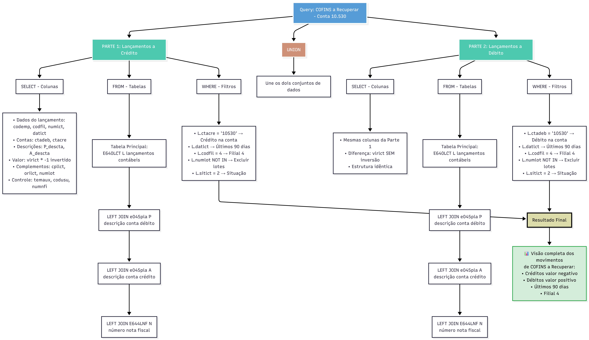
*Estrutura da query: UNION de lançamentos a crédito e débito com JOINs*

```sql
-- =========================================================
-- Query: COFINS a Recuperar – Visao Contabil (Conta 10.530)
-- Descricao: Consulta lancamentos contabeis da conta 10.530 (COFINS a Recuperar)
--             excluindo lotes especificos ja processados
--             Uniao de lancamentos a débito e crédito
-- =========================================================

SELECT
    L.codemp,
    L.codfil,
    L.numlct,
    CAST(L.datlct AS DATE) AS datlct,
    L.ctadeb,
    P.descta AS P_descta,
    L.ctacre,
    A.descta AS A_descta,
    (L.vlrlct * -1) AS vlrlct,
    L.cpllct,
    L.orilct,
    L.numlot,
    L.temaux,
    L.codusu,
    N.numnfi
FROM E640LCT L
LEFT JOIN e045pla P
    ON P.codemp = L.codemp
   AND P.ctared = L.ctadeb
LEFT JOIN e045pla A
    ON A.codemp = L.codemp
   AND A.ctared = L.ctacre
LEFT JOIN E644LNF N
    ON N.codemp = L.codemp
   AND N.numlct = L.numlct
WHERE
    L.ctacre = '10530'
    AND L.datlct BETWEEN DATEADD(DAY, -90, GETDATE()) AND GETDATE()
    AND L.codfil = 4
    AND L.numlot NOT IN ('52660', '52751', '52826')
    AND L.sitlct = 2

UNION

SELECT
    L.codemp,
    L.codfil,
    L.numlct,
    CAST(L.datlct AS DATE) AS datlct,
    L.ctadeb,
    P.descta AS P_descta,
    L.ctacre,
    A.descta AS A_descta,
    L.vlrlct,
    L.cpllct,
    L.orilct,
    L.numlot,
    L.temaux,
    L.codusu,
    N.numnfi
FROM E640LCT L
LEFT JOIN e045pla P
    ON P.codemp = L.codemp
   AND P.ctared = L.ctadeb
LEFT JOIN e045pla A
    ON A.codemp = L.codemp
   AND A.ctared = L.ctacre
LEFT JOIN E644LNF N
    ON N.codemp = L.codemp
   AND N.numlct = L.numlct
WHERE
    L.ctadeb = '10530'
    AND L.datlct BETWEEN DATEADD(DAY, -90, GETDATE()) AND GETDATE()
    AND L.codfil = 4
    AND L.numlot NOT IN ('52660', '52751', '52826')
    AND L.sitlct = 2;

```

**Ambiente de execucao:** SSMS (SQL Server Management Studio) no Banco de Dados `sapiens_prod`

---

### Objetivo da Consulta

Extrair todos os lancamentos contabeis da conta **10.530** (COFINS a Recuperar) nos últimos 90 dias da filial 4, excluindo lotes especificos ja processados.

### Estrutura da Query

A consulta é dividida em duas partes unidas por `UNION`:

#### Parte 1 - Lancamentos a Crédito

- Busca quando a conta 10.530 esta em `ctacre` (lado crédito)
- Inverte o sinal do valor (`vlrlct * -1`) para padronizar visualizacao
- Retorna movimentos de entrada/crédito de COFINS

#### Parte 2 - Lancamentos a Débito

- Busca quando a conta 10.530 esta em `ctadeb` (lado débito)
- Mantém o valor positivo original
- Retorna movimentos de saida/débito de COFINS

### Tabelas Utilizadas

| Tabela | Descricao |
|--------|-----------|
| `E640LCT` | Lancamentos contabeis (tabela principal) |
| `e045pla` | Plano de contas (descricao das contas débito e crédito) |
| `E644LNF` | Vinculacao com números de notas fiscais |

### Filtros Aplicados

| Filtro | Valor |
|--------|-------|
| Periodo | Últimos 90 dias |
| Filial | 4 |
| Lotes excluidos | 52660, 52751, 52826 |
| Situacao do lancamento | 2 (contabilizado) |

### Resultado Esperado

Visao consolidada dos movimentos de COFINS a Recuperar com valores, descricoes das contas, complementos historicos e vinculos com notas fiscais.

---

## 1.2. Python

Guia rapido com a base minima da linguagem.

### 1.2.1. Sintaxe Basica (tipos, colecoes, operadores, controle)


#### Tipos de Dados

```python
# String (texto)
nome = "Joao"
query = 'SELECT * FROM tabela'

# Inteiro e Float (números)
quantidade = 100
preco = 49.90

# Boolean (verdadeiro/falso)
ativo = True
processado = False

# None (ausencia de valor)
resultado = None
```

---

#### Colecoes

**Quando usar cada uma:**
- **Lista** → quando a ordem importa e pode mudar
- **Dicionario** → quando precisa buscar por chave
- **Tupla** → quando nao pode mudar (dados fixos)

#### Lista
Sequencia ordenada e mutavel.
```python
frutas = ["maca", "banana", "laranja"]
frutas.append("uva")          # Adiciona
frutas[0]                     # Acessa: "maca"
len(frutas)                   # Tamanho: 4
```

#### Dicionario
Pares chave-valor.
```python
pessoa = {
    "nome": "Joao",
    "idade": 30,
    "ativo": True
}
pessoa["nome"]                # Acessa: "Joao"
pessoa["cargo"] = "Analista"  # Adiciona chave
pessoa.keys()                 # Lista chaves
pessoa.values()               # Lista valores
```

#### Tupla
Sequencia imutavel.
```python
coordenadas = (10, 20)
host, porta = ("localhost", 5432)  # Desempacotamento
```

---

### Operadores

```python
# Aritméticos
soma = 10 + 5         # 15
divisao = 10 / 3      # 3.333
inteiro = 10 // 3     # 3
resto = 10 % 3        # 1

# Comparacao
10 == 10              # True
10 != 5               # True
10 > 5                # True
10 <= 10              # True

# Logicos
True and False        # False
True or False         # True
not True              # False
```

---

### Estruturas de Controle

#### Condicional
```python
idade = 25

if idade >= 18:
    print("Maior de idade")
elif idade >= 12:
    print("Adolescente")
else:
    print("Crianca")
```

#### Loop For
```python
# Iterando lista
frutas = ["maca", "banana", "laranja"]
for fruta in frutas:
    print(fruta)

# Iterando com indice
for i, fruta in enumerate(frutas):
    print(f"{i}: {fruta}")

# Range
for i in range(5):       # 0, 1, 2, 3, 4
    print(i)
```

#### Loop While
```python
contador = 0
while contador < 3:
    print(contador)
    contador += 1
```

#### Controle de Loop
```python
for i in range(10):
    if i == 3:
        continue      # Pula para proxima iteracao
    if i == 7:
        break         # Sai do loop completamente
    print(i)          # Imprime: 0, 1, 2, 4, 5, 6
```

---

### Funcoes

#### Definir e Chamar
```python
def saudacao(nome):
    return f"Ola, {nome}!"

mensagem = saudacao("Joao")   # "Ola, Joao!"
```

#### Parametros com Valor Padrao
```python
def conectar(host, porta=5432):
    return f"{host}:{porta}"

conectar("localhost")         # "localhost:5432"
conectar("localhost", 3306)   # "localhost:3306"
```

#### Múltiplos Retornos
```python
def dividir(a, b):
    quociente = a // b
    resto = a % b
    return quociente, resto

q, r = dividir(10, 3)         # q=3, r=1
```

---

#### Tratamento de Erros

**Quando usar:** Evita que o script pare por erros previsiveis (conexao, arquivo nao encontrado, divisao por zero).

```python
try:
    resultado = 10 / 0
except ZeroDivisionError:
    print("Erro: divisao por zero")
except Exception as e:
    print(f"Erro: {e}")
finally:
    print("Sempre executa")  # Limpeza, fechar conexoes
```

---

#### Manipulacao de Strings

```python
texto = "  Ola Mundo  "

texto.strip()                 # "Ola Mundo"
texto.lower()                 # "  ola mundo  "
texto.upper()                 # "  OLa MUNDO  "
texto.replace("Mundo", "Python")

# f-strings (formatacao)
nome = "Joao"
idade = 30
f"Nome: {nome}, Idade: {idade}"

# Split e Join
"a,b,c".split(",")            # ["a", "b", "c"]
",".join(["a", "b", "c"])     # "a,b,c"
```

---

#### Bibliotecas Essenciais

##### Importacao
```python
import os                           # Modulo inteiro
from datetime import datetime       # Funcao especifica
import pandas as pd                 # Com alias
```

##### Bibliotecas Comuns
| Biblioteca | Uso |
|------------|-----|
| `os` | Variaveis de ambiente, caminhos |
| `datetime` | Manipulacao de datas |
| `json` | Leitura/escrita de JSON |
| `logging` | Logs de execucao |
| `pandas` | Manipulacao de dados |
| `boto3` | Integracao AWS (S3) |

##### Exemplo: datetime
```python
from datetime import datetime, timedelta

agora = datetime.now()
ontem = agora - timedelta(days=1)
formatado = agora.strftime("%Y-%m-%d")   # "2025-01-13"
```

##### Exemplo: os
```python
import os

# Variaveis de ambiente
usuario = os.getenv("DB_USER", "default")

# Caminhos
caminho = os.path.join("pasta", "arquivo.txt")
```

---


### 1.2.2. Recursos da Linguagem (comprehension, decorators, context manager)


> Os topicos a seguir aparecem frequentemente em codigo de DAGs e scripts de extracao.

---

#### Comprehension

**Quando usar:** Transformar ou filtrar uma lista/dicionario de forma compacta.

```python
# List comprehension - criar lista transformada
numeros = [1, 2, 3, 4, 5]
dobros = [x * 2 for x in numeros]           # [2, 4, 6, 8, 10]

# Com filtro - criar lista filtrada
pares = [x for x in numeros if x % 2 == 0]  # [2, 4]

# Dict comprehension
nomes = ["ana", "bob"]
tamanhos = {nome: len(nome) for nome in nomes}  # {"ana": 3, "bob": 3}
```

**Exemplo real (extrair nomes de colunas do cursor):**
```python
colunas = [desc[0] for desc in cursor.description]
```

---

#### Context Manager (with)

**Quando usar:** Abrir arquivos, conexoes ou recursos que precisam ser fechados.

```python
# Arquivo - fecha automaticamente ao sair do bloco
with open("dados.csv", "r") as f:
    conteudo = f.read()

# Múltiplos recursos
with open("entrada.txt") as entrada, open("saida.txt", "w") as saida:
    saida.write(entrada.read())
```

**Por que usar:** Evita esquecer de fechar arquivos/conexoes, mesmo se der erro.

---

#### Decorators

**O que é:** Marcador (`@`) que modifica o comportamento de uma funcao.

```python
@task
def extrair_dados():
    pass
```

**Na pratica:** Voce vai *ler* e *usar* decorators prontos, nao criar. Quando vir `@algo` antes de uma funcao, saiba que ela esta sendo "decorada" com comportamento extra.

---

#### Argumentos `**kwargs`

**O que é:** Captura argumentos nomeados extras como dicionario.

```python
def funcao(obrigatorio, **kwargs):
    print(obrigatorio)
    print(kwargs)        # Dicionario com argumentos extras

funcao("valor", nome="Joao", idade=30)
# Saida:
# valor
# {"nome": "Joao", "idade": 30}
```

**Uso comum (acessar contexto do Airflow):**
```python
def minha_task(**context):
    data_execucao = context["ds"]
    params = context["params"]
```

---

#### Type Hints

**O que é:** Indica tipos esperados. Nao obriga, apenas documenta.

```python
def somar(a: int, b: int) -> int:
    return a + b

def processar(nome: str, ativo: bool = True) -> dict:
    return {"nome": nome, "ativo": ativo}
```

**Tipos comuns:** `str`, `int`, `float`, `bool`, `list`, `dict`, `Optional[str]`

---

#### Unpacking

**Quando usar:** Extrair valores de tuplas, listas ou dicionarios em variaveis separadas.

```python
# Tupla/Lista
coordenadas = (10, 20)
x, y = coordenadas                # x=10, y=20

# Em loop com tuplas
pares = [("a", 1), ("b", 2)]
for letra, numero in pares:
    print(f"{letra}: {numero}")

# Dicionario (.items())
config = {"host": "localhost", "porta": 5432}
for chave, valor in config.items():
    print(f"{chave} = {valor}")
```

---


### 1.2.3. Pandas para Analise Exploratoria

> Biblioteca para analise e manipulacao de dados tabulares.

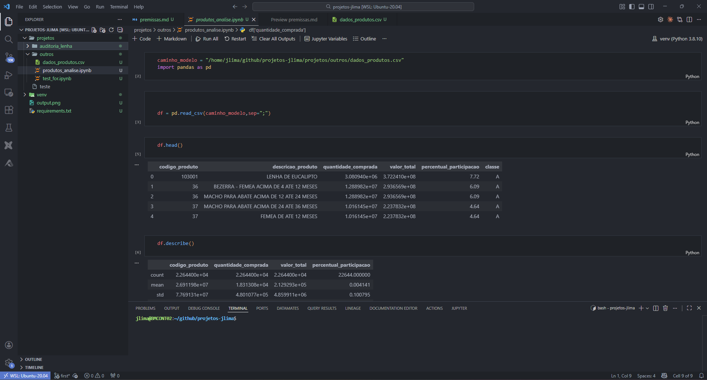
*Jupyter Notebook com análise exploratória*

---

#### Criar DataFrame

```python
import pandas as pd

# De dicionario
df = pd.DataFrame({
    "nome": ["Ana", "Bob", "Carol"],
    "idade": [25, 30, 28],
    "salario": [5000, 6000, 5500]
})

# De arquivo
df = pd.read_csv("dados.csv")
df = pd.read_excel("dados.xlsx")
```

---

#### Conhecer os Dados

```python
df.head()              # Primeiras 5 linhas
df.tail()              # Últimas 5 linhas
df.shape               # (linhas, colunas)
df.columns             # Nomes das colunas
df.dtypes              # Tipos de cada coluna
df.info()              # Resumo geral
df.describe()          # Estatisticas numéricas
```

---

#### Selecionar e Filtrar

```python
# Selecao
df["nome"]             # Uma coluna (Series)
df[["nome", "idade"]]  # Múltiplas colunas (DataFrame)
df.iloc[0]             # Primeira linha por indice
df.iloc[0:3]           # Linhas 0, 1, 2

# Filtros
df[df["idade"] > 25]                              # Idade maior que 25
df[df["nome"] == "Ana"]                           # Nome igual a Ana
df[(df["idade"] > 25) & (df["salario"] > 5000)]   # Múltiplas condicoes
```

---

#### Agregar

```python
# Valores únicos
df["salario"].sum()           # Soma
df["salario"].mean()          # Média
df["salario"].max()           # Maximo
df["salario"].min()           # Minimo
df["nome"].count()            # Contagem
df["nome"].nunique()          # Quantidade de valores únicos
df["cargo"].value_counts()    # Frequencia de cada valor

# Group By
df.groupby("departamento")["salario"].mean()      # Média por grupo
df.groupby("departamento").agg({
    "salario": "mean",
    "nome": "count"
})
```

---

#### Tratar Nulos

```python
df.isnull().sum()         # Conta nulos por coluna
df.dropna()               # Remove linhas com nulo
df.fillna(0)              # Substitui nulos por 0
```

---

#### Exportar

```python
df.to_csv("saida.csv", index=False)
df.to_excel("saida.xlsx", index=False)
```

---

##### Teste seu Conhecimento

**O que esse codigo retorna?**

```python
dados = [
    {"nome": "Ana", "ativo": True},
    {"nome": "Bob", "ativo": False},
    {"nome": "Carol", "ativo": True}
]

resultado = [x["nome"] for x in dados if x["ativo"]]
```

<details>
<summary>Ver resposta</summary>

```python
["Ana", "Carol"]
```
Explicacao: List comprehension que filtra apenas os dicionarios onde `ativo` é `True` e extrai o valor de `"nome"`.

</details>

---

# 2. Conceitos e Ciclo de Vida

## 2.1. Ciclo de Vida da Analise de Dados

Framework conceitual para o processo de analise de dados - Pipeline Auditavel End-to-End.

### 2.1.1. Etapas do Ciclo (6 etapas)


*Pipeline completo: da definição do problema até dashboards auditáveis*

### 2.1.2. Detalhamento das Etapas


| Etapa | Descricao | Ferramentas/Atividades |
|-------|-----------|------------------------|
| **1. Definicao do Problema** | Identificar a pergunta de negocio | Objetivos, KPIs, Stakeholders |
| **2. Analise Exploratoria** | Entender os dados disponiveis | Mapeamento SQL Server, Cardinalidades, Anomalias |
| **3. Preparacao e Transformacao** | Limpar e padronizar dados | Staging Layer dbt, Padronizacao, Limpeza, Joins, Testes |
| **4. Modelagem Dimensional** | Criar modelo analitico | Marts Layer dbt, Fatos, Dimensoes, Star Schema |
| **5. Validacao de Integridade** | Garantir qualidade | Totalizacao Tripla: Origem → dbt → SQL Server |
| **6. Power BI** | Visualizar e entregar | Modelagem 1:N, DAX, Dashboards |

---

## 2.2. Arquitetura ELT

Documentacao da arquitetura de dados implementada na Barra Mansa Alimentos.

### 2.2.1. Visao Geral do Processo


O pipeline de dados esta estruturado para processar informacoes dos sistemas corporativos e industriais (ERP Sapiens e Sistema AIS) até a disponibilizacao em dashboards no Power BI Service.

#### Arquitetura do Pipeline

```
┌─────────────┐     ┌──────────────────┐     ┌─────────────────────────────────────────┐     ┌─────────────────┐
│   FONTES    │     │  EXTRAcaO &      │     │           DATA WAREHOUSE                │     │  VISUALIZAcaO   │
│             │     │  CARGA (EL)      │     │          Amazon Redshift                │     │                 │
│ ERP Sapiens │────▶│                  │     │                                         │     │  Power BI       │
│ Sistema AIS │     │ Scripts Python   │────▶│  Raw    → Source  → Staging → Marts    │────▶│  Service        │
│             │     │ Apache Airflow   │     │  Layer    Layer     Layer     Layer     │     │  Dashboards     │
└─────────────┘     └──────────────────┘     │  (Dados   (Padro-   (Limpeza) (Dimensoes│     │  Corporativos   │
                                             │  Brutos)  nizacao)            & Fatos)  │     └─────────────────┘
                                             └─────────────────────────────────────────┘
```


### 2.2.2. Componentes Principais (fontes, EL, transformacao, camadas, visualizacao)


#### Fontes de Dados
- **ERP Sapiens** - Sistema corporativo
- **Sistema AIS** - Sistema industrial

#### Extracao e Carga (EL)
- **Scripts Python** - Extracao dos dados das fontes
- **Apache Airflow** - Orquestracao dos processos

#### Transformacao (T) - Processamento Hibrido

| Tipo | Ferramenta | Frequencia | Uso |
|------|------------|------------|-----|
| Batch | dbt Cloud | Varias execucoes/dia | Transformacoes programadas |
| Near Real-Time (NRT) | Apache Airflow + Scripts Python | Continuo | Dados criticos |

#### Camadas do Data Warehouse

| Camada | Funcao |
|--------|--------|
| **Raw Layer** | Dados brutos sem transformacao |
| **Source Layer** | Padronizacao de tipos e nomenclatura |
| **Staging Layer** | Limpeza, joins e testes |
| **Marts Layer** | Dimensoes e Fatos prontos para consumo |

#### Visualizacao
- **Power BI Service** - Dashboards corporativos para todas as areas

---

---

# 3. Ambiente e Ferramentas

## 3.1. WSL/Linux

### 3.1.1. Navegacao

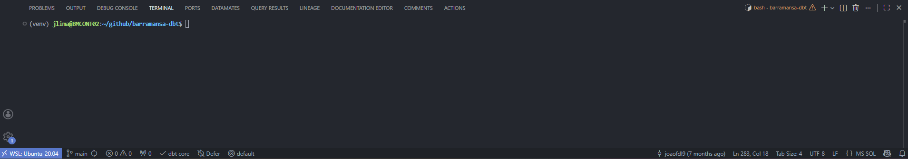
*Terminal WSL integrado ao VS Code*

```bash
pwd                 # Mostra diretorio atual
ls                  # Lista arquivos
ls -la              # Lista com detalhes e ocultos
cd pasta            # Entra na pasta
cd ..               # Volta um nivel
cd ~                # Vai para home
```

### 3.1.2. Gerenciamento de Arquivos

```bash
mkdir pasta         # Cria pasta
touch arquivo.txt   # Cria arquivo vazio
cp origem destino   # Copia
mv origem destino   # Move/renomeia
rm arquivo          # Remove arquivo
rm -rf pasta        # Remove pasta e conteúdo
```


### 3.1.3. Gerenciamento de Pacotes

```bash
sudo apt update             # Atualiza lista de pacotes
sudo apt upgrade            # Atualiza pacotes instalados
sudo apt install pacote     # Instala pacote
sudo apt remove pacote      # Remove pacote
```


## 3.2. Python (Ambiente)

### 3.2.1. Criar e Ativar Ambiente Virtual

```bash
python -m venv nome_env     # Cria ambiente
source nome_env/bin/activate    # Ativa (Linux/WSL)
```

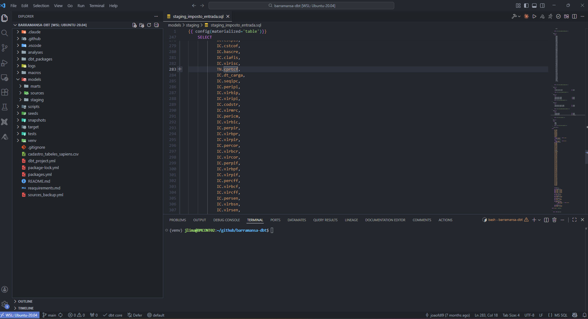
*Ambiente virtual ativado com projeto dbt*

### 3.2.2. Gerenciar Dependencias

```bash
pip install pacote          # Instala pacote
pip install -r requirements.txt   # Instala do arquivo
pip freeze > requirements.txt     # Exporta dependencias
pip list                    # Lista instalados
```

### Desativar
```bash
deactivate                  # Sai do ambiente virtual
```


## 3.3. VS Code

### 3.3.1. Extensoes Recomendadas

| Extensao | Uso |
|----------|-----|
| Python | Intellisense e debug |
| Pylance | Autocomplete avancado |
| dbt Power User | Navegacao, preview e lineage dbt |
| GitLens | Historico e blame |
| Remote - WSL | Desenvolvimento no WSL |


### 3.3.2. Atalhos Principais

| Atalho | Acao |
|--------|------|
| `Ctrl + Shift + P` | Command Palette |
| `Ctrl + P` | Buscar arquivo |
| `Ctrl + B` | Toggle sidebar |
| `Ctrl + `` ` | Terminal integrado |
| `Ctrl + Shift + F` | Buscar no projeto |
| `Ctrl + D` | Seleciona proxima ocorrencia |
| `Alt + ↑/↓` | Move linha |

---

## 3.4. Git

### 3.4.1. Comandos Basicos

| Comando | Descricao |
|---------|-----------|
| `git init` | Inicializa o repositorio |
| `git status` | Verifica status dos arquivos |
| `git add .` | Adiciona alteracoes ao stage |
| `git commit -m` | Cria um commit |
| `git branch` | Lista branches |
| `git checkout -b` | Cria nova branch |
| `git pull` | Atualiza o codigo local |
| `git push` | Envia para o GitHub |


### 3.4.2. Desfazer Alteracoes

```bash
git restore arquivo.sql            # Descarta alteracoes nao staged
git restore --staged arquivo.sql   # Remove do stage (mantém alteracao)
git reset --soft HEAD~1            # Desfaz último commit (mantém alteracoes)
git reset --hard HEAD~1            # Desfaz último commit (perde alteracoes)
git clean -fd                      # Remove arquivos nao rastreados
git stash                          # Guarda alteracoes temporariamente
git stash pop                      # Recupera alteracoes guardadas
git merge --abort                  # Cancela merge em andamento
```


### 3.4.3. Resolucao de Conflitos

```bash
git merge --abort                  # Cancela merge em andamento
```

*Para conflitos detalhados, edite os arquivos manualmente e faca commit apos resolver.*

### 3.4.4. Boas Praticas


### 1️⃣ Atualizar branch principal
```bash
git checkout main
git pull
```

### 2️⃣ Criar nova branch
```bash
git checkout -b nome-da-branch
```

**Padrao para branches:** `feature/`, `fix/`, `docs/`

### 3️⃣ Desenvolver e testar
```bash
# Editar arquivos no VS Code
dbt build -s nome_do_modelo        # Executa e testa
```

### 4️⃣ Commitar e enviar
```bash
git status
git add .
git commit -m "feat: cria modelo de vendas"
git push origin -u nome-da-branch
```

### 5️⃣ Abrir Pull Request no GitHub

---

## 3.4.3 Resolucao de Conflitos

### Quando Acontece
Conflitos ocorrem quando duas branches alteram as mesmas linhas.

### Passo a Passo
```bash
git pull origin main               # Atualiza sua branch
git status                         # Identifica arquivos em conflito
```


## 3.5 Fluxo de Desenvolvimento

### 3.5.1. Git → dbt → GitHub (passo a passo)

Abrir arquivo e resolver:
```
<<<<<<< HEAD
seu codigo
=======
codigo da main
>>>>>>> main
```

Remover marcadores, escolher codigo correto, depois:
```bash
git add arquivo_resolvido.sql
git commit -m "fix: resolve conflito"
git push
```

### Cancelar Merge
```bash
git merge --abort                  # Volta ao estado anterior
```

---

## Boas Praticas

- ✅ Commits pequenos e objetivos
- ✅ Mensagens claras: `feat:`, `fix:`, `docs:`
- ✅ Sempre trabalhar com branches
- ✅ `git pull` antes de comecar o dia
- ✅ `dbt build` antes do commit
- ✅ Resolver conflitos imediatamente

---

Fluxo padrao de desenvolvimento local até publicacao no GitHub. Este guia descreve o processo oficial de trabalho com Git e dbt, utilizado para criacao, versionamento e publicacao de modelos no GitHub.

### Fluxo Padrao de Desenvolvimento (Git → dbt → GitHub)

#### 1️⃣ Atualizar a branch principal
```bash
git checkout main
git pull
```

#### 2️⃣ Criar uma nova branch
```bash
git checkout -b nome-da-branch
```

**Padrao recomendado para branches:**
- `feature/nome-do-modelo`
- `fix/correcao-imposto`
- `docs/atualizacao-documentacao`

#### 3️⃣ Realizar as alteracoes

Criar ou editar arquivos no VS Code. Exemplos de arquivos: `.sql`, `.yml`, `.md`

#### 4️⃣ Executar o dbt localmente (obrigatorio)

---

#### 6️⃣ Verificar alteracoes realizadas
```bash
git status
```

#### 7️⃣ Adicionar arquivos ao stage
```bash
git add .
```

#### 8️⃣ Criar o commit
```bash
git commit -m "mensagem clara e objetiva"
```

**Boas praticas de commit:**
```bash
git commit -m "feat: cria modelo de vendas"
git commit -m "fix: ajusta calculo de ICMS"


```

#### 9️⃣ Enviar a branch para o GitHub
```bash
git push origin -u nome-da-branch
```

Apos a primeira vez:
```bash
git push
```

#### 🔟 Abrir Pull Request no GitHub
1. Acesse o repositorio no GitHub
2. Clique em **Compare & Pull Request**
3. Preencha a descricao
4. Solicite revisao


```bash
# Executar seed normalmente
dbt seed -s nome_do_modelo

# Executar seed com full refresh (substitui todos os dados)
dbt seed -s nome_do_modelo --full-refresh
```

### Fluxo Diario Mais Utilizado

```bash
git status
git add .
git commit -m "mensagem"
git push
```

### Comandos Git Mais Usados

| Comando | Descricao |
|---------|-----------|
| `git init` | Inicializa o repositorio |
| `git status` | Verifica o status dos arquivos |
| `git add .` | Adiciona alteracoes ao stage |
| `git commit -m` | Cria um commit |
| `git branch` | Lista branches |
| `git checkout -b` | Cria nova branch |
| `git pull` | Atualiza o codigo local |
| `git push` | Envia para o GitHub |

### Boas Praticas

- ✅ Commits pequenos e objetivos
- ✅ Mensagens claras e padronizadas
- ✅ Sempre trabalhar com branches
- ✅ Executar `git pull` antes de subir alteracoes
- ✅ Rodar `dbt run` antes do commit

---

# 4. Stack de Dados

## 4.1 AWS no Contexto Barra Mansa

Visao geral dos servicos AWS utilizados no pipeline de dados.

---

## 4.1.1 Visao Geral

```
┌─────────────┐      ┌─────────────┐      ┌─────────────┐      ┌─────────────┐
│ SQL Server  │ ──── │     S3      │ ──── │  Redshift   │ ──── │  Power BI   │
│   (Fonte)   │      │ (Staging)   │      │    (DW)     │      │   (Consumo) │
└─────────────┘      └─────────────┘      └─────────────┘      └─────────────┘
                            │
                     ┌──────┴──────┐
                     │     EC2     │
                     └─────────────┘
```

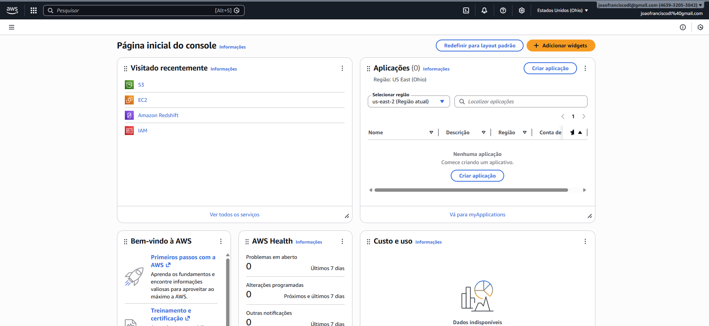
*Console AWS - acesso aos serviços*

---

## 4.1.2 S3

**O que é:** Armazenamento de arquivos na nuvem (buckets e objetos).

**Uso na Barra Mansa:** area de staging temporaria. Os arquivos CSV/GZIP ficam no S3 entre a extracao (SQL Server) e a carga (Redshift).


*Bucket S3 com arquivos de staging*

**Estrutura:**
```
s3://bm-airflow/
└── comercial/
    ├── tabela1_incremental_temp.csv.gz
    └── tabela2_incremental_temp.csv.gz
```

---

## 4.1.3. EC2

**O que é:** Servidores virtuais na AWS.

**Uso na Barra Mansa:** Maquina onde roda o Apache Airflow, executando as DAGs de extracao e carga.

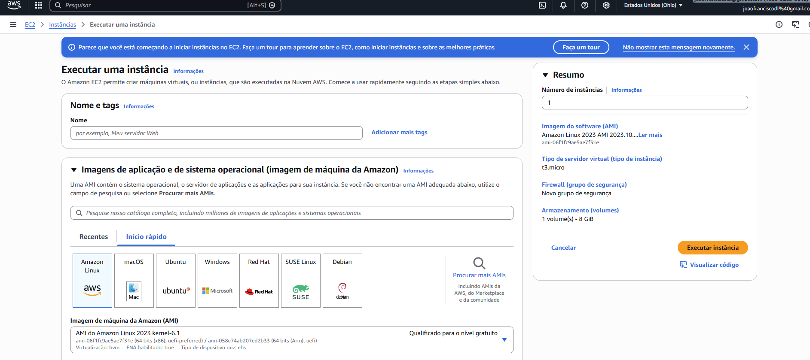
*Instância EC2 executando Airflow*

---

## 4.1.4. Redshift

**O que é:** Data Warehouse colunar da AWS, otimizado para consultas analiticas (OLAP).

**Uso na Barra Mansa:** Destino final dos dados. O Power BI conecta aqui para os dashboards.

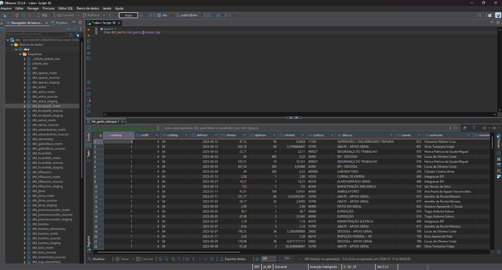
*Conexão Redshift via DBeaver*

---

### Distribution Style

Define como os dados sao distribuidos entre os nos do cluster.

| Estilo | Quando usar | Exemplo |
|--------|-------------|---------|
| **KEY** | Tabelas grandes com JOINs frequentes | Fatos (distribui pela FK) |
| **ALL** | Tabelas pequenas usadas em muitos JOINs | Dimensoes (replica em todos os nos) |
| **EVEN** | Tabelas sem padrao claro de JOIN | Padrao quando nao especificado |

```sql
CREATE TABLE fato_vendas (
    id_venda INT,
    id_produto INT,
    valor DECIMAL
)
DISTSTYLE KEY
DISTKEY (id_produto);
```

---

### Sort Key

Define a ordem fisica dos dados no disco. Acelera filtros no `WHERE`.

**Regra pratica:** Use a coluna mais filtrada (geralmente data).

```sql
CREATE TABLE fato_vendas (
    id_venda INT,
    data_venda DATE,
    valor DECIMAL
)
SORTKEY (data_venda);
```

---

### COPY

Comando para carga em massa do S3 para Redshift. Muito mais rapido que INSERT.

```sql
COPY minha_tabela
FROM 's3://bm-airflow/comercial/arquivo.csv.gz'
IAM_ROLE 'arn:aws:iam::123456789:role/RedshiftRole'
DELIMITER ','
GZIP
IGNOREHEADER 1
CSV;
```

---

### EXPLAIN

Mostra o plano de execucao da query antes de rodar. Útil para identificar gargalos.

```sql
EXPLAIN
SELECT * FROM fato_vendas WHERE data_venda > '2025-01-01';
```

**O que observar:**
- `DS_DIST_*` → redistribuicao de dados (lento)
- `Seq Scan` → leitura sequencial (pode ser lento em tabelas grandes)
- Custo alto → query pode demorar

---

### Troubleshooting

#### Ver erros de COPY
```sql
SELECT *
FROM stl_load_errors
ORDER BY starttime DESC
LIMIT 10;
```

#### Ver queries em execucao
```sql
SELECT 
    pid,
    user_name,
    starttime,
    query
FROM stv_recents
WHERE status = 'Running';
```

#### Ver transacoes ativas/travadas
```sql
SELECT 
    txn_owner,
    txn_start,
    lock_mode,
    relation
FROM svv_transactions
WHERE lockable_object_type = 'relation';
```

#### Derrubar processo travado
```sql
-- Primeiro: identifique o PID com as queries acima
-- Depois: termine o processo
SELECT pg_terminate_backend(PID_AQUI);
```

⚠️ **Cuidado:** So derrube processos que voce tem certeza que estao travados.

---

### Manutencao

```sql
-- Reorganiza dados apos DELETEs (libera espaco)
VACUUM tabela;

-- Atualiza estatisticas para o otimizador
ANALYZE tabela;
```

**Quando rodar:** Apos grandes cargas incrementais ou deletes em massa.

---

# 4.2. dbt (Data Build Tool)

Ferramenta de transformacao de dados que roda SQL no warehouse.

---

## 4.2.1. Estrutura do Projeto


*Estrutura de pastas do projeto dbt*

```
dbt_bm/
├── models/
│   ├── staging/
│   │   ├── stg_clientes.sql
│   │   └── stg_vendas.sql
│   └── marts/
│       ├── dim_clientes.sql
│       └── fato_vendas.sql
├── seeds/
│   └── mapeamento_filiais.csv
├── macros/
│   └── grant_permissions.sql
├── tests/
├── dbt_project.yml
└── packages.yml
```

| Pasta | Conteúdo |
|-------|----------|
| `models/` | Arquivos SQL das transformacoes |
| `seeds/` | CSVs carregados como tabelas |
| `macros/` | Funcoes reutilizaveis (ex: permissoes) |
| `tests/` | Testes customizados |

---

## 4.2.2. Camadas de Dados

```
┌─────────┐    ┌─────────┐    ┌─────────────────────┐    ┌─────────┐
│   Raw   │ ── │ Source  │ ── │      Staging        │ ── │  Marts  │
│         │    │         │    │ (staging + intermed)│    │         │
└─────────┘    └─────────┘    └─────────────────────┘    └─────────┘
  Airflow        dbt              dbt                      dbt
  (EL)        (padroniza)     (limpa, join)          (dims e fatos)
```

| Camada | Schema Redshift | Responsavel | Objetivo |
|--------|-----------------|-------------|----------|
| **Raw** | `airbyte_raw` | Airflow | Dados brutos do SQL Server |
| **Source** | `source` | dbt | Padronizacao de nomes e tipos |
| **Staging** | `staging` | dbt | Limpeza, joins, regras de negocio |
| **Marts** | `marts` | dbt | Dimensoes e Fatos para consumo |


*Exemplo de modelo staging no VS Code*

---

### 4.2.3. Materializacoes

Define como o modelo é persistido no banco.

| Tipo | O que faz | Quando usar |
|------|-----------|-------------|
| **table** | Cria tabela fisica (DROP + CREATE) | Padrao na BM |
| **view** | Cria view (sempre recalcula) | Dados leves, pouca transformacao |
| **incremental** | Insere apenas novos registros | Tabelas grandes com coluna de data |
| **ephemeral** | Nao cria nada (CTE) | Modelo auxiliar usado por outros |

**Configurar no modelo:**
```sql
{{ config(materialized='table') }}

SELECT * FROM {{ ref('stg_clientes') }}
```

**Ou no `dbt_project.yml` (aplica para pasta inteira):**
```yaml
models:
  bm_dbt:
    staging:
      materialized: table
    marts:
      materialized: table
```

---

### 4.2.4. Sources e Refs

#### source() - Referencia tabelas externas (Raw)
```sql
-- models/staging/stg_clientes.sql
SELECT *
FROM {{ source('airbyte_raw', 'e095for') }}
```

#### ref() - Referencia outros modelos dbt
```sql
-- models/marts/dim_clientes.sql
SELECT *
FROM {{ ref('stg_clientes') }}
```

**Por que usar:** dbt monta a ordem de execucao automaticamente (DAG).

---

#### Declarar Sources (schema.yml)

```yaml
# models/staging/schema.yml
version: 2

sources:
  - name: airbyte_raw
    database: producao
    schema: airbyte_raw
    tables:
      - name: e095for
        description: "Cadastro de fornecedores"
      - name: e440nfc
        description: "Notas fiscais de compra"
```

---

### 4.2.5. Testes

Validam qualidade dos dados. Rodam com `dbt test`.

#### Testes Nativos

| Teste | Valida |
|-------|--------|
| `unique` | Valores únicos (sem duplicados) |
| `not_null` | Sem valores nulos |
| `accepted_values` | Valores dentro de lista permitida |
| `relationships` | FK existe na tabela referenciada |

#### Configurar no schema.yml

```yaml
# models/marts/schema.yml
version: 2

models:
  - name: dim_clientes
    columns:
      - name: id_cliente
        tests:
          - unique
          - not_null
      - name: status
        tests:
          - accepted_values:
              values: ['ativo', 'inativo']
```

---

### 4.2.6. Jinja Basico

dbt usa Jinja para SQL dinamico.

#### Sintaxe

| Sintaxe | Uso |
|---------|-----|
| `{{ }}` | Imprime valor |
| `` | Logica (if, for) |
| `{# #}` | Comentario |

#### Funcoes Comuns

```sql
-- Referencias
{{ ref('stg_clientes') }}
{{ source('airbyte_raw', 'e095for') }}

-- Variaveis
{{ var('data_inicio', '2025-01-01') }}

-- Condicional

    schema_producao

    schema_dev

```

---

### Macro de Permissoes (BM)

Macro que concede permissoes apos criar tabelas. Roda automaticamente.

```sql
-- macros/grant_permissions.sql

    GRANT SELECT ON ALL TABLES IN SCHEMA {{ target.schema }} TO GROUP leitores;

```

**Configurar para rodar apos cada modelo:**
```yaml
# dbt_project.yml
on-run-end:
  - "{{ grant_permissions() }}"
```

---

### Lineage (Grafo de Dependencias)

Visualiza a relacao entre modelos.

### Gerar e Visualizar
```bash
dbt docs generate    # Gera documentacao
dbt docs serve       # Abre no navegador
```

### Como Usar
1. Clique no icone de grafo (canto inferior direito)
2. Busque um modelo
3. Veja dependencias (upstream) e dependentes (downstream)

**Útil para:** Entender impacto de mudancas, debugar erros em cascata.

---

### 4.2.7. Comandos dbt


*Execução do comando dbt run no terminal*

#### Execucao
```bash
dbt run                            # Executa todos os modelos
dbt run -s nome_do_modelo          # Executa modelo especifico
dbt run -s +nome_do_modelo         # Modelo + filhos (downstream)
dbt run -s @nome_do_modelo         # Modelo + pais e filhos
```

#### Testes e Build
```bash
dbt test                           # Executa todos os testes
dbt test -s nome_do_modelo         # Testa modelo especifico
dbt build                          # Executa run + test
dbt build -s nome_do_modelo        # Build de modelo especifico
```

#### Seeds e Dependencias
```bash
dbt seed                           # Carrega todos os seeds
dbt seed -s nome_do_seed           # Carrega seed especifico
dbt seed --full-refresh            # Substitui todos os dados
dbt deps                           # Instala packages do packages.yml
```

#### Debug e Documentacao
```bash
dbt debug                          # Verifica conexao e configuracao
dbt compile                        # Compila SQL sem executar
dbt compile -s nome_do_modelo      # Compila modelo especifico
dbt docs generate                  # Gera documentacao
dbt docs serve                     # Abre documentacao no navegador
```

---

## 4.3. Airflow

Orquestrador de pipelines de dados.

### 4.3.1. Conceitos Essenciais

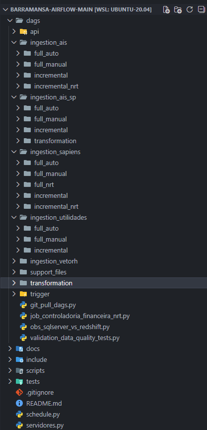
*Interface do Airflow com DAGs*

**Airflow** agenda, executa e monitora pipelines de dados.

**Por que usar (vs cron/scripts):**

| Cron/Scripts | Airflow |
|--------------|---------|
| Sem visualizacao | Interface web com fluxo visual |
| Dependencias manuais | Dependencias automaticas |
| Logs espalhados | Logs centralizados |
| Retry manual | Retry automatico |

---


```
┌───────┐      ┌───────┐      ┌───────┐
│ Task  │ ───► │ Task  │ ───► │ Task  │
│   A   │      │   B   │      │   C   │
└───────┘      └───────┘      └───────┘
 extrair       transformar     carregar
```

| Conceito | O que é |
|----------|---------|
| **DAG** | Fluxo de tarefas (grafo sem ciclos) |
| **Task** | Unidade de trabalho |
| **Dependencia** | Ordem de execucao |

---


### 4.3.2. Operadores


Operador define **o que** a task faz.

| Operador | O que faz |
|----------|-----------|
| `@task` | Executa funcao Python (padrao) |
| `BranchPythonOperator` | Decide qual caminho seguir |
| `EmptyOperator` | Placeholder |
| `TriggerDagRunOperator` | Dispara outra DAG |

**`@task`** é um atalho para `PythonOperator`:

```python
# Com decorator (recomendado)
@task
def extrair():
    return dados

# Equivalente
PythonOperator(task_id="extrair", python_callable=extrair_func)
```

---

### 4.3.3. Anatomia de uma DAG

```python
from airflow import DAG
from airflow.decorators import task
import pendulum

with DAG(
    dag_id="minha_dag",                        # Nome único
    start_date=pendulum.datetime(2025, 1, 1),  # Data inicial
    schedule_interval="0 8 * * *",             # Quando roda (cron)
    catchup=False,                             # Nao executa passadas
    tags=["exemplo"],                          # Categorizacao
) as dag:

    @task
    def extrair():
        return "dados"

    @task
    def carregar(dados):
        print(dados)

    # Dependencia: extrair → carregar
    resultado = extrair()
    carregar(resultado)
```

---

### 4.3.4. Hooks e Conexoes

**Hook** = conector para sistemas externos.

```python
from airflow.providers.microsoft.mssql.hooks.mssql import MsSqlHook
from airflow.providers.postgres.hooks.postgres import PostgresHook

# SQL Server
hook = MsSqlHook(mssql_conn_id="mssql_bm_conn")
cursor = hook.get_conn().cursor()
cursor.execute("SELECT * FROM tabela")

# Redshift
hook = PostgresHook(postgres_conn_id="redshift_conn")
hook.run("TRUNCATE TABLE destino")
```

---

### 4.3.5. Recursos Intermediarios

####  Context e Params

**Context:** Informacoes da execucao.

```python
@task
def minha_task(**context):
    data = context["ds"]           # Data execucao
    params = context["params"]     # Parametros passados
```

**Params:** Parametros via UI/CLI.

```python
with DAG(
    params={"custom_tables": Param(default=[], type=["null", "array"])}
) as dag:
    ...

# Disparar: {"custom_tables": ["e640lct"]}
```

---

#### Controle de Fluxo

**TriggerRule:** Quando a task executa.

| Regra | Executa quando |
|-------|----------------|
| `ALL_SUCCESS` | Todas anteriores OK (padrao) |
| `ALL_DONE` | Todas finalizadas (sucesso ou falha) |

**AirflowSkipException:** Pula task sem falhar.

```python
from airflow.exceptions import AirflowSkipException

@task
def processar(tabela, **context):
    permitidas = context["params"].get("custom_tables", [])
    if permitidas and tabela not in permitidas:
        raise AirflowSkipException(f"{tabela} nao esta na lista")
```

---

#### TaskGroups

Agrupa tasks visualmente.

```python
from airflow.utils.task_group import TaskGroup

with TaskGroup(group_id="vendas") as grupo:
    extrair_clientes()
    extrair_produtos()
```

---

#### Modularizacao

**O que:** Separar DAG (orquestracao) de logica (funcoes).

**Por que:** Reutilizacao, testes, manutencao.

**Como:**
```
dags/                    # Orquestracao
scripts/python/          # Funcoes reutilizaveis
include/seed/            # Configuracoes
```

```python
# DAG importa funcoes do modulo
from scripts.python.get_el_tasks import extract_upload

@task
def extrair(tabela):
    return extract_upload(tabela, S3_BUCKET)
```

---

#### Geracao Dinamica

Cria tasks automaticamente a partir de lista ou arquivo.

##### Via Lista

```python
TABELAS = ["e095for", "e440nfc", "e660inv"]

for tabela in TABELAS:
    @task(task_id=f"process_{tabela}")
    def processar(t=tabela):
        extract_upload(t)
    processar()
```

**Resultado:** 3 tasks criadas automaticamente.

#### Via CSV

```python
import pandas as pd

df = pd.read_csv("nrt_dependencies.csv", sep=";")

for _, row in df.iterrows():
    criar_task(row["tabela_origem"], row["tabela_fato"])
```

**Vantagem:** Adicionar tabela = nova linha (sem mexer em codigo).

---


### 4.3.6. Airflow na Barra Mansa

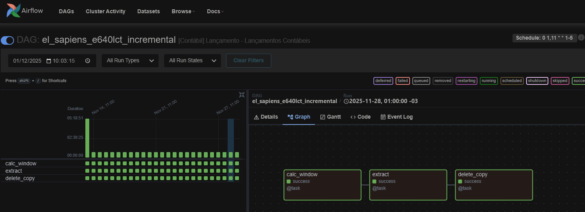
*DAG incremental da tabela e640lct*

#### Visao Geral

**Números:** 70+ DAGs | 300+ tabelas | ~7k execucoes/dia

**Fluxo EL:**
```
SQL Server  ──►  S3  ──►  Redshift
 (fonte)      (staging)    (DW)
```

**Conexoes:**

| Connection ID | Sistema |
|---------------|---------|
| `mssql_bm_conn` | SQL Server Sapiens |
| `mssql_bm_vetorh` | SQL Server VetorH |
| `mssql_bm_ais` | SQL Server AIS |
| `redshift_conn` | Redshift DW |

---

### Estratégias de Carga

| Estratégia | Operacao | Uso | Schedule |
|------------|----------|-----|----------|
| **full_auto** | DROP → CREATE → COPY | Cadastros pequenos | Diario |
| **full_manual** | DROP → CREATE → COPY | Tabelas grandes | Manual |
| **incremental** | DELETE (120 dias) → COPY | Transacoes | Diario |
| **nrt** | DELETE (60 dias) → COPY | Dados criticos | 5min |

**Por que full_auto vs full_manual?**
- Tabelas grandes travam se rodam junto
- Manual permite controle

**Janela incremental:**
- DELETE apaga últimos N dias
- COPY insere dados atualizados
- Evita duplicacao


### 4.3.7. Como Adicionar Nova Tabela


### DAGs Principais

#### job_sapiens_full_auto

Carga diaria de cadastros (48 tabelas pequenas).

```
Lista → Para cada: DROP → CREATE → COPY
```

---

#### job_sapiens_full_manual

Carga manual de tabelas grandes (43 tabelas).

```
Lista → Para cada: DROP → CREATE → COPY
```

Usado para carga inicial antes de ativar incremental.

---

#### job_sapiens_incremental

Carga incremental de transacoes (43 tabelas).

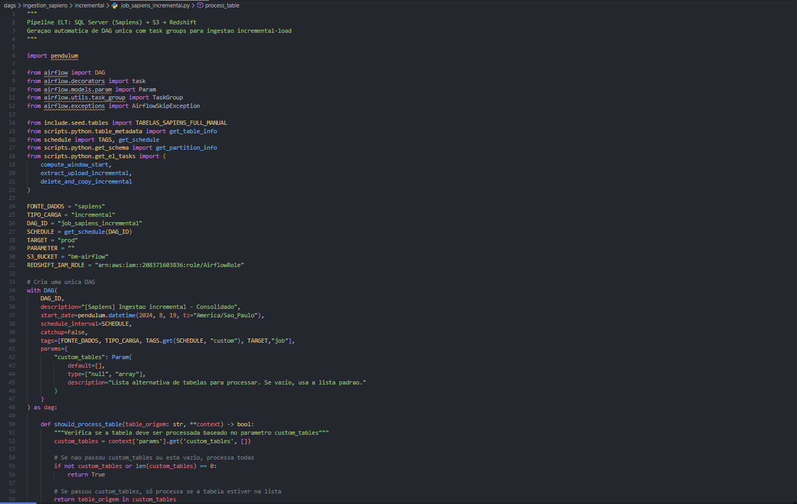
*Execução do job_sapiens_incremental*

```
┌─────────────────────────────────────────────┐
│ job_sapiens_incremental                     │
├─────────────────────────────────────────────┤
│  Lista (tables.py)                          │
│       │                                     │
│       ▼                                     │
│  ┌────────────┐  ┌────────────┐            │
│  │ dom_vendas │  │ dom_fiscal │  ...       │
│  │ ├─ e140nfv │  │ ├─ e660inv │            │
│  │ └─ e120ped │  │ └─ e440nfc │            │
│  └────────────┘  └────────────┘            │
│                                             │
│  Cada task: DELETE(120d) → COPY            │
└─────────────────────────────────────────────┘
```

---

#### job_controladoria_financeira_nrt

Pipeline NRT: ingestao + transformacao a cada 5min (60+ tabelas).

```
┌─────────────────────────────────────────────────────┐
│ job_controladoria_financeira_nrt                    │
├─────────────────────────────────────────────────────┤
│                                                     │
│  CSV (nrt_dependencies.csv)                         │
│       │                                             │
│       ▼                                             │
│  ┌──────────────┐      ┌───────────────┐           │
│  │ ingestion    │      │ transformation│           │
│  │ ├─ e095for ──┼─────►│ ├─ dim_fornec │           │
│  │ └─ e440nfc ──┼─────►│ └─ fato_compra│           │
│  └──────────────┘      └───────┬───────┘           │
│                                │                    │
│                                ▼                    │
│                        ┌─────────────┐             │
│                        │ log_execucao│             │
│                        └──────┬──────┘             │
│                               │                     │
│                               ▼                     │
│                        ┌─────────────┐             │
│                        │trigger_valid│──► obs_dag  │
│                        └─────────────┘             │
└─────────────────────────────────────────────────────┘
```

**Arquivos de configuracao:**

| Arquivo | Conteúdo |
|---------|----------|
| `nrt_dependencies.csv` | origem → fato |
| `nrt_dominios_origem.csv` | dominio origem |
| `nrt_dominios.csv` | dominio fato |

---

### Como Adicionar Nova Tabela

#### Cenario 1: Tabela Full (cadastro pequeno)

| Passo | Arquivo | Acao |
|-------|---------|------|
| 1 | `schema_sapiens.csv` | Adicionar colunas |
| 2 | `tables.py` | Adicionar em `TABELAS_FULL_AUTO` |

Proxima execucao processa automaticamente.

---

#### Cenario 2: Tabela Incremental (transacional)

| Passo | Arquivo | Acao |
|-------|---------|------|
| 1 | `schema_sapiens.csv` | Adicionar colunas |
| 2 | `incremental_config.csv` | Adicionar config |
| 3 | `tables.py` | Adicionar em `TABELAS_INCREMENTAL` |

```bash
# Carga inicial (obrigatorio)
airflow dags trigger job_sapiens_full_manual \
    --conf '{"custom_tables": ["nova_tabela"]}'
```

Proximas execucoes: incremental automatico.

---

### 4.3.8. Operacao

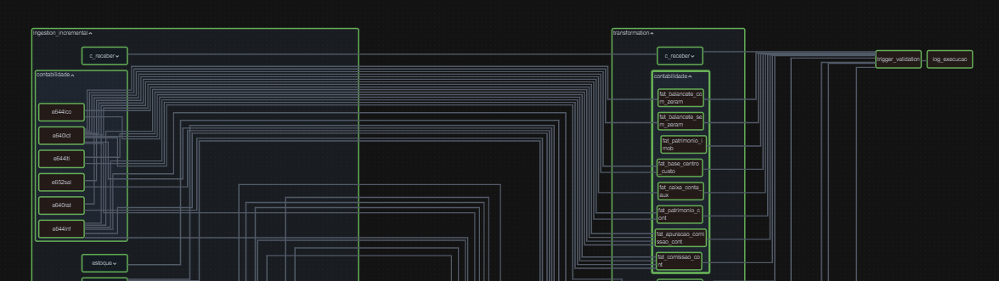
*DAG da controladoria financeira*

#### Cenario 3: Tabela NRT (transacional + transformacao)

| Passo | Arquivo | Acao |
|-------|---------|------|
| 1-3 | (Cenario 2) | Config raw incremental |
| 4 | `nrt_dependencies.csv` | Mapear origem → fato |
| 5 | `nrt_dominios_origem.csv` | Dominio origem |
| 6 | `nrt_dominios.csv` | Dominio fato |
| 7 | `models/marts/` | Criar model dbt |

```bash
# Carga inicial raw
airflow dags trigger job_sapiens_full_manual \
    --conf '{"custom_tables": ["nova_tabela"]}'

# Testar transformacao
dbt run -s fato_nova
```

---

#### Resumo

| Tipo | Cenario | DAG |
|------|---------|-----|
| Cadastro pequeno | 1 | job_sapiens_full_auto |
| Transacional | 2 | job_sapiens_incremental |
| Transacional + dashboard | 3 | job_controladoria_nrt |

---

### Operacao

#### Rodar Tabela Especifica

**UI:** Trigger DAG w/ config → `{"custom_tables": ["e640lct"]}`

**CLI:**
```bash
airflow dags trigger job_sapiens_incremental \
    --conf '{"custom_tables": ["e640lct"]}'
```

#### Monitoramento

| Status | Cor | Acao |
|--------|-----|------|
| Success | 🟢 | OK |
| Failed | 🔴 | Ver logs → Clear |
| Skipped | 🟣 | Normal |
| Running | 🟡 | Aguardar |

#### Troubleshooting


## 4.4. Power BI

#### Ferramenta de visualizacao e analise de dados.

**Fluxo de trabalho:**
```
Conectar  ──►  Modelar  ──►  Visualizar  ──►  Publicar
 (fontes)     (relacionar)    (graficos)      (compartilhar)
```

**Componentes:**
| Componente | Uso |
|------------|-----|
| Power Query | Conexao e transformacao de dados |
| Modelo | Relacionamentos entre tabelas |
| Relatorio | Criacao de visuais |
| Servico | Publicacao e compartilhamento |

---

### 4.4.1. Conexao com Fontes

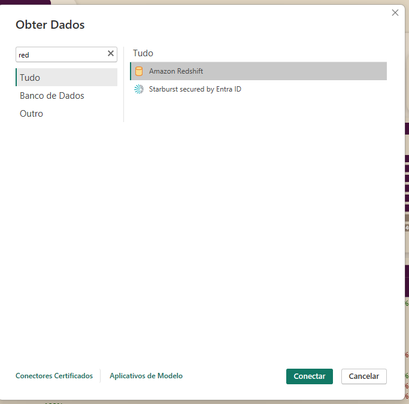
*Tela Obter Dados do Power BI*

#### Redshift (conector nativo)
1. Obter Dados → Banco de Dados → Amazon Redshift
2. Informar servidor e banco
3. Credenciais → Banco de Dados
4. Selecionar tabelas

#### Excel e CSV
1. Obter Dados → Arquivo → Excel / CSV
2. Selecionar arquivo
3. Escolher planilha/tabela

### 4.4.2. Modelagem de Dados

#### Google Sheets
1. Obter Dados → Mais → Google Sheets
2. Autenticar conta Google
3. Selecionar planilha

#### Import vs DirectQuery

| Modo | Dados | Quando usar |
|------|-------|-------------|
| **Import** | Carregados no Power BI | Analises complexas, melhor performance |
| **DirectQuery** | Consultados em tempo real | Dados muito grandes, sempre atualizados |

**Padrao BM:** Import (atualizacao agendada).

---

### Modelagem de Dados

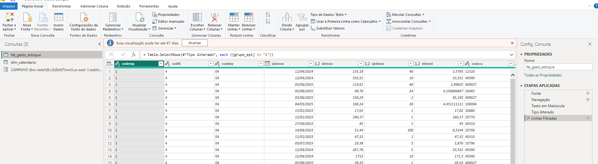
*Transformações no Power Query*

#### Star Schema

Modelo ideal para analise: tabela **Fato** no centro, **Dimensoes** ao redor.

```
                    ┌─────────────┐
                    │ dim_produto │
                    └──────┬──────┘
                           │
┌─────────────┐     ┌──────┴──────┐     ┌─────────────┐
│ dim_cliente │─────│ fato_vendas │─────│  dim_data   │
└─────────────┘     └──────┬──────┘     └─────────────┘
                           │
                    ┌──────┴──────┐
                    │ dim_vendedor│
                    └─────────────┘
```

| Tipo | Conteúdo | Exemplo |
|------|----------|---------|
| **Fato** | Métricas, transacoes | vendas, saidas, lancamentos |
| **Dimensao** | Atributos descritivos | produto, cliente, data |

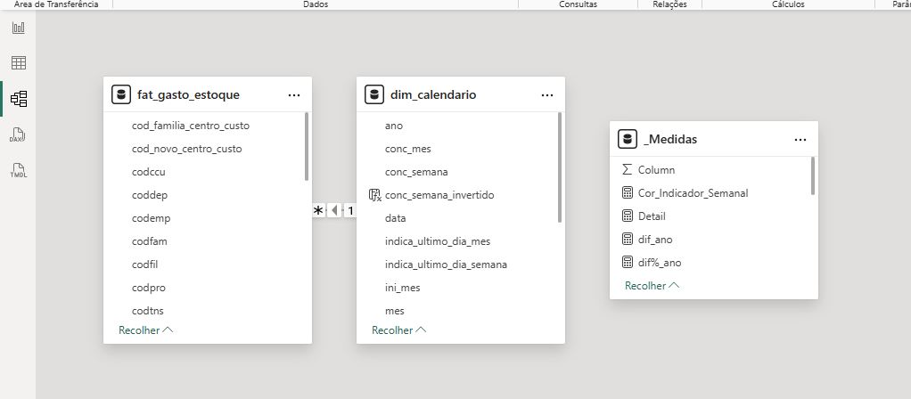
*Modelo de dados no Power BI*

### 4.4.3. DAX Intermediario


**Criar:** Arrastar campo de uma tabela para outra.

**Cardinalidade:**
| Tipo | Significado |
|------|-------------|
| 1:N | Um registro da dimensao para N da fato (padrao) |
| N:N | Evitar quando possivel |

#### Tabelas De-Para (Lookup)

Traduz codigos para descricoes ou agrupa categorias.

**Exemplo:** `depara_categoria`
| cod_produto | categoria |
|-------------|-----------|
| 001-100 | Carnes |
| 101-200 | Frios |
| 201-300 | Embutidos |

---

### DAX Intermediario

#### Colunas Calculadas vs Medidas

| Tipo | Calculado | Armazenado | Quando usar |
|------|-----------|------------|-------------|
| **Coluna** | Ao atualizar | Sim (ocupa espaco) | Classificacoes fixas, lookups |
| **Medida** | Ao exibir | Nao | Agregacoes, KPIs |

**Regra:** Prefira medidas sempre que possivel.

---

#### Funcoes Basicas

```dax
// Agregacoes
Total Vendas = SUM(fato_vendas[valor])
Media Vendas = AVERAGE(fato_vendas[valor])
Qtd Registros = COUNT(fato_vendas[id])
Qtd Clientes = DISTINCTCOUNT(fato_vendas[id_cliente])
```

---

#### CALCULATE (Mudar Contexto)

Aplica filtros a agregacao.

```dax
// Vendas apenas de 2025
Vendas 2025 = 
CALCULATE(
    SUM(fato_vendas[valor]),
    dim_data[ano] = 2025
)

// Vendas da categoria "Carnes"
Vendas Carnes = 
CALCULATE(
    SUM(fato_vendas[valor]),
    dim_produto[categoria] = "Carnes"
)
```

---

#### RELATED (Buscar de Outra Tabela)

Traz valor de tabela relacionada (dimensao → fato).

```dax
// Coluna calculada na fato_vendas
Categoria = RELATED(dim_produto[categoria])
```

---

#### SUMMARIZE (Criar Tabela Agregada)

```dax
// Tabela com total por categoria

SUMMARIZE(
    fato_vendas,
    dim_produto[categoria],
    "Total", SUM(fato_vendas[valor]),
    "Qtd", COUNT(fato_vendas[id])
)
```

---

#### Tabelas Calculadas

```dax
// Tabela de datas (calendario)
Calendario = 
CALENDAR(DATE(2020,1,1), DATE(2030,12,31))

// Tabela de parametros
Metas = 
DATATABLE(
    "Mes", INTEGER,
    "Meta", CURRENCY,
    {
        {1, 100000},
        {2, 120000},
        {3, 110000}
    }
)
```

---

#### Exemplo: % Realizado vs Orcado

### 4.4.5. Criacao de Visuais

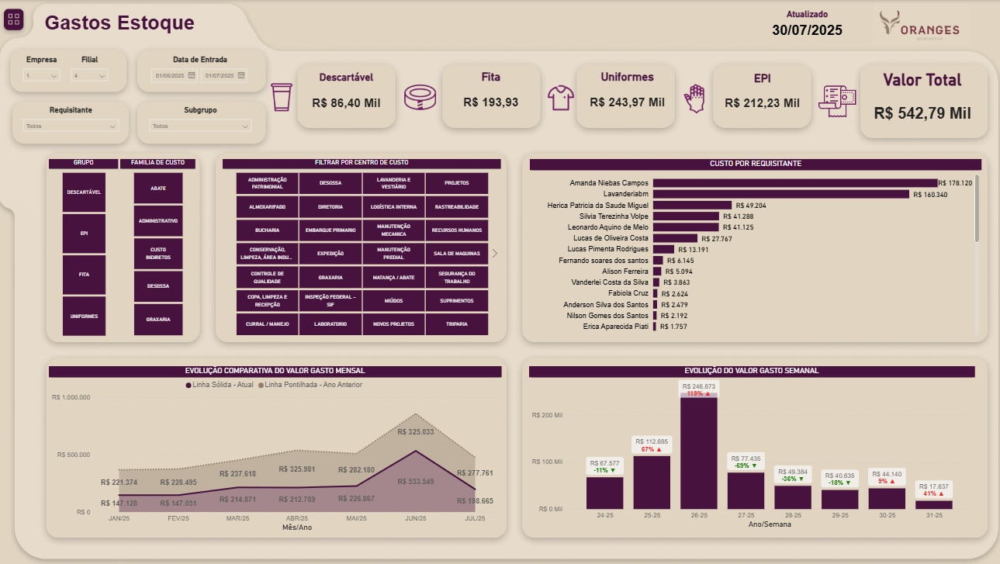
*Dashboard de Gasto de Estoque*

```dax
// Medidas
Realizado = SUM(fato_lancamentos[valor])

Orcado = SUM(dim_orcamento[valor])

% Variacao = 
DIVIDE(
    [Realizado] - [Orcado],
    [Orcado],
    0
)
```

---

### 4.4.4. Design de Layouts

#### Figma para Tela de Fundo

**Por que:** Controle total sobre design, consistencia visual.

**Como:**
1. Criar frame 1920x1080 (ou 1280x720)
2. Definir areas: cabecalho, filtros, graficos
3. Aplicar cores e formas
4. Exportar como PNG

**Aplicar no Power BI:**
1. Formato → Tela de fundo da pagina
2. Imagem → Selecionar arquivo
3. Ajustar transparencia se necessario

### 4.4.6. Interatividade

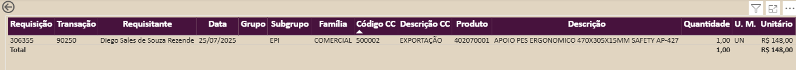
*Drill-down de dados*

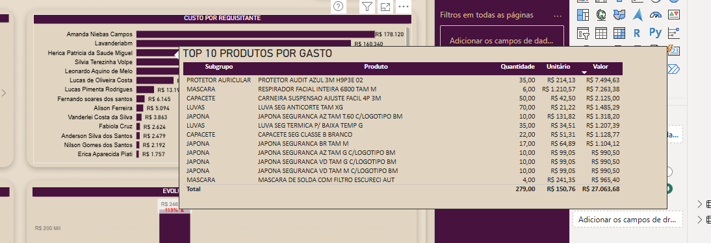
*Dica de ferramenta personalizada*

#### Principios de Design

| Principio | Aplicacao |
|-----------|-----------|
| **Hierarquia** | KPIs principais no topo |
| **Alinhamento** | Visuais alinhados em grade |
| **Proximidade** | Agrupar informacoes relacionadas |
| **Contraste** | Destaque para números importantes |

---

### Criacao de Visuais

#### Quando Usar Cada Visual

| Visual | Uso |
|--------|-----|
| **Cartao** | KPI único (total, média) |
| **Tabela** | Dados detalhados |
| **Matriz** | Dados com hierarquia (drill-down) |
| **Barra** | Comparar categorias |
| **Linha** | Evolucao no tempo |
| **Combo** | Duas métricas com escalas diferentes |

#### Tabelas e Matrizes

**Tabela:** Lista simples de registros.

**Matriz:** Linhas e colunas com agregacao.
- Permite drill-down (expandir/recolher)

### 4.4.7. Boas Praticas


---

### Interatividade

#### Segmentacao (Slicers)

Filtros visuais para o usuario.

**Tipos:**
- Lista (selecao única/múltipla)
- Dropdown (economiza espaco)
- Entre (range de datas/valores)

#### Filtros

| Nivel | Afeta |
|-------|-------|
| Visual | Apenas o visual selecionado |
| Pagina | Todos os visuais da pagina |
| Relatorio | Todas as paginas |

#### Drill-down

Navegar em hierarquias (ex: Ano → Mes → Dia).

1. Criar hierarquia na dimensao
2. Adicionar ao visual
3. Usar icones de drill no visual
   
#### Layouts

- ✅ Fundo neutro (cinza claro, branco)

### 4.4.8. Exemplos Contextualizados

- ✅ KPIs no topo
- ✅ Filtros a esquerda ou topo
- ❌ Cores vibrantes em excesso
- ❌ Graficos 3D

#### Tabelas Auxiliares

| Tabela | Uso |
|--------|-----|
| Calendario | Analises temporais, time intelligence |
| De-Para | Categorizacao, traducao de codigos |
| Parametros | Metas, configuracoes |

#### Tipagem de Colunas

| Tipo | Usar para |
|------|-----------|
| Texto | Codigos, descricoes |
| Número inteiro | IDs, quantidades |
| Número decimal | Valores monetarios |
| Data | Datas (nao texto!) |

#### Nomenclatura

- Tabelas: `fato_`, `dim_`, `depara_`
- Medidas: Comecar com verbo (Total, Qtd, %)
- Colunas: snake_case ou PascalCase (consistente)

#### Performance

- ✅ Usar medidas (nao colunas calculadas)
- ✅ Remover colunas nao usadas
- ✅ Evitar relacionamentos N:N
- ❌ Colunas calculadas com RELATED em tabelas grandes

---

## Exemplos Contextualizados

### Dashboard: Saidas de Estoque

**Modelo:**
```
┌─────────────────┐     ┌─────────────────┐
│ depara_categoria│     │   dim_produto   │
└────────┬────────┘     └────────┬────────┘
         │                       │
         └───────────┬───────────┘
                     │
              ┌──────┴──────┐
              │ fato_saidas │
              └──────┬──────┘
                     │
              ┌──────┴──────┐
              │  dim_data   │
              └─────────────┘
```

**Medidas:**
```dax
Total Saidas = SUM(fato_saidas[quantidade])

Saidas por Categoria = 
CALCULATE(
    [Total Saidas],
    USERELATIONSHIP(dim_produto[cod_categoria], depara_categoria[cod_categoria])
)

Ranking Categoria = 
RANKX(
    ALL(depara_categoria[categoria]),
    [Total Saidas]
)
```

**Visuais:**
- Cartoes: Total saidas, Qtd categorias
- Matriz: Categoria → Produto (com drill-down)
- Grafico barra: Top 10 categorias
- Slicer: Periodo

---

### Dashboard: Acompanhamento Orcamentario

**Modelo:**
```
┌─────────────────┐     ┌─────────────────┐
│  depara_classe  │     │   dim_conta     │
└────────┬────────┘     └────────┬────────┘
         │                       │
         └───────────┬───────────┘
                     │
            ┌────────┴────────┐
            │ fato_lancamentos│
            └────────┬────────┘
                     │
         ┌───────────┼───────────┐
         │           │           │
  ┌──────┴───┐ ┌─────┴─────┐ ┌───┴────┐
  │ dim_data │ │dim_depto  │ │orcamento│
  └──────────┘ └───────────┘ └─────────┘
```

**Medidas:**
```dax
Realizado = SUM(fato_lancamentos[valor])

Orcado = SUM(orcamento[valor])

Variacao = [Realizado] - [Orcado]

% Variacao = 
DIVIDE([Variacao], [Orcado], 0)

Status = 
IF(
    [% Variacao] > 0.1, "Acima",
    IF([% Variacao] < -0.1, "Abaixo", "OK")
)
```

**Visuais:**
- Cartoes: Realizado, Orcado, % Variacao
- Tabela: Classe | Realizado | Orcado | Variacao | Status
- Grafico linha: Tendencia mensal (Realizado vs Orcado)
- Slicers: Departamento, Periodo, Classe

---

### Ex: Power BI - Analise de Vendas (NF-e Saida 2020-2025)

Sugestao de analise utilizando a base historica de notas fiscais de saida.

### Objetivo

Acompanhar a evolucao do faturamento ao longo do tempo e identificar padroes de sazonalidade que impactam o negocio.

### O que deve ser construido no Power BI

1. **Faturamento mensal e anual** - Grafico de linhas mostrando evolucao temporal
2. **Comparativo ano a ano** - Faturamento por ano para identificar crescimento/queda
3. **Analise de sazonalidade** - Identificar meses de pico e baixa nas vendas
4. **Top 10 produtos** - Quais produtos mais faturam (curva ABC simples)
5. **Volume de notas emitidas** - Quantidade de NF-e por mes (indicador operacional)

### Visualizacoes Sugeridas

- Grafico de linha para evolucao mensal
- Grafico de barras para comparativo anual
- Tabela com top produtos por faturamento

### Valor da Analise

Visao rapida e clara do desempenho comercial, identificacao de tendencias e padroes sazonais para planejamento.

| Complexidade | Execucao | Valor Informacional |
|--------------|----------|---------------------|
| Baixa | Rapida | Alto |

---

### 4.5 Power BI Service


*Página inicial do Power BI Service*

#### 4.5.1 Introdução e Conceitos

**O que é Power BI Service?**

Power BI Service é a plataforma em nuvem da Microsoft para publicação, atualização e compartilhamento de relatórios. Enquanto o Power BI Desktop é usado para desenvolvimento local, o Service funciona como ambiente de produção onde usuários finais acessam dashboards atualizados.

**Fluxo de trabalho:**
```
Desktop (desenvolvimento) → Service (publicação) → Usuários (consumo)
```

**Escopo na BM:**

Os relatórios estão organizados no workspace **Controladoria Financeira**, divididos em subpastas por área:

```
Controladoria Financeira/
├── Auditoria/
│   └── Auditoria Lenha
├── CONTABILIDADE/
│   ├── conciliação_almoxarifado
│   └── conciliacao_clientes_adt
├── fiscal/
│   └── obrigacoes_acessorias
├── Orçamento/
│   └── orçamento_ti
└── Custo/
    └── gasto_estoque_geral
```

**Arquitetura de dados:**

Os relatórios consomem dados que passam por 4 camadas de transformação:

```
Raw (Airflow) → Source (dbt) → Staging (dbt) → Marts (dbt) → Power BI
```

---

#### 4.5.2 Estrutura: Workspaces e Componentes


*Estrutura do workspace Controladoria Financeira*

**Workspaces**

Espaços que agrupam relatórios relacionados. Na BM, há um workspace principal (**Controladoria Financeira**) organizado em subpastas por setor.

**Níveis de permissão:**

| Permissão | Visualizar | Editar | Publicar | Gerenciar |
|-----------|------------|--------|----------|-----------|
| **Viewer** | ✅ | ❌ | ❌ | ❌ |
| **Contributor** | ✅ | ❌ | ✅ | ❌ |
| **Member** | ✅ | ✅ | ✅ | ❌ |
| **Admin** | ✅ | ✅ | ✅ | ✅ |

**Exemplo BM:** Analistas de Custo têm permissão **Member** na subpasta "Custo" para editar `gasto_estoque_geral`.

---

**Componentes Publicados**

Quando você publica do Desktop, dois componentes são criados:

**1. Modelo Semântico (Dataset)**
- Contém: tabelas, relações, medidas DAX
- Um modelo pode alimentar múltiplos relatórios
- Exemplo: modelo `financeiro_base` alimenta vários dashboards

**2. Relatório**
- Contém: páginas, visuais, filtros
- Sempre vinculado a um modelo semântico
- Exemplo: `gasto_estoque_geral` (relatório) conectado a modelo `custos_operacionais`

**Relação:**
```
Desktop (.pbix)
    ↓ Publicar
Service:
  ├── Modelo Semântico (dados + medidas)
  └── Relatório (visualizações)
```

Se você atualizar o modelo, todos os relatórios conectados refletem as mudanças automaticamente.

---

#### 4.5.3 Infraestrutura: Gateway de Dados


*Configuração do Gateway de Dados*

**O que é Gateway?**

Ponte entre Power BI Service (nuvem) e fontes de dados internas. Permite que relatórios atualizem automaticamente consultando dados corporativos que não estão na nuvem pública.

**Por que precisamos?**

Power BI Service está na nuvem Microsoft, mas nossos dados estão em:
- Redshift (AWS privado)
- Servidores locais BM
- Google Sheets (conta corporativa)

---

**Gateways Configurados na BM**

**1. Gateway Redshift (Redshift2)**

**Conecta:** AWS Redshift (data warehouse)

**Usado em:**
- Dados processados por dbt: `gasto_estoque_geral`, `orçamento_ti`
- Dados NRT do Airflow: `conciliação_almoxarifado`, `conciliacao_clientes_adt`

**Exemplo:** `gasto_estoque_geral` consulta `marts.fato_gasto_estoque` via Redshift2.

---

**2. Gateway Rede Local (GatewayBM)**

**Conecta:** Pastas compartilhadas em servidores BM

**Usado em:** Arquivos Excel/CSV atualizados manualmente

**Exemplo:** `obrigacoes_acessorias` lê Excel em `\\servidor-bm\fiscal\obrigacoes_2026.xlsx`.

---

**3. Gateway Google Sheets (GatewaySheets)**

**Conecta:** Planilhas do Google Drive corporativo

**Usado em:** Dados coletados via Google Forms

**Exemplo:** `Auditoria Lenha` combina Google Sheets (coleta manual) + Redshift (após processamento dbt).

---

**Como Escolher o Gateway**

| Fonte de Dados | Gateway | Modo Suportado | Exemplo BM |
|----------------|---------|----------------|------------|
| Marts dbt (Redshift) | Redshift2 | Import / Direct Query | gasto_estoque_geral |
| NRT Airflow (Redshift) | Redshift2 | Import / Direct Query | conciliação_almoxarifado |
| Excel rede local | GatewayBM | Apenas Import | obrigacoes_acessorias |
| Google Sheets | GatewaySheets | Apenas Import | Auditoria Lenha |

---

**⚠️ Resolução de Problemas: Falha na Atualização**

**Sintoma:** Erro ao atualizar relatório automaticamente

**Checklist:**

**1. Confirmar gateway correto**
```
Settings do modelo → Gateway connection
Verificar se gateway selecionado corresponde à fonte:
- Redshift → Redshift2
- Rede local → GatewayBM
- Sheets → GatewaySheets
```

**2. Verificar status do gateway**
```
Power BI Admin Portal → Gateway management
Status deve estar "Online" (bolinha verde)
Se offline: verificar com TI se servidor está ligado
```

**3. Testar conexão**
```
Settings → Data source credentials → Edit credentials
Test connection
Se falhar: senha pode ter expirado
```

**4. Ver histórico de erros**
```
Refresh history → clicar em status "Failed"
Erros comuns:
- "Gateway not found": gateway removido/renomeado
- "Credentials expired": atualizar senha
- "Connection timeout": verificar rede/firewall
```

**Exemplo real:**

`gasto_estoque_geral` falhou com erro "Gateway not found". Verificação mostrou que estava configurado para gateway "Redshift_OLD". Solução: reconfigurar para "Redshift2".

---

#### 4.5.4 Operação Básica: Publicação e Atualização


*Configuração de atualização agendada*

**Publicar Relatório**

**Passo a passo:**

1. **No Power BI Desktop:**
   - Arquivo salvo e validado localmente
   - Clicar em "Publish" (barra superior)
   - Selecionar workspace: "Controladoria Financeira"
   - Selecionar subpasta (Custo, Orçamento, etc)
   - Aguardar upload

2. **No Power BI Service:**
   - Acessar workspace selecionado
   - Verificar presença de modelo semântico e relatório
   - Abrir relatório para conferir visualizações

**Importante:** Primeira publicação cria os componentes. Publicações seguintes apenas atualizam o existente.

---

**Configurar Atualização Automática**

**Localização:**
```
Workspace → Modelo semântico → Settings → Scheduled refresh
```

**Exemplo prático: `gasto_estoque_geral`**

**1. Configurar credenciais**
```
Data source credentials → Edit credentials
- Authentication: Basic
- Username: [usuario_powerbi]
- Password: [senha]
- Privacy level: Organizational
→ Sign in
```

**2. Selecionar gateway**
```
Gateway connection → Use a data gateway
- Selecionar: Redshift2
(fonte é marts.fato_gasto_estoque no Redshift)
```

**3. Agendar horários**
```
Scheduled refresh → On
- Frequency: Daily
- Time zone: (UTC-03:00) Brasília
- Time: 06:30, 12:00, 18:00
- Refresh failure notifications: analista.dados@barramansa.com.br
→ Apply
```

**Motivo dos horários:** dbt atualiza marts às 06:00, 11:30, 17:30. Power BI atualiza 30min depois (margem de segurança).

---

**Limites de Atualização**

| Licença | Atualizações/dia | Observação |
|---------|------------------|------------|
| **Pro** | 8 | Padrão BM |
| **Premium** | 48 | Apenas workspace Controladoria |

**Exemplo de distribuição (Pro):**
- 06:30 - Antes do expediente
- 09:00 - Início das operações
- 12:00 - Meio-dia
- 15:00 - Tarde
- 18:00 - Fim do expediente

Total: 5 atualizações/dia (dentro do limite de 8)

---

**Boas Práticas**

✅ **Sincronizar com upstream:**
- dbt roda 06:00 → PBI atualiza 06:30
- Airflow NRT roda de hora em hora → PBI atualiza 10min depois

✅ **Escalonar horários:**
- `gasto_estoque_geral`: 06:30
- `orçamento_ti`: 07:00
- Evita sobrecarga simultânea no gateway

✅ **Documentar:**
- Anotar horários no README do projeto
- Explicar motivo de cada horário

❌ **Evitar:**
- Agendar todos os relatórios às 06:00 (sobrecarga)
- Ignorar e-mails de falha
- Atualizar Direct Query agendadamente (não é necessário)

---

#### 4.5.5 Operação Básica: Gestão de Acessos


*Gerenciamento de permissões*

**Requisito Fundamental**

Para acessar qualquer relatório da BM:
- ✅ E-mail corporativo `@barramansa.com.br`
- ❌ E-mails pessoais não funcionam

---

**Método 1: Adicionar ao Workspace**

**Quando usar:** Usuário precisa acessar vários relatórios do setor

**Exemplo:** Nova pessoa na equipe Custo precisa acessar múltiplos relatórios.

**Como fazer:**
```
1. Workspace "Controladoria Financeira" → Settings
2. Access → Add people or groups
3. Digitar: novo.analista@barramansa.com.br
4. Selecionar permissão:
   - Viewer: apenas visualizar
   - Contributor: visualizar + publicar novos
   - Member: visualizar + editar + publicar
   - Admin: controle total
5. Add
```

**Resultado:** Usuário vê **todos** os relatórios do workspace.

---

**Método 2: Compartilhar Relatório Direto**

**Quando usar:** Compartilhar apenas 1 relatório específico

**Exemplo:** Diretor Comercial precisa ver `gasto_estoque_geral` pontualmente.

**Como fazer:**
```
1. Abrir relatório gasto_estoque_geral
2. Botão "Share" (topo direito)
3. Digitar: diretor.comercial@barramansa.com.br
4. (Opcional) Send email notification
5. Grant access
```

**Resultado:** Usuário acessa **apenas aquele relatório** (somente visualização).

---

**Comparação**

| Aspecto | Workspace | Share Direto |
|---------|-----------|--------------|
| **Escopo** | Todos os relatórios | 1 relatório |
| **Permissões** | Configuráveis | Apenas visualização |
| **Edição** | Possível (Member/Admin) | Não |
| **Gestão** | Centralizada | Individual |
| **Exemplo BM** | Equipe Custo inteira | Diretor externo ao setor |

---

**⚠️ Resolução de Problemas: Usuário Não Vê Relatório**

**Sintoma:** Usuário diz que não consegue acessar relatório compartilhado

**Checklist:**

**1. Confirmar e-mail correto**
```
- Deve ser @barramansa.com.br
- Verificar digitação (sem espaços, letras trocadas)
- Confirmar que usuário fez login com e-mail corporativo
```

**2. Verificar compartilhamento**
```
Relatório → Share → People with access
- E-mail deve aparecer na lista
- Se não está: repetir compartilhamento
```

**3. Verificar permissões do workspace**
```
Se usuário precisa editar:
Workspace settings → Access
- Adicionar com permissão adequada (Member/Contributor)
```

**4. Orientar usuário:**
```
- Acessar app.powerbi.com
- Login com @barramansa.com.br
- Verificar:
  • Shared with me (share direto)
  • Workspaces (se foi adicionado)
- Checar spam no e-mail
```

**5. Testar acesso pessoalmente**
```
- Abrir navegador anônimo
- Login com credenciais do usuário (se disponível)
- Tentar acessar relatório
- Se você não consegue: problema de permissão
- Se você consegue: problema no lado do usuário
```

**6. Último recurso**
```
- Remover usuário completamente
- Aguardar 5 minutos
- Adicionar novamente
- Se persistir: abrir chamado com TI
  • Verificar conta ativa no Azure AD
  • Confirmar licença Power BI Pro
```

---

#### 4.5.6 Operação Geral: Monitoramento e Validação


*Painel de monitoramento*

**Validação pelo Card de Data**

Todo dashboard BM deve ter card "Última Atualização".

**Implementar:**
```dax
Última Atualização = NOW()
```

**Validar:**
```
1. Abrir dashboard
2. Verificar card
3. Comparar com horário agendado
   - Se recente: ✅ ok
   - Se antigo: ⚠️ investigar
```

**Exemplo:** `gasto_estoque_geral` atualiza às 06:30. Se você abre às 09:00 e card mostra 06:35, está correto.

---

**Histórico de Atualizações**

**Acessar:**
```
Workspace → Modelo semântico → Settings → Refresh history
```

**Status possíveis:**

| Status | Significado | Ação |
|--------|-------------|------|
| ✅ **Completed** | Sucesso | Nenhuma |
| ❌ **Failed** | Falha | Investigar |
| ⏸️ **Cancelled** | Cancelada | Verificar motivo |
| ⏳ **In Progress** | Rodando | Aguardar |

**Ver erro:**
```
Clicar em Failed → Details
Mensagens comuns:
- "Gateway timeout": fonte demorou muito
- "Invalid credentials": senha expirou
- "Table not found": tabela removida/renomeada
```

---

**⚠️ Resolução de Problemas**

**Problema 1: PBI Atualizou, Mas Dados Estão Antigos**

**Sintoma:** Refresh history mostra "Completed", mas números desatualizados

**Investigação em camadas** (do fim para o início):

**Exemplo: `gasto_estoque_geral`**

```
Hoje: 14/01/2026, 10:00
Card: "Última Atualização: 13/01/2026 18:05"
Status: ❌ Dados de ontem
```

**Etapa 1: Validar Power BI**
```
Card mostra data antiga → problema está upstream (antes do PBI)
```

**Etapa 2: Validar camada Marts (dbt)**
```sql
SELECT MAX(data_atualizacao), COUNT(*)
FROM marts.fato_gasto_estoque;
-- Resultado: 13/01/2026 18:00, 15.420 linhas
```
→ Marts não atualizou hoje ❌

**Etapa 3: Validar camada Staging**
```sql
SELECT MAX(data_carga)
FROM staging.estoque_movimentacao;
-- Resultado: 14/01/2026 06:05
```
→ Staging atualizou hoje ✅

**Etapa 4: Verificar job dbt**
```
dbt Cloud → Jobs → job_marts_controladoria
Status: Failed às 06:15
Erro: "Relation 'staging.produto_categoria' does not exist"
```

**Causa raiz:** dbt marts falhou. Staging tem dados novos, mas marts não foi reconstruído.

**Solução:** Corrigir dependência no dbt, re-executar job manualmente.

---

**Objetivo da investigação:**

Identificar em qual camada o pipeline parou:

```
Raw ❌ → problema Airflow (extração)
Raw ✅ → Staging ❌ → problema dbt staging
Raw ✅ → Staging ✅ → Marts ❌ → problema dbt marts
Raw ✅ → Staging ✅ → Marts ✅ → PBI ❌ → problema Power BI
```

---

**Problema 2: Números Estranhos**

**Sintoma:** Relatório mostra dados inconsistentes

**Exemplo: `conciliacao_clientes_adt`**

```
Situação: Mostra "0 clientes inadimplentes"
Realidade: Gerente sabe que há 15
```

**Checklist:**

**1. Verificar slicers visíveis**
```
Slicer "Período" → estava "Dezembro 2025"
Alterar para "Janeiro 2026" → 15 clientes aparecem
```

**2. Verificar filtros de página**
```
Filters pane → Page level
"Status Cliente" = "Ativo" estava aplicado
Remover filtro → inadimplentes aparecem
```

**3. Verificar filtros de visual**
```
Selecionar visual → Filters pane → Visual level
Algum filtro oculto aplicado?
```

**4. Revisar medida DAX**
```
Clicar no visual → ver medida usada
Verificar fórmula no Model view
Testar em tabela simples (sem formatação)
```

**5. Validar relações do modelo**
```
Model view:
- Cardinalidade correta? (1:*, *:1)
- Direção de filtro: ambos ou único?
- Relação ativa conforme esperado?
```

**6. Comparar com fonte**
```sql
-- Query direto no Redshift
SELECT 
  COUNT(*) as total_inadimplentes
FROM marts.fato_credito_cliente
WHERE status_credito = 'Inadimplente'
  AND data_referencia = '2026-01-14';
-- Resultado: 15 linhas

-- Comparar com Power BI
```

**Dica:** Use tabela matrix sem formatação para debug. Visuais complexos podem mascarar problemas.

---

#### 4.5.7 Operação Geral: Import vs Direct Query

**Diferenças Técnicas**

| Aspecto | Import | Direct Query |
|---------|--------|--------------|
| **Dados** | Copiados para Power BI | Permanecem na fonte |
| **Atualização** | Agendada (8x/dia Pro) | Tempo real |
| **Performance** | Mais rápida | Depende da fonte |
| **Limite** | 1GB (Pro) | Sem limite |
| **Transformações** | Todas (Power Query) | Limitadas |
| **Carga no servidor** | Apenas no refresh | Constante |

---

**Quando Usar na BM**

**Import - Casos de Uso**

✅ **Use Import para:**
- Dados históricos/marts consolidados
- Volumes pequenos/médios (< 1GB)
- Múltiplos usuários simultâneos
- Fontes: Google Sheets, Excel local

**Exemplos BM:**

| Relatório | Fonte | Motivo | Freq. Atualização |
|-----------|-------|--------|-------------------|
| **gasto_estoque_geral** | marts.fato_gasto_estoque | Agregado mensal, 40k linhas, alta performance | 3x/dia (06:30, 12:00, 18:00) |
| **orçamento_ti** | marts.dim_orcamento_ti | Histórico, 5k linhas, baixo volume | 1x/dia (07:00) |
| **Auditoria Lenha** | Sheets → marts.fato_auditoria_lenha | Multi-fonte, 500 linhas | 2x/dia (08:00, 14:00) |
| **obrigacoes_acessorias** | Excel `\\servidor-bm\fiscal\obrigacoes.xlsx` | Manual, 2k linhas | 1x/dia (09:00) |

---

**Direct Query - Casos de Uso**

✅ **Use Direct Query para:**
- Dados operacionais em tempo real
- Tabelas NRT do Airflow
- Volumes grandes (> 1GB)
- Dados que mudam constantemente

**Exemplos BM:**

| Relatório | Fonte | Motivo | Pipeline Upstream |
|-----------|-------|--------|-------------------|
| **conciliação_almoxarifado** | raw.almoxarifado_movimentacao | Conferência no mesmo dia, 500k linhas | Airflow NRT (30/30min) |
| **conciliacao_clientes_adt** | raw.adt_clientes_credito | Crédito precisa status atual, 150k linhas | Airflow horária |

---

**Comparação Prática: Todos os Relatórios BM**

| Relatório | Modo | Workspace | Volume | Pipeline | Motivo Escolha |
|-----------|------|-----------|--------|----------|----------------|
| gasto_estoque_geral | Import | Custo | 40k | dbt marts | Agregado, performance |
| orçamento_ti | Import | Orçamento | 5k | dbt marts | Histórico, baixo |
| conciliação_almoxarifado | Direct Query | CONTABILIDADE | 500k | Airflow NRT | Operacional, tempo real |
| conciliacao_clientes_adt | Direct Query | CONTABILIDADE | 150k | Airflow NRT | Crédito, sempre atual |
| Auditoria Lenha | Import | Auditoria | 500 | Sheets + dbt | Multi-fonte híbrida |
| obrigacoes_acessorias | Import | fiscal | 2k | Manual Excel | Local, manual |

---

**Relação com Gateways**

| Gateway | Import | Direct Query |
|---------|--------|--------------|
| **Redshift2** | ✅ Suporta | ✅ Suporta |
| **GatewayBM** | ✅ Suporta | ❌ Não suporta |
| **GatewaySheets** | ✅ Suporta | ❌ Não suporta |

**Conclusão:** Direct Query só funciona com Redshift na BM.

---

**Modo Híbrido (Composite Model)**

Combina Import e Direct Query no mesmo modelo.

**Exemplo: `conciliacao_clientes_adt`**

**Estrutura:**
- Dimensão `dim_cliente`: **Import** (50k clientes, muda pouco)
- Dimensão `dim_data`: **Import** (calendário, estático)
- Fato `fato_credito_cliente`: **Direct Query** (150k linhas, sempre atual)

**Vantagem:** Performance das dimensões + atualidade do fato.

**Como configurar:**
```
Power BI Desktop:
1. Importar dim_cliente e dim_data normalmente
2. Conectar fato_credito_cliente via Direct Query
3. Criar relações entre tabelas
4. Model view → dim_cliente → Properties → Storage mode: Import
5. Model view → fato_credito_cliente → Properties → Storage mode: DirectQuery
```

---

**⚠️ Resolução de Problemas: Direct Query Desatualizado**

**Sintoma:** Relatório Direct Query mostra dados antigos

**Exemplo: `conciliacao_clientes_adt` mostra dados de 2 horas atrás**

**Investigação:**

**1. Confirmar modo Direct Query**
```
Power BI Desktop → selecionar tabela
Ícone: ⚡ = Direct Query ✅
```

**2. Verificar DAG do Airflow**
```
Airflow → job_controladoria_financeira
Status: ❌ Failed há 2 horas
Último sucesso: 08:00 (agora 10:00)
```

**3. Ver log de erro**
```
Task: extract_adt_clientes
Erro: "ConnectionError: Timeout connecting to ADT API"
```

**4. Validar tabela no Redshift**
```sql
SELECT MAX(data_atualizacao) 
FROM raw.adt_clientes_credito;
-- Resultado: 08:05 (confirma não atualizou)
```

**5. Solução**
```
Causa: API do ADT estava fora
Ação imediata: Re-executar DAG manualmente
Ação preventiva: Configurar retry na DAG
```

**Lição:** Direct Query depende 100% do pipeline upstream. Power BI só consulta o que está no Redshift. Se Airflow não carregou, não há dados novos.

---

#### 4.5.8 Recursos Avançados

**Alertas de Dados**

Notificações quando métrica atinge valor específico.

**Quando usar:** Monitorar KPIs críticos

**Exemplo BM:**
```
Relatório: obrigacoes_acessorias
Card: "Obrigações Vencendo em 7 dias"
Alert: Se > 5 → notificar gestor.fiscal@barramansa.com.br
Frequência: Diária às 09:00
```

**Como configurar:**
```
1. Fixar visual (card) no dashboard
2. Dashboard → (...) no card → Manage alerts
3. Add alert rule:
   - Condition: Above
   - Threshold: 5
   - Frequency: At most once a day
4. Save
```

---

**Subscriptions (Assinaturas)**

Envio automático de snapshot por e-mail.

**Quando usar:** Relatórios gerenciais recorrentes

**Exemplo BM:**
```
Relatório: gasto_estoque_geral
Destinatários: diretoria.controladoria@barramansa.com.br
Frequência: Toda segunda às 08:00
Formato: PDF do dashboard
Objetivo: Revisão semanal de gastos
```

**Como configurar:**
```
1. Abrir relatório
2. Subscribe → Others
3. Configurar:
   - Recipients: e-mails separados por vírgula
   - Subject: [Semanal] Gastos com Estoque
   - Frequency: Weekly - Monday
   - Time: 08:00
4. Save
```

**Importante:** E-mail contém imagem estática, não é interativo.

---

**Apps (Aplicativos)**

Pacote curado de relatórios para distribuição.

**Quando usar:** Distribuir conjunto relacionado

**Exemplo BM:**
```
App: "Controladoria - Dashboards Operacionais"
Conteúdo:
  - gasto_estoque_geral (Custo)
  - orçamento_ti (Orçamento)
  - conciliacao_clientes_adt (CONTABILIDADE)
Público: Equipe Controladoria (15 pessoas)
```

**Como criar:**
```
1. Workspace → Create app
2. Setup:
   - Name: Controladoria - Operacional
   - Description
3. Navigation: organizar em seções
4. Permissions: adicionar usuários
5. Publish app
```

**Vantagem:** Usuários instalam uma vez, recebem atualizações automaticamente quando você publica nova versão.

---

**Lineage View**

Visualiza dependências entre componentes.

**Quando usar:** Entender impacto de mudanças

**Acessar:**
```
Workspace → Lineage view (ícone de rede)
```

**Mostra:**
```
Gateway → Modelo Semântico → Relatórios → Dashboards
```

**Exemplo de uso:** "Se eu alterar `marts.fato_gasto_estoque`, quais relatórios são afetados?" Lineage view mostra todos conectados.

---

**Métricas de Uso**

Verificar acessos de cada relatório.

**Quando usar:** Identificar relatórios subutilizados

**Acessar:**
```
Relatório → Settings → Usage metrics report
```

**Métricas:**
- Views por dia
- Usuários únicos
- Tempo médio de visualização
- Método de acesso (web/mobile)

**Exemplo:** `gasto_estoque_geral` tem 450 views/mês (muito usado ✅). `orçamento_ti` tem 45 views/mês (investigar se usuários conhecem o relatório ⚠️).

---

**Boas Práticas**

✅ **Fazer:**
- Alertas para KPIs críticos (não triviais)
- Subscriptions para diretoria
- Apps para facilitar onboarding
- Lineage antes de mudanças estruturais

❌ **Evitar:**
- Alertas excessivos (fadiga)
- Subscriptions de relatórios que mudam muito
- Apps desorganizados

---

### 4.6 DBT Cloud


*Dashboard do dbt Cloud*

---

#### 4.6.1 Conceitos Fundamentais

##### O que é dbt Cloud

**dbt (data build tool)** é uma ferramenta de transformação de dados que opera sobre dados já carregados no data warehouse. No contexto da Barra Mansa:

- **Função:** Camada de transformação (T) do pipeline ELT
- **Entrada:** Dados raw/staging no Redshift
- **Saída:** Tabelas analíticas (marts) prontas para BI
- **Linguagem:** SQL + Jinja2

**dbt Cloud** é a versão gerenciada do dbt, oferecendo:
- IDE web (Studio) para desenvolvimento
- Orquestração de jobs (schedules automáticos)
- Documentação automática
- Visualização de linhagem de dados
- Controle de versão integrado com Git

##### Diferença: dbt Core vs dbt Cloud

| Aspecto | dbt Core | dbt Cloud |
|---------|----------|-----------|
| **Instalação** | Local (CLI) | SaaS (navegador) |
| **IDE** | Editor externo | Studio integrado |
| **Orquestração** | Manual ou via Airflow | Nativa (jobs + schedules) |
| **Documentação** | Gerada localmente | Hospedada na plataforma |
| **Colaboração** | Git manual | Git integrado + PRs |

> **Na Barra Mansa:** Usamos **dbt Cloud** para facilitar a colaboração e orquestração. Airflow gerencia pipelines NRT, enquanto dbt Cloud orquestra transformações batch.

##### Arquitetura dbt Cloud

```
┌─────────────────────────────────────────────────────────┐
│                    DBT CLOUD                             │
├─────────────────────────────────────────────────────────┤
│                                                          │
│  ┌────────────────────────────────────────────────┐    │
│  │  IDE STUDIO (Desenvolvimento)                   │    │
│  │  • Pull de alterações do Git                    │    │
│  │  • Edição de modelos SQL                        │    │
│  │  • Testes locais (run/test)                     │    │
│  │  • Push via Pull Requests                       │    │
│  └────────────────────────────────────────────────┘    │
│                                                          │
│  ┌────────────────────────────────────────────────┐    │
│  │  ORQUESTRAÇÃO (Produção)                        │    │
│  │  • Jobs agendados (daily, intraday)             │    │
│  │  • Execução por tags ou seletores               │    │
│  │  • Notificações de sucesso/falha                │    │
│  └────────────────────────────────────────────────┘    │
│                                                          │
│  ┌────────────────────────────────────────────────┐    │
│  │  DOCUMENTAÇÃO & LINEAGE                         │    │
│  │  • Docs gerados automaticamente                 │    │
│  │  • Linhagem visual upstream/downstream          │    │
│  │  • Testes de qualidade de dados                 │    │
│  └────────────────────────────────────────────────┘    │
│                                                          │
└─────────────────────────────────────────────────────────┘
              ↓                              ↑
      ┌───────────────┐            ┌──────────────────┐
      │  Git Repo      │            │  Redshift        │
      │  barramansa-dbt│            │  (staging → marts)│
      └───────────────┘            └──────────────────┘
```

##### Papel no Pipeline ELT

**Fluxo completo na Barra Mansa:**

```
1. EXTRACT (Airflow)
   → Sapiens API → raw.sapiens_*

2. LOAD (Airflow)
   → raw → staging.stg_*

3. TRANSFORM (dbt Cloud)
   → staging → marts.mart_*
   → marts → Power BI
```

**Responsabilidades do dbt:**
- ✅ Lógica de negócio (agregações, cálculos, joins)
- ✅ Modelagem dimensional (fatos, dimensões)
- ✅ Testes de qualidade (not_null, unique, relationships)
- ✅ Documentação de colunas e tabelas
- ❌ Extração de dados (responsabilidade do Airflow)
- ❌ Carga inicial (responsabilidade do Airflow)

---

#### 4.6.2 Operacional Básico


*IDE Studio do dbt Cloud*

##### A. IDE Studio - Desenvolvimento

**Acesso ao Studio:**
1. Acessar [dbt Cloud](https://cloud.getdbt.com)
2. Selecionar projeto `barramansa-dbt`
3. Abrir IDE Studio

**Fluxo de trabalho típico:**

**1. Sincronizar alterações do repositório**
```bash
# No Studio, clicar em "git pull" ou executar no terminal:
git checkout main
git pull origin main
```

**2. Criar branch para desenvolvimento**
```bash
# Seguindo commit semântico:
git checkout -b feat/novo-modelo-vendas
# ou
git checkout -b fix/correcao-calculo-estoque
```

**3. Editar modelos SQL**
- Criar arquivo `models/marts/vendas/mart_vendas_diarias.sql`
- Escrever transformação SQL
- Adicionar documentação em `schema.yml`

**4. Testar modelo localmente**

**Executar modelo específico:**
```bash
# Roda apenas o modelo e suas dependências
dbt run --select mart_vendas_diarias
```

**Executar com pais e filhos (upstream + downstream):**
```bash
# + antes = inclui pais (upstream)
# + depois = inclui filhos (downstream)
dbt run --select +mart_vendas_diarias+
```

**Executar testes:**
```bash
dbt test --select mart_vendas_diarias
```

**5. Carregar seeds (se necessário)**

Seeds são arquivos CSV com dados estáticos (ex: calendário, categorias).

```bash
# Executar seed específica
dbt seed --select seed_calendario

# Executar todas as seeds
dbt seed

# Forçar recarga (full-refresh)
dbt seed --full-refresh
```

> **Quando usar seeds:**
> - Tabelas de referência (ex: lista de feriados)
> - Dados de configuração (ex: mapeamento de contas)
> - Dados que mudam raramente

**6. Criar Pull Request**
- Commit das alterações: `git commit -m "feat: adicionar modelo de vendas diárias"`
- Push da branch: `git push origin feat/novo-modelo-vendas`
- Abrir PR no GitHub do repositório `barramansa-dbt`
- Solicitar review da equipe
- Após aprovação → merge para `main`

##### B. Orquestração - Jobs Principais

**Jobs configurados na Barra Mansa:**

| Job | Frequência | Horário | Escopo | Tags/Comandos |
|-----|------------|---------|--------|---------------|
| **Daily** | 1x/dia | Madrugada (00:00) | Todos os modelos | `dbt run` |
| **Fluxo de Caixa** | Múltiplas/dia + sob demanda | ~16h (fechamento) | Modelos financeiros | `dbt run --select tag:fluxo_caixa` |
| **Almoxarifado** | Várias/dia | A cada 4h | Estoque e movimentações | `dbt run --select tag:almoxarifado` |
| **Fiscal** | Várias/dia | A cada 6h | Obrigações e apurações | `dbt run --select tag:fiscal` |

**Estratégias de execução:**

**Por tags:**
```bash
# Modelos marcados com tag específica
dbt run --select tag:fluxo_caixa

# Múltiplas tags
dbt run --select tag:fluxo_caixa tag:diario
```

**Por diretório:**
```bash
# Todos os modelos de uma pasta
dbt run --select marts.financeiro.*
```

**Comandos combinados:**
```bash
# Exemplo: rodar staging + marts financeiro
dbt run --select staging.stg_sapiens_* marts.financeiro.*
```

**Execução manual (sob demanda):**

1. Acessar **Deploy → Jobs**
2. Selecionar job (ex: Fluxo de Caixa)
3. Clicar em **Run Now**
4. Confirmar execução

> **Caso de uso:** Gerente solicita atualização do fluxo de caixa antes do fechamento → executar job manualmente.

##### C. Monitoramento Essencial

**Acompanhamento de runs:**

1. **Acessar histórico:**
   - Deploy → Run History
   - Visualizar runs recentes (sucesso/falha)

2. **Verificar detalhes de um run:**
   - Clicar no run específico
   - Ver modelos executados
   - Tempo de execução de cada modelo
   - Erros (se houver)

**Status possíveis:**
- ✅ **Success:** Todos os modelos rodaram sem erros
- ⚠️ **Success with warnings:** Rodou, mas há avisos (ex: testes falharam)
- ❌ **Error:** Falhou (verificar logs)
- 🔄 **Running:** Execução em andamento
- ⏸️ **Cancelled:** Cancelado manualmente

**Visualizar documentação gerada:**

1. **Acessar:** Deploy → Documentation
2. **Navegar:**
   - Buscar por modelo (ex: `mart_fluxo_caixa`)
   - Ver descrição de colunas
   - Verificar dependências (upstream/downstream)

**Identificar erros básicos:**

**Erro de compilação:**
```sql
-- Exemplo: referência incorreta
select * from {{ ref('modelo_que_nao_existe') }}
```
→ **Solução:** Corrigir nome do modelo

**Erro de dependência circular:**
```
modelo_a depende de modelo_b
modelo_b depende de modelo_a
```
→ **Solução:** Refatorar lógica para quebrar o ciclo

**Erro de coluna não encontrada:**
```sql
-- Tabela upstream mudou estrutura
select coluna_antiga from {{ ref('stg_vendas') }}
```
→ **Solução:** Atualizar query para usar coluna correta

---

#### 4.6.3 Operacional Avançado


*Lista de jobs no dbt Cloud*


*Execução de job*

##### Criação e Configuração de Novos Jobs

**Passo a passo:**

1. **Acessar configuração:**
   - Deploy → Jobs → Create Job

2. **Configurar parâmetros básicos:**
   - **Nome:** `Job - [Área] - [Descrição]` (ex: `Job - Fiscal - Apurações Diárias`)
   - **Ambiente:** Production
   - **Comando:** `dbt run --select tag:fiscal`

3. **Schedule (agendamento):**
   - **Cron expression:** `0 6,12,18 * * *` (às 6h, 12h, 18h)
   - **Timezone:** America/Sao_Paulo
   - **Run on merge:** ✅ (roda automaticamente após merge na main)

4. **Notificações:**
   - Email on failure: ✅
   - Destinatários: equipe responsável

5. **Advanced settings:**
   - **Threads:** 4 (execução paralela de modelos)
   - **Target:** prod (schema de produção)

**Exemplo de job completo:**
```yaml
name: Job - Fiscal - Obrigações Acessórias
commands:
  - dbt run --select tag:fiscal
  - dbt test --select tag:fiscal
schedule: 0 */6 * * *  # A cada 6 horas
threads: 4
target: prod
notifications:
  email_on_failure: true
```

##### Estratégias de Execução

**1. Execução incremental (performance)**

Modelos incrementais processam apenas dados novos:

```sql
-- models/marts/vendas/mart_vendas_incremental.sql
{{ config(
    materialized='incremental',
    unique_key='id_venda'
) }}

select
    id_venda,
    data_venda,
    valor_total
from {{ ref('stg_vendas') }}


    -- Apenas dados novos desde última execução
    where data_venda > (select max(data_venda) from {{ this }})

```

**Quando usar:**
- ✅ Tabelas grandes (>10M linhas)
- ✅ Dados históricos que não mudam
- ❌ Dados que sofrem atualizações retroativas

**2. Full-refresh (reprocessamento completo)**

```bash
# Forçar reconstrução total de modelo incremental
dbt run --select mart_vendas_incremental --full-refresh
```

**Quando usar:**
- Correção de lógica histórica
- Alteração de estrutura de tabela
- Após mudanças em modelos upstream

**3. Execução por tags (granularidade)**

Organização típica no `barramansa-dbt`:

```yaml
# models/marts/financeiro/schema.yml
models:
  - name: mart_fluxo_caixa
    config:
      tags: ['financeiro', 'fluxo_caixa', 'diario']
  
  - name: mart_contas_receber
    config:
      tags: ['financeiro', 'contas_receber', 'intraday']
```

**Executar apenas modelos críticos:**
```bash
dbt run --select tag:intraday
```

##### Análise de Linhagem de Dados (Lineage)

**Acessar visualização:**
1. Deploy → Documentation
2. Buscar modelo (ex: `mart_fluxo_caixa`)
3. Clicar em **Lineage Graph**

**Interpretar o gráfico:**

```
┌─────────────────┐
│ raw.sapiens_mov │
└────────┬────────┘
         │
         ▼
┌─────────────────┐
│ stg_movimentos  │
└────────┬────────┘
         │
         ▼
┌─────────────────┐       ┌──────────────┐
│ int_fluxo_caixa │ ───── │ seed_bancos  │
└────────┬────────┘       └──────────────┘
         │
         ▼
┌─────────────────┐
│ mart_fluxo_caixa│ ─────→ (Power BI)
└─────────────────┘
```

**Upstream (pais):** Modelos dos quais depende
**Downstream (filhos):** Modelos que dependem dele

**Uso prático:**
- Identificar impacto de mudanças
- Debugar dependências
- Documentar fluxo de dados para auditoria

##### Otimização de Performance

**1. Materialização adequada:**

| Tipo | Uso | Performance |
|------|-----|-------------|
| **view** | Modelos leves, queries simples | ⚡⚡ Rápida criação, lenta leitura |
| **table** | Modelos intermediários, queries complexas | ⚡⚡⚡ Rápida leitura |
| **incremental** | Grandes volumes, dados históricos | ⚡⚡⚡⚡ Melhor para tabelas massivas |
| **ephemeral** | CTEs reutilizáveis, sem persistência | ⚡⚡⚡⚡⚡ Apenas em memória |

**2. Redução de joins:**
```sql
-- ❌ Evitar joins desnecessários
select
    v.*,
    c.nome_cliente,
    c.cpf_cliente  -- Campos não utilizados
from vendas v
join clientes c on v.id_cliente = c.id_cliente

-- ✅ Selecionar apenas campos necessários
select
    v.id_venda,
    v.valor_total,
    c.nome_cliente  -- Apenas o necessário
from vendas v
join clientes c on v.id_cliente = c.id_cliente
```

**3. Paralelização (threads):**
- Configurar jobs com 4-8 threads
- dbt executa modelos independentes em paralelo
- Reduz tempo total de execução

##### Gestão de Ambientes (Dev vs Prod)

**Configuração no `profiles.yml`:**

```yaml
barramansa-dbt:
  target: prod
  outputs:
    dev:
      type: redshift
      host: bm-redshift.us-east-1.redshift.amazonaws.com
      database: dev
      schema: dbt_{{ var('user_name') }}  # Schema isolado por dev
      
    prod:
      type: redshift
      host: bm-redshift.us-east-1.redshift.amazonaws.com
      database: prod
      schema: public  # Schema de produção
```

**Boas práticas:**
- ✅ Desenvolver em schema isolado (`dbt_joao`, `dbt_maria`)
- ✅ Testar exaustivamente antes de abrir PR
- ✅ Jobs automáticos rodam apenas em `prod`
- ❌ Nunca executar `dbt run` diretamente em prod via Studio

---

#### 4.6.4 Troubleshooting Comum

##### Problema 1: Job Falhou

**Sintomas:**
- Notificação de erro por email
- Run History mostra status "Error"
- Power BI exibe dados desatualizados

**Investigação:**

**1. Acessar logs do run:**
```
Deploy → Run History → Clicar no run falhado
```

**2. Identificar modelo que quebrou:**
```
Exemplo de erro:
❌ 1 of 45 ERROR creating table marts.mart_vendas_diarias
```

**3. Analisar mensagem de erro:**

**Erro comum: coluna não existe**
```sql
Database Error in model mart_vendas_diarias
  column "campo_novo" does not exist
  
Contexto: Modelo upstream (stg_vendas) removeu coluna
```

**Erro comum: violação de constraint**
```sql
Database Error in model mart_estoque
  duplicate key value violates unique constraint
  
Contexto: Dados duplicados na fonte
```

**4. Verificar dependências upstream:**
```bash
# No Studio, verificar se modelos pais rodaram corretamente
dbt run --select +mart_vendas_diarias

# Se staging falhou, problema está antes
```

**Solução:**

**A. Corrigir código:**
```sql
-- Antes (quebrado)
select campo_novo from {{ ref('stg_vendas') }}

-- Depois (corrigido)
select campo_atual from {{ ref('stg_vendas') }}
```

**B. Testar no Studio:**
```bash
dbt run --select mart_vendas_diarias
dbt test --select mart_vendas_diarias
```

**C. Commitar correção:**
```bash
git add models/marts/vendas/mart_vendas_diarias.sql
git commit -m "fix: corrigir referência de coluna em mart_vendas_diarias"
git push origin fix/correcao-mart-vendas
```

**D. Abrir PR → Merge → Job reexecuta automaticamente**

---

##### Problema 2: Dados Desatualizados

**Sintomas:**
- Power BI mostra dados de ontem
- Usuário reporta números inconsistentes
- Conferir horário: dados deveriam ter atualizado às 6h

**Investigação:**

**1. Verificar última execução:**
```
Deploy → Run History → Filtrar por job "Daily"
Última execução: 05/01/2026 06:03 (sucesso)
Esperado: 06/01/2026 06:00
```

**2. Identificar causa:**

**Cenário A: Job não rodou no schedule**
- Verificar se schedule está ativo
- Conferir se ambiente está suspenso

**Cenário B: Job rodou mas pulou modelos**
```bash
# Logs mostram:
SKIP mart_fluxo_caixa (schema mismatch)
```

**Cenário C: Airflow não alimentou staging**
- Dados raw não atualizaram
- Pipeline upstream quebrado

**Solução:**

**Para Cenário A:**
```
1. Deploy → Jobs → Daily → Edit
2. Verificar schedule: ☑️ Active
3. Se desativado → Ativar e salvar
4. Run Now (manual) para atualizar agora
```

**Para Cenário B:**
```bash
# Forçar reconstrução
dbt run --select mart_fluxo_caixa --full-refresh
```

**Para Cenário C:**
```
1. Verificar Airflow (seção 4.3)
2. Conferir logs da DAG upstream
3. Se raw não atualizou → trigger manual da DAG
4. Após raw atualizar → reexecutar job dbt
```

---

##### Problema 3: Seed Não Carregou

**Sintomas:**
- Teste falha: `relationship test failed`
- Query retorna valores NULL em joins com seed
- Documentação mostra seed desatualizada

**Investigação:**

**1. Confirmar arquivo CSV no repositório:**
```bash
# No Studio, verificar:
ls seeds/
# Deve listar: calendario.csv, categorias.csv, etc.
```

**2. Validar formato do arquivo:**

**Formato correto:**
```csv
id_categoria,nome_categoria,grupo
1,Alimentos,Varejo
2,Bebidas,Varejo
3,Limpeza,Varejo
```

**Problemas comuns:**
- ❌ Encoding errado (usar UTF-8)
- ❌ Delimitador incorreto (usar vírgula)
- ❌ Linhas vazias no final
- ❌ Aspas duplas mal formatadas

**3. Checar logs de erro:**
```
Deploy → Run History → Buscar execução de seed

Erro típico:
Database Error in seed calendario
  invalid input syntax for type date: "32/13/2026"
```

**Solução:**

**A. Corrigir arquivo CSV:**
```csv
# Antes (errado)
data_feriado,descricao
32/13/2026,Feriado Inválido

# Depois (correto)
data_feriado,descricao
2026-01-01,Ano Novo
```

**B. Commitar correção:**
```bash
git add seeds/calendario.csv
git commit -m "fix: corrigir datas inválidas em seed calendario"
git push
```

**C. Executar seed manualmente:**
```bash
# No Studio
dbt seed --select calendario --full-refresh

# Verificar resultado
select * from {{ ref('calendario') }} limit 10
```

**D. Se seed for grande (>1000 linhas):**
- ❌ Evitar seeds para dados volumosos
- ✅ Migrar para tabela real carregada via Airflow

---

##### Problema 4: Conflitos no Git (Studio)

**Sintomas:**
- Git pull retorna mensagem de conflito
- Arquivo mostra marcações `<<<<<<< HEAD`
- Não consegue fazer push da branch

**Investigação:**

**Exemplo de conflito:**
```sql
-- models/marts/vendas/mart_vendas.sql

<<<<<<< HEAD
-- Sua alteração
select id_venda, valor_total * 1.1 as valor_ajustado
=======
-- Alteração do colega no main
select id_venda, valor_total * 1.05 as valor_ajustado
>>>>>>> origin/main

from {{ ref('stg_vendas') }}
```

**Solução:**

**1. Pull antes de iniciar trabalho (prevenção):**
```bash
# SEMPRE fazer antes de começar:
git checkout main
git pull origin main
git checkout -b feat/minha-feature
```

**2. Resolver conflito manualmente:**
```sql
-- Decidir qual versão manter ou combinar:

-- Opção A: Manter sua alteração
select id_venda, valor_total * 1.1 as valor_ajustado
from {{ ref('stg_vendas') }}

-- Opção B: Manter alteração do colega
select id_venda, valor_total * 1.05 as valor_ajustado
from {{ ref('stg_vendas') }}

-- Opção C: Combinar (se fizer sentido)
select
    id_venda,
    valor_total * 1.1 as valor_ajustado_fiscal,
    valor_total * 1.05 as valor_ajustado_gerencial
from {{ ref('stg_vendas') }}
```

**3. Remover marcações de conflito:**
- Deletar linhas `<<<<<<<`, `=======`, `>>>>>>>`
- Manter apenas código final escolhido

**4. Testar modelo após resolver:**
```bash
dbt run --select mart_vendas
dbt test --select mart_vendas
```

**5. Commitar resolução:**
```bash
git add models/marts/vendas/mart_vendas.sql
git commit -m "merge: resolver conflito em mart_vendas"
git push origin feat/minha-feature
```

**Prevenção:**
- ✅ Pull frequente (início e fim do dia)
- ✅ Branches de vida curta (<3 dias)
- ✅ Comunicação com equipe sobre modelos sendo editados
- ✅ Code reviews rápidos (não acumular PRs)

---

#### Referências Rápidas

**Comandos essenciais:**
```bash
# Desenvolvimento
dbt run --select modelo                  # Rodar modelo específico
dbt run --select +modelo                 # Modelo + pais
dbt run --select modelo+                 # Modelo + filhos
dbt run --select +modelo+                # Modelo + pais + filhos
dbt test --select modelo                 # Testar modelo
dbt seed --select seed_name              # Carregar seed

# Troubleshooting
dbt run --select modelo --full-refresh   # Reprocessar tudo
dbt compile --select modelo              # Compilar sem executar
dbt debug                                # Diagnóstico de conexão

# Produção (via Jobs)
dbt run                                  # Todos os modelos
dbt run --select tag:fiscal              # Por tag
dbt run --select marts.financeiro.*      # Por diretório
```

**Links úteis:**
- Documentação oficial: [docs.getdbt.com](https://docs.getdbt.com)
- Repositório Barra Mansa: `github.com/barramansa-alimentos/barramansa-dbt`
- dbt Cloud: [cloud.getdbt.com](https://cloud.getdbt.com)

---

**Status:** Operacional  
**Última Atualização:** Janeiro 2026  
**Responsável:** Equipe de Dados - Controladoria Financeira

---

## 5. Qualidade e Validação

### 5.1. Pontos de Validação no Pipeline

#### 5.1.1. O que é Qualidade de Dados?

Dado de qualidade é dado confiável para tomada de decisão. Não basta existir — precisa ser útil. Um relatório pode carregar sem erros, exibir números e ainda assim estar completamente errado. O papel de quem trabalha com dados é garantir que o número que chega no dashboard represente a realidade do negócio.

Qualidade não é binário. Não existe dado "bom" ou "ruim" de forma absoluta. Existe dado adequado para o propósito. Um relatório gerencial pode tolerar pequenas divergências; um fechamento contábil não tolera nenhuma.

#### 5.1.2. Atributos de Qualidade de Dados


*6 dimensões para avaliar qualidade de dados*

| Atributo | Definição | Pergunta-chave |
|----------|-----------|----------------|
| **Completude** | Todos os registros esperados estão presentes | Falta algum dado? |
| **Consistência** | Mesmo dado não conflita entre fontes | Bate em todos os lugares? |
| **Conformidade** | Adesão a padrões e regras de negócio | Segue o formato esperado? |
| **Integridade** | Relacionamentos entre dados estão corretos | As chaves encontram correspondência? |
| **Precisão** | Valores refletem a realidade | O número está certo? |
| **Atualidade** | Dados estão no tempo esperado | É de quando deveria ser? |

Quando um usuário diz "o número está errado", ele está apontando um sintoma. O trabalho do analista é identificar qual atributo foi comprometido para encontrar a causa.

#### 5.1.3. Por que Validar em Múltiplos Pontos?

O dado não nasce no dashboard. Ele percorre um caminho: sai de um sistema de origem, passa por processos de extração, transformação e carga, até virar um visual que o usuário consome. Cada etapa desse caminho pode introduzir um problema.

A extração pode falhar silenciosamente e trazer menos registros do que deveria — comprometendo a **completude**. Uma transformação pode aplicar uma regra de negócio errada — comprometendo a **acurácia**. Um job pode não executar no horário — comprometendo a **atualidade**. Um join mal feito pode duplicar linhas — comprometendo a **unicidade**.

Se você valida apenas no final (no dashboard), sabe que algo está errado, mas não sabe onde. Se valida em cada ponto onde o dado muda de forma, consegue isolar o problema rapidamente.

#### 5.1.4. Princípio: Validar Onde o Dado Muda de Forma

O dado muda de forma quando:

- Muda de sistema (sai do ERP, entra no data warehouse)
- Muda de estrutura (tabela bruta vira tabela agregada)
- Muda de formato (tabela vira gráfico)

Cada mudança é um ponto de risco. É onde você deve validar.

#### 5.1.5. Contexto BM: As Camadas do Pipeline

No ambiente da Barra Mansa, o dado percorre quatro camadas principais:

```
┌─────────────────┐      ┌─────────────────┐      ┌─────────────────┐      ┌─────────────────┐
│   SQL Server    │  →   │    Redshift     │  →   │      dbt        │  →   │    Power BI     │
│    (origem)     │      │     (raw)       │      │    (marts)      │      │  (apresentação) │
└─────────────────┘      └─────────────────┘      └─────────────────┘      └─────────────────┘
        ↓                        ↓                        ↓                        ↓
   Completude?              Atualidade?              Acurácia?              Consistência?
   Dados existem            Chegaram no              Transformou            Filtros e
   na fonte?                tempo certo?             corretamente?          visuais ok?
```

Cada camada tem uma pergunta principal, mas todas podem afetar qualquer atributo. O diagrama mostra o foco típico de cada ponto.

#### 5.1.6. Regra Prática

Quanto mais cedo você detecta um problema, mais fácil é corrigir. Erro que chega no dashboard significa que o usuário final descobriu antes de você — e isso compromete a confiança no dado. Validação não é overhead, é proteção.

---

### 5.2. Validação Cruzada: Origem × Destino

#### 5.2.1. O que é Validação Cruzada?

Validação cruzada é comparar a mesma informação em dois pontos diferentes do pipeline. O objetivo é garantir que nada se perdeu ou se corrompeu no caminho.

A analogia mais simples: conferir o extrato bancário com suas próprias anotações. Se o banco diz que você tem R$ 1.000 e suas contas dizem R$ 1.000, você tem confiança de que está certo. Se diverge, você sabe que precisa investigar.

#### 5.2.2. Princípio da Reconciliação

A lógica é direta:

- Se a origem tem 1.000 registros, o destino deve ter 1.000
- Se a origem soma R$ 1 milhão, o destino deve somar R$ 1 milhão
- Se a origem tem 50 clientes distintos, o destino deve ter 50

Divergência não significa necessariamente erro. Significa que algo mudou no caminho e você precisa entender o quê. Às vezes é um filtro intencional, às vezes é um problema real.

#### 5.2.3. Métricas de Validação

Existem quatro métricas básicas que cobrem a maioria dos casos:

| Métrica | Atributo que valida | O que revela quando diverge |
|---------|---------------------|----------------------------|
| `COUNT(*)` | Completude | Registros perdidos ou duplicados |
| `SUM(valor)` | Acurácia | Erro de cálculo ou agregação |
| `COUNT(DISTINCT chave)` | Unicidade / Integridade | FK quebrada, dado órfão, duplicata |
| `MAX(data)` | Atualidade | Pipeline parou ou atrasou |

Uma query de reconciliação típica calcula essas quatro métricas na origem e no destino, lado a lado, para facilitar a comparação.

#### 5.2.4. Tolerâncias: Quando Divergência é Aceitável

Nem toda divergência é problema. Algumas são esperadas e aceitáveis:

| Tipo de Métrica | Tolerância Típica | Justificativa |
|-----------------|-------------------|---------------|
| Contagem de registros | 0% | Qualquer diferença indica problema |
| Valores financeiros | ~0.01% | Arredondamento entre sistemas |
| Data máxima | D-1 aceitável | Se pipeline roda de madrugada, dado de "hoje" só aparece amanhã |
| Contagem de distintos | 0% | Diferença indica duplicata ou filtro incorreto |

O importante é definir a tolerância antes de precisar dela. Se você só decide o que é aceitável depois de ver o resultado, está racionalizando, não validando.

#### 5.2.5. Contexto BM: Pontos de Reconciliação

No pipeline da Barra Mansa, os pontos típicos de reconciliação são:

| Comparação | O que valida | Quando fazer |
|------------|--------------|--------------|
| SQL Server × Redshift (raw) | Extração funcionou corretamente? | Após execução do Airflow |
| Raw × Marts | Transformação dbt aplicou regras corretas? | Após dbt run |
| Marts × Power BI | Dashboard apresenta dado fiel à fonte? | Após refresh do relatório |

Não é necessário validar todos os pontos toda vez. O ideal é focar nas tabelas mais críticas para o negócio e validar sempre que houver mudança (deploy, alteração de regra, incidente reportado).

#### 5.2.6. Regra Prática

Crie queries de reconciliação prontas para as tabelas críticas. Deixe-as documentadas e acessíveis. Rode após deploys e periodicamente como rotina. Documente o que é resultado esperado versus resultado aceitável — isso evita discussões quando aparecer uma divergência.

Divergência não é fim do mundo. É ponto de partida para investigar.

---

### 5.3. Investigação de Problemas

#### 5.3.1. Mentalidade de Investigação

Quando alguém reporta um problema, o que você recebe é um sintoma, não a causa. "O número está errado" pode significar muitas coisas: o dado está errado na origem, a transformação aplicou regra errada, o filtro do dashboard está incorreto, ou a expectativa do usuário é que está errada.

Investigar é isolar variáveis até encontrar onde o problema realmente está. Não é adivinhar, não é assumir. É verificar camada por camada.

#### 5.3.2. Princípio: Investigar de Trás para Frente

O sintoma aparece no final do pipeline (geralmente no Power BI, onde o usuário vê). A causa pode estar em qualquer ponto anterior. A estratégia mais eficiente é começar pelo fim e ir voltando até encontrar onde o dado diverge.

```
Passo 1: Power BI
         └── O dado está errado aqui ou só parece errado?
             (verificar filtros, slicers, medidas DAX)

Passo 2: Marts (dbt)
         └── A agregação e transformação estão corretas?
             (query direto na tabela marts)

Passo 3: Staging / Raw (Redshift)
         └── O dado chegou íntegro da origem?
             (query nas camadas anteriores)

Passo 4: Origem (SQL Server)
         └── O dado existe e está correto na fonte?
             (query direto no ERP)
```

Quando você encontra a camada onde o dado diverge, encontrou onde o problema foi introduzido.

#### 5.3.3. Categorias de Falha

A maioria dos problemas cai em uma destas categorias:

| Categoria | Sintoma Típico | Atributo Afetado | Onde Começar a Investigar |
|-----------|----------------|------------------|---------------------------|
| **Atraso** | "Dados de ontem", "Não atualizou" | Atualidade | Airflow (DAG executou?) → dbt (run completou?) |
| **Divergência** | "Total não bate", "Número diferente do ERP" | Acurácia | Query de reconciliação → identificar camada |
| **Ausência** | "Falta o registro X", "Cliente não aparece" | Completude | Raw (chegou?) → Origem (existe?) |
| **Duplicação** | "Valor está dobrado", "Soma maior que deveria" | Unicidade | Marts (join errado?) → Staging (PK duplicada?) |
| **Inconsistência** | "Power BI mostra diferente da planilha" | Consistência | Verificar se fontes são as mesmas → filtros aplicados |

Identificar a categoria ajuda a direcionar a investigação para o lugar certo.

#### 5.3.4. Perguntas-Chave para Diagnóstico

Antes de sair rodando queries, faça estas perguntas:

1. **Quando o problema foi notado?** Cruze com o horário de execução dos jobs. Se o problema apareceu às 10h e o pipeline roda às 6h, o dado errado pode ter entrado na execução da manhã.

2. **Sempre foi assim ou mudou recentemente?** Se sempre foi assim, pode ser regra de negócio mal interpretada. Se mudou, algo aconteceu — deploy, alteração na origem, mudança de processo.

3. **Afeta todos os registros ou só alguns?** Se afeta todos, provavelmente é problema sistêmico (job falhou, regra errada). Se afeta só alguns, pode ser filtro, exceção de negócio ou dado específico corrompido.

4. **Outros relatórios da mesma fonte estão ok?** Se sim, o problema é isolado naquele relatório (transformação específica, visual específico). Se não, o problema é mais embaixo no pipeline.

#### 5.3.5. Contexto BM: Onde Olhar

No ambiente da Barra Mansa, cada camada tem sua ferramenta de investigação:

| Camada | Ferramenta | O que verificar |
|--------|------------|-----------------|
| Extração | Airflow UI | Status da DAG, logs das tasks, horário de execução |
| Transformação | Logs do dbt / Query Redshift | Model executou com sucesso? Query compilada está correta? |
| Apresentação | Power BI Service | Histórico de refresh, erros de gateway, data da última atualização |

O Airflow mostra se o job rodou. O dbt mostra se a transformação aplicou. O Power BI Service mostra se o refresh funcionou. Entre os três, você cobre todo o pipeline.

#### 5.3.6. Regra Prática

Anote a data e hora exata do problema reportado — isso é essencial para cruzar com logs. Não assuma onde está o erro; valide camada por camada. Lembre-se que problema de apresentação (filtro errado, visual mal configurado) não é problema de dado. E quando encontrar a causa raiz, documente. Problema que acontece uma vez tende a acontecer de novo.

---

# 6. Pratica

## 6.1. Exercicios SQL Analiticos


Exercicios propostos para desenvolver habilidade essencial de Analise de Dados: realizar consultas SQL analiticas que permitam responder perguntas de negocio de forma eficiente e precisa.

### Estrutura dos Exercicios

| Bloco | Exercicios | Conceito | Nivel |
|-------|------------|----------|-------|
| 1 | EX1-5 | SELECT + WHERE | ⭐ |
| 2 | EX6-10 | JOINs | ⭐⭐ |
| 3 | EX11-15 | Agregacoes | ⭐⭐ |
| 4 | EX16-20 | CTEs | ⭐⭐⭐ |
| 5 | EX21-25 | Window Functions | ⭐⭐⭐ |
| 6 | EX26-30 | UNION + Subconsultas + DML | ⭐⭐⭐ |

### Tabelas Principais

`E440NFC`, `E440IPC`, `E095FOR`, `E440ISC`, `E660INC`, `E075PRO`, `E070FIL`

### Aplicacoes

Contabil | Fiscal | Compras | Financeiro | Controladoria

---

### 6.1.1. Basico (SELECT + WHERE)

#### EX1: Consulta de Lancamentos Contabeis com Filtro por Conta Especifica

**Objetivo:** Extrair lancamentos contabeis da tabela E640LCT

**Retornar:** Codigo Empresa, Codigo Filial, Número Lancamento, Data Lancamento, Conta Débito, Conta Crédito, Valor Lancamento e Complemento de Lancamento.

**Critérios:** Ano de 2025 e lancamentos que envolvam a Conta 11730.

<details>
<summary>📝 Ver Resposta</summary>

```sql
SELECT
    CodEmp AS empresa,
    CodFil AS filial,
    NumLct AS numero_lancamento,
    DatLct AS data_lancamento,
    CtaDeb AS conta_debito,
    CtaCre AS conta_credito,
    VlrLct AS valor_lancamento,
    CplLct AS complemento
FROM E640LCT
WHERE DatLct BETWEEN '20250101' AND '20251231'
    AND (CtaDeb = 11730 OR CtaCre = 11730)
```

</details>

---

#### EX2: Analise de Itens de Produto em Notas Fiscais de Entrada

**Objetivo:** Consultar itens de produto da tabela E440IPC (Compras - Itens de Produto)

**Retornar:** Codigo Empresa, Codigo Filial, Número da NF, Codigo do Fornecedor, Codigo do Produto, Quantidade Recebida, Preco Unitario, Valor Liquido e Data de Geracao.

**Critérios:** Primeiro semestre de 2025 (Janeiro a Junho) com quantidade superior a 10 unidades.

<details>
<summary>📝 Ver Resposta</summary>

```sql
SELECT
    CodEmp AS empresa,
    CodFil AS filial,
    NumNfc AS numero_nota,
    CodFor AS codigo_fornecedor,
    CodPro AS codigo_produto,
    QtdRec AS quantidade_recebida,
    PreUni AS preco_unitario,
    VlrLiq AS valor_liquido,
    DatGer AS data_geracao
FROM E440IPC
WHERE DatGer BETWEEN '20250101' AND '20250630'
    AND QtdRec > 10
```

</details>

---

#### EX3: Relatorio de Servicos com Impostos Retidos

**Objetivo:** Extrair itens de servico da tabela E440ISC (Compras - Itens de Servico)

**Retornar:** Codigo Empresa, Codigo Filial, Número da NF, Codigo do Fornecedor, Codigo do Servico, Valor Bruto, Valor de ISS, Valor de IRRF e Data de Geracao.

**Critérios:** Mes de Marco de 2025, ordenado por valor bruto decrescente.

<details>
<summary>📝 Ver Resposta</summary>

```sql
SELECT
    CodEmp AS empresa,
    CodFil AS filial,
    NumNfc AS numero_nota,
    CodFor AS codigo_fornecedor,
    CodSer AS codigo_servico,
    VlrBru AS valor_bruto,
    VlrIss AS valor_iss,
    VlrIrf AS valor_irrf,
    DatGer AS data_geracao
FROM E440ISC
WHERE DatGer BETWEEN '20250301' AND '20250331'
ORDER BY VlrBru DESC
```

</details>

---

#### EX4: Levantamento de Notas Fiscais Fechadas com Tributos

**Objetivo:** Consultar dados gerais de notas fiscais na tabela E440NFC (Compras - Dados Gerais)

**Retornar:** Codigo Empresa, Codigo Filial, Número da NF, Codigo do Fornecedor, Data de Emissao, Data de Entrada, Valor de Produtos, Valor de ICMS, Valor de IPI e Situacao da NF.

**Critérios:** Segundo trimestre de 2025 (Abril a Junho) e status 'F' (Fechada).

<details>
<summary>📝 Ver Resposta</summary>

```sql
SELECT
    CodEmp AS empresa,
    CodFil AS filial,
    NumNfc AS numero_nota,
    CodFor AS codigo_fornecedor,
    DatEmi AS data_emissao,
    DatEnt AS data_entrada,
    VlrBpr AS valor_produtos,
    VlrIcm AS valor_icms,
    VlrIpi AS valor_ipi,
    SitNfc AS situacao_nota
FROM E440NFC
WHERE DatEnt BETWEEN '20250401' AND '20250630'
    AND SitNfc = 'F'
```

</details>

---

#### EX5: Apuracao Fiscal de Itens com Valor Relevante

**Objetivo:** Analisar itens fiscais da tabela E660INC (Impostos - Itens de Produto/Servico)

**Retornar:** Codigo Filial, Codigo do Fornecedor, Número da NF, Codigo do Produto, Quantidade de Entrada, Valor Contabil, Valor de ICMS, Percentual de ICMS e Data de Geracao.

**Critérios:** Primeira quinzena de Janeiro de 2025 (01/01 a 15/01) com valor contabil superior a R$ 500,00.

<details>
<summary>📝 Ver Resposta</summary>

```sql
SELECT
    CodFil AS filial,
    CodFor AS codigo_fornecedor,
    NumNfi AS numero_nota,
    CodPro AS codigo_produto,
    QtdEnt AS quantidade_entrada,
    VlrCtb AS valor_contabil,
    VlrIcm AS valor_icms,
    PerIcm AS percentual_icms,
    DatGer AS data_geracao
FROM E660INC
WHERE DatGer BETWEEN '20250101' AND '20250115'
    AND VlrCtb > 500
```

</details>

---

### 6.1.2. JOINs

#### EX6: Analise Completa de Compras com Dados de Fornecedores

**Objetivo:** Consultar notas fiscais de entrada relacionando com dados cadastrais de fornecedores

**Retornar:** Codigo Empresa, Codigo Filial, Número NF, Nome do Fornecedor, CNPJ, Cidade, Data de Emissao, Valor Total, Status da NF.

**Critérios:** Primeiro trimestre de 2025 (Janeiro a Marco), ordenado por valor decrescente.

<details>
<summary>📝 Ver Resposta</summary>

```sql
SELECT
    nfc.CodEmp AS codigo_empresa,
    nfc.CodFil AS codigo_filial,
    nfc.NumNfc AS numero_nf,
    fornec.NomFor AS nome_fornecedor,
    fornec.CgcCpf AS cnpj_fornecedor,
    fornec.CidFor AS cidade_fornecedor,
    nfc.DatEmi AS data_emissao,
    nfc.VlrLiq AS valor_total,
    nfc.SitNfc AS status_nf
FROM E440NFC AS nfc
    INNER JOIN E095FOR AS fornec
        ON nfc.CodFor = fornec.CodFor
WHERE nfc.DatEmi BETWEEN '20250101' AND '20250331'
ORDER BY nfc.VlrLiq DESC
```

</details>

---

#### EX7: Itens de Produto com Informacoes Detalhadas de Produto e Fornecedor

**Objetivo:** Analisar itens de compra relacionando produtos, fornecedores e notas fiscais

**Retornar:** Número NF, Nome Fornecedor, Codigo Produto, Descricao Produto, Quantidade Recebida, Preco Unitario, Valor Total do Item, Data de Entrada.

**Critérios:** Mes de Fevereiro 2025, produtos com valor total superior a R$ 1.000,00.

<details>
<summary>📝 Ver Resposta</summary>

```sql
SELECT
    ipc.NumNfc AS numero_nf,
    fornec.NomFor AS nome_fornecedor,
    ipc.CodPro AS codigo_produto,
    prod.DesPro AS descricao_produto,
    ipc.QtdRec AS quantidade_recebida,
    ipc.PreUni AS preco_unitario,
    (ipc.QtdRec * ipc.PreUni) AS valor_total_item,
    nfc.DatEnt AS data_entrada
FROM E440IPC AS ipc
    INNER JOIN E440NFC AS nfc
        ON ipc.CodEmp = nfc.CodEmp
        AND ipc.CodFil = nfc.CodFil
        AND ipc.NumNfc = nfc.NumNfc
    INNER JOIN E095FOR AS fornec
        ON nfc.CodFor = fornec.CodFor
    INNER JOIN E075PRO AS prod
        ON ipc.CodPro = prod.CodPro
WHERE nfc.DatGer BETWEEN '20250201' AND '20250228'
    AND (ipc.QtdRec * ipc.PreUni) > 1000
ORDER BY valor_total_item DESC
```

</details>

---

#### EX8: Consolidacao de Impostos com Filiais e Fornecedores

**Objetivo:** Relacionar dados fiscais de entrada com informacoes organizacionais

**Retornar:** Nome Filial, Nome Fornecedor, Número NF, Data Emissao, Valor Base ICMS, Valor ICMS, Valor IPI, Valor Total Tributos.

**Critérios:** Segundo trimestre de 2025 (Abril a Junho), agrupado por filial.

<details>
<summary>📝 Ver Resposta</summary>

```sql
SELECT
    fil.NomFil AS nome_filial,
    fornec.NomFor AS nome_fornecedor,
    nfc.NumNfi AS numero_nf,
    nfc.DatEmi AS data_emissao,
    inc.VlrBic AS base_icms,
    inc.VlrIcm AS valor_icms,
    inc.VlrIpi AS valor_ipi,
    (ISNULL(inc.VlrIcm, 0) + ISNULL(inc.VlrIpi, 0) +
     ISNULL(inc.VlrPir, 0) + ISNULL(inc.VlrCor, 0)) AS total_tributos
FROM E660INC AS inc
    INNER JOIN E660NFC AS nfc
        ON inc.CodFil = nfc.CodFil
        AND inc.CodFor = nfc.CodFor
        AND inc.NumNfi = nfc.NumNfi
    INNER JOIN E070FIL AS fil
        ON nfc.CodFil = fil.CodFil
        AND nfc.CodEmp = fil.CodEmp
    INNER JOIN E095FOR AS fornec
        ON nfc.CodFor = fornec.CodFor
WHERE nfc.DatGer BETWEEN '20250401' AND '20250630'
ORDER BY fil.NomFil, total_tributos DESC
```

</details>

---

#### EX9: Analise de Servicos com Centro de Custo e Fornecedor

**Objetivo:** Relacionar servicos contratados com centros de custo e fornecedores

**Retornar:** Nome Fornecedor, Descricao Servico, Centro de Custo, Descricao Centro Custo, Quantidade, Valor Unitario, Valor Total, Valor ISS Retido, Data Geracao.

**Critérios:** Janeiro a Marco 2025, apenas servicos com ISS retido, ordenado por centro de custo.

<details>
<summary>📝 Ver Resposta</summary>

```sql
SELECT
    fornec.NomFor AS nome_fornecedor,
    serv.DesSer AS descricao_servico,
    isc.CodCcu AS centro_custo,
    ccu.DesCcu AS descricao_centro_custo,
    isc.QtdRec AS quantidade,
    isc.PreUni AS valor_unitario,
    isc.VlrLiq AS valor_liquido,
    isc.VlrIss AS valor_iss,
    nfc.DatGer AS data_geracao
FROM E440ISC AS isc
    INNER JOIN E440NFC AS nfc
        ON isc.CodEmp = nfc.CodEmp
        AND isc.CodFil = nfc.CodFil
        AND isc.NumNfc = nfc.NumNfc
    INNER JOIN E095FOR AS fornec
        ON nfc.CodFor = fornec.CodFor
    LEFT JOIN E080SER AS serv
        ON isc.CodSer = serv.CodSer
    LEFT JOIN E044CCU AS ccu
        ON isc.CodCcu = ccu.CodCcu
        AND isc.CodEmp = ccu.CodEmp
WHERE nfc.DatGer BETWEEN '20250101' AND '20250331'
    AND isc.VlrIss > 0
ORDER BY ccu.DesCcu, isc.VlrLiq DESC
```

</details>

---

#### EX10: Rastreamento Completo: Compra, Contabilizacao e Impostos

**Objetivo:** Relacionar compras com lancamentos contabeis e apuracao fiscal em uma visao integrada

**Retornar:** Número NF, Nome Fornecedor, Descricao Produto, Conta Contabil Débito, Descricao Conta, Valor Contabil, Base ICMS, Valor ICMS, Data Lancamento.

**Critérios:** Fevereiro 2025, apenas itens com lancamento contabil e ICMS destacado.

<details>
<summary>📝 Ver Resposta</summary>

```sql
SELECT DISTINCT
    ipc.NumNfc AS numero_nf,
    fornec.NomFor AS nome_fornecedor,
    prod.DesPro AS descricao_produto,
    lct.CtaDeb AS conta_debito,
    pla.DesCta AS descricao_conta,
    inc.VlrCtb AS valor_contabil,
    inc.VlrBic AS base_icms,
    inc.VlrIcm AS valor_icms,
    lct.DatLct AS data_lancamento
FROM E440IPC AS ipc
    INNER JOIN E440NFC AS nfc
        ON ipc.CodEmp = nfc.CodEmp
        AND ipc.CodFil = nfc.CodFil
        AND ipc.NumNfc = nfc.NumNfc
    INNER JOIN E095FOR AS fornec
        ON nfc.CodFor = fornec.CodFor
    INNER JOIN E075PRO AS prod
        ON ipc.CodPro = prod.CodPro
    LEFT JOIN E660INC AS inc
        ON ipc.CodEmp = inc.CodEmp
        AND ipc.CodFil = inc.CodFil
        AND ipc.NumNfc = inc.NumNfi
        AND ipc.SeqIpc = inc.SeqIpc
    LEFT JOIN E640LCT AS lct
        ON nfc.CodEmp = lct.CodEmp
        AND nfc.CodFil = lct.CodFil
        AND nfc.DatEmi = lct.DatLct
    LEFT JOIN E045PLA AS pla
        ON lct.CtaDeb = pla.CtaRed
        AND lct.CodEmp = pla.CodEmp
WHERE nfc.DatGer BETWEEN '20250201' AND '20250228'
    AND inc.VlrIcm > 0
    AND lct.NumLct IS NOT NULL
ORDER BY nfc.DatEmi, ipc.NumNfc
```

</details>

---

### 6.1.3. Agregacoes

#### EX11: Totalizacao de Compras por Fornecedor no Trimestre

**Objetivo:** Agregar valores de compras por fornecedor para analise de volume de aquisicoes

**Retornar:** Codigo Fornecedor, Nome Fornecedor, Quantidade de Notas Fiscais, Valor Total de Compras, Valor Médio por Nota, Valor Total de ICMS.

**Critérios:** Primeiro trimestre de 2025, agrupar por fornecedor, ordenar por valor total decrescente.

<details>
<summary>📝 Ver Resposta</summary>

```sql
SELECT
    fornec.CodFor AS codigo_fornecedor,
    fornec.NomFor AS nome_fornecedor,
    COUNT(DISTINCT nfc.NumNfc) AS quantidade_notas,
    SUM(nfc.VlrLiq) AS valor_total_compras,
    AVG(nfc.VlrLiq) AS valor_medio_nota,
    SUM(nfc.VlrIcm) AS valor_total_icms
FROM E440NFC AS nfc
    INNER JOIN E095FOR AS fornec
        ON nfc.CodFor = fornec.CodFor
WHERE nfc.DatEnt BETWEEN '20250101' AND '20250331'
GROUP BY fornec.CodFor, fornec.NomFor
ORDER BY valor_total_compras DESC
```

</details>

---

#### EX12: Analise Mensal de Impostos Recuperaveis por Filial

**Objetivo:** Consolidar valores de créditos tributarios (PIS e COFINS) por filial e mes

**Retornar:** Codigo Filial, Nome Filial, Mes/Ano, Quantidade de Itens, Total Base PIS, Total PIS Recuperavel, Total Base COFINS, Total COFINS Recuperavel.

**Critérios:** Primeiro semestre de 2025, agrupar por filial e mes, apenas itens com crédito.

<details>
<summary>📝 Ver Resposta</summary>

```sql
SELECT
    fil.CodFil AS codigo_filial,
    fil.NomFil AS nome_filial,
    MONTH(inc.DatGer) AS mes,
    YEAR(inc.DatGer) AS ano,
    COUNT(*) AS quantidade_itens,
    SUM(inc.VlrBpr) AS total_base_pis,
    SUM(inc.VlrPir) AS total_pis_recuperavel,
    SUM(inc.VlrBcr) AS total_base_cofins,
    SUM(inc.VlrCor) AS total_cofins_recuperavel
FROM E660INC AS inc
    INNER JOIN E070FIL AS fil
        ON inc.CodFil = fil.CodFil
        AND inc.CodEmp = fil.CodEmp
WHERE inc.DatGer BETWEEN '20250101' AND '20250630'
    AND (inc.VlrPir > 0 OR inc.VlrCor > 0)
GROUP BY fil.CodFil, fil.NomFil, MONTH(inc.DatGer), YEAR(inc.DatGer)
ORDER BY fil.CodFil, ano, mes
```

</details>

---

#### EX13: Ranking de Produtos Mais Comprados com Analise de Preco

**Objetivo:** Identificar os produtos com maior volume de compras e variacao de precos

**Retornar:** Codigo Produto, Descricao Produto, Quantidade Total Comprada, Quantidade de Fornecedores, Preco Minimo, Preco Maximo, Preco Médio, Valor Total Gasto.

**Critérios:** Ano de 2025, agrupar por produto, mostrar apenas produtos com mais de 5 compras.

<details>
<summary>📝 Ver Resposta</summary>

```sql
SELECT
    prod.CodPro AS codigo_produto,
    prod.DesPro AS descricao_produto,
    SUM(ipc.QtdRec) AS quantidade_total_comprada,
    COUNT(DISTINCT nfc.CodFor) AS quantidade_fornecedores,
    MIN(ipc.PreUni) AS preco_minimo,
    MAX(ipc.PreUni) AS preco_maximo,
    AVG(ipc.PreUni) AS preco_medio,
    SUM(ipc.VlrLiq) AS valor_total_gasto
FROM E440IPC AS ipc
    INNER JOIN E440NFC AS nfc
        ON ipc.CodEmp = nfc.CodEmp
        AND ipc.CodFil = nfc.CodFil
        AND ipc.NumNfc = nfc.NumNfc
    INNER JOIN E075PRO AS prod
        ON ipc.CodPro = prod.CodPro
WHERE nfc.DatGer BETWEEN '20250101' AND '20251231'
GROUP BY prod.CodPro, prod.DesPro
HAVING COUNT(*) > 5
ORDER BY quantidade_total_comprada DESC
```

</details>

---

#### EX14: Consolidacao de Servicos por Centro de Custo com Analise Fiscal

**Objetivo:** Sumarizar gastos com servicos por centro de custo incluindo retencoes tributarias

**Retornar:** Centro de Custo, Descricao Centro Custo, Quantidade de Notas, Valor Total Servicos, Total ISS Retido, Total IRRF Retido, Total PIS Retido, Total COFINS Retido.

**Critérios:** Primeiro semestre de 2025, agrupar por centro de custo, ordenar por valor total.

<details>
<summary>📝 Ver Resposta</summary>

```sql
SELECT
    ccu.CodCcu AS centro_custo,
    ccu.DesCcu AS descricao_centro_custo,
    COUNT(DISTINCT isc.NumNfc) AS quantidade_notas,
    SUM(isc.VlrLiq) AS valor_total_servicos,
    SUM(isc.VlrIss) AS total_iss_retido,
    SUM(isc.VlrIrf) AS total_irrf_retido,
    SUM(isc.VlrPit) AS total_pis_retido,
    SUM(isc.VlrCrt) AS total_cofins_retido
FROM E440ISC AS isc
    INNER JOIN E440NFC AS nfc
        ON isc.CodEmp = nfc.CodEmp
        AND isc.CodFil = nfc.CodFil
        AND isc.NumNfc = nfc.NumNfc
    LEFT JOIN E044CCU AS ccu
        ON isc.CodCcu = ccu.CodCcu
        AND isc.CodEmp = ccu.CodEmp
WHERE nfc.DatGer BETWEEN '20250101' AND '20250630'
GROUP BY ccu.CodCcu, ccu.DesCcu
ORDER BY valor_total_servicos DESC
```

</details>

---

#### EX15: Analise Comparativa de Compras: Produtos vs Servicos por Filial

**Objetivo:** Comparar volumes de compras de produtos e servicos por filial em uma única visao

**Retornar:** Codigo Filial, Nome Filial, Quantidade NF Produtos, Valor Total Produtos, Quantidade NF Servicos, Valor Total Servicos, Valor Total Geral, Percentual Produtos.

**Critérios:** Segundo trimestre de 2025, agrupar por filial, calcular participacao percentual.

<details>
<summary>📝 Ver Resposta</summary>

```sql
SELECT
    fil.CodFil AS codigo_filial,
    fil.NomFil AS nome_filial,
    COUNT(DISTINCT CASE WHEN nfc.TipNfe = 'P' THEN nfc.NumNfc END) AS qtd_nf_produtos,
    SUM(CASE WHEN nfc.TipNfe = 'P' THEN nfc.VlrBpr ELSE 0 END) AS valor_total_produtos,
    COUNT(DISTINCT CASE WHEN nfc.TipNfe = 'S' THEN nfc.NumNfc END) AS qtd_nf_servicos,
    SUM(CASE WHEN nfc.TipNfe = 'S' THEN nfc.VlrBse ELSE 0 END) AS valor_total_servicos,
    SUM(nfc.VlrLiq) AS valor_total_geral,
    CASE 
        WHEN SUM(nfc.VlrLiq) > 0 
        THEN ROUND((SUM(CASE WHEN nfc.TipNfe = 'P' THEN nfc.VlrBpr ELSE 0 END) / SUM(nfc.VlrLiq)) * 100, 2)
        ELSE 0 
    END AS percentual_produtos
FROM E440NFC AS nfc
    INNER JOIN E070FIL AS fil
        ON nfc.CodFil = fil.CodFil
        AND nfc.CodEmp = fil.CodEmp
WHERE nfc.DatEnt BETWEEN '20250401' AND '20250630'
GROUP BY fil.CodFil, fil.NomFil
ORDER BY valor_total_geral DESC
```

</details>

---

### 6.1.4. CTEs

#### EX16: CTE Basica - Totalizacao de Compras por Fornecedor com Filtro

**Objetivo:** Utilizar CTE para pré-calcular totais de compras e depois filtrar fornecedores relevantes

**Retornar:** Codigo Fornecedor, Nome Fornecedor, Quantidade de Notas, Valor Total de Compras, Ticket Médio, classificando apenas fornecedores com mais de 3 notas.

**Critérios:** Primeiro trimestre de 2025, valor total acima de R$ 10.000,00.

<details>
<summary>📝 Ver Resposta</summary>

```sql
WITH TotaisCompras AS (
    SELECT
        fornec.CodFor AS codigo_fornecedor,
        fornec.NomFor AS nome_fornecedor,
        COUNT(DISTINCT nfc.NumNfc) AS quantidade_notas,
        SUM(nfc.VlrLiq) AS valor_total_compras,
        AVG(nfc.VlrLiq) AS ticket_medio
    FROM E440NFC AS nfc
        INNER JOIN E095FOR AS fornec
            ON nfc.CodFor = fornec.CodFor
    WHERE nfc.DatEnt BETWEEN '20250101' AND '20250331'
    GROUP BY fornec.CodFor, fornec.NomFor
)
SELECT
    codigo_fornecedor,
    nome_fornecedor,
    quantidade_notas,
    valor_total_compras,
    ticket_medio
FROM TotaisCompras
WHERE quantidade_notas > 3
    AND valor_total_compras > 10000
ORDER BY valor_total_compras DESC
```

</details>

---

#### EX17: CTEs Encadeadas - Analise de Produtos com Calculo de Participacao

**Objetivo:** Usar múltiplas CTEs para calcular totais gerais e depois percentual de participacao

**Retornar:** Codigo Produto, Descricao Produto, Quantidade Comprada, Valor Total, Percentual sobre Total Geral, Classificacao (A/B/C conforme participacao).

**Critérios:** Primeiro semestre de 2025, ordenar por valor decrescente.

<details>
<summary>📝 Ver Resposta</summary>

```sql
WITH ComprasProdutos AS (
    SELECT
        prod.CodPro AS codigo_produto,
        prod.DesPro AS descricao_produto,
        SUM(ipc.QtdRec) AS quantidade_comprada,
        SUM(ipc.VlrLiq) AS valor_total
    FROM E440IPC AS ipc
        INNER JOIN E440NFC AS nfc
            ON ipc.CodEmp = nfc.CodEmp
            AND ipc.CodFil = nfc.CodFil
            AND ipc.NumNfc = nfc.NumNfc
        INNER JOIN E075PRO AS prod
            ON ipc.CodPro = prod.CodPro
    WHERE nfc.DatGer BETWEEN '20250101' AND '20250630'
    GROUP BY prod.CodPro, prod.DesPro
),
TotalGeral AS (
    SELECT SUM(valor_total) AS total_geral
    FROM ComprasProdutos
)
SELECT
    cp.codigo_produto,
    cp.descricao_produto,
    cp.quantidade_comprada,
    cp.valor_total,
    ROUND((cp.valor_total / tg.total_geral) * 100, 2) AS percentual_participacao,
    CASE
        WHEN (cp.valor_total / tg.total_geral) * 100 >= 10 THEN 'A'
        WHEN (cp.valor_total / tg.total_geral) * 100 >= 5 THEN 'B'
        ELSE 'C'
    END AS classificacao_abc
FROM ComprasProdutos cp
    CROSS JOIN TotalGeral tg
ORDER BY cp.valor_total DESC
```

</details>

---

#### EX18: CTE com Agregacao Temporal - Comparativo Mensal de Impostos

**Objetivo:** Criar CTE para agregar impostos por mes e depois calcular variacoes

**Retornar:** Mes, Ano, Total Base ICMS, Total ICMS, Total IPI, Total PIS, Total COFINS, Carga Tributaria Efetiva (%).

**Critérios:** Primeiro semestre de 2025, agrupar por mes.

<details>
<summary>📝 Ver Resposta</summary>

```sql
WITH ImpostosMensais AS (
    SELECT
        MONTH(nfc.DatEmi) AS mes,
        YEAR(nfc.DatEmi) AS ano,
        SUM(inc.VlrBic) AS total_base_icms,
        SUM(inc.VlrIcm) AS total_icms,
        SUM(inc.VlrIpi) AS total_ipi,
        SUM(inc.VlrPir) AS total_pis,
        SUM(inc.VlrCor) AS total_cofins,
        SUM(inc.VlrCtb) AS total_valor_contabil
    FROM E660INC AS inc
        INNER JOIN E660NFC AS nfc
            ON inc.CodFil = nfc.CodFil
            AND inc.CodFor = nfc.CodFor
            AND inc.NumNfi = nfc.NumNfi
    WHERE nfc.DatEmi BETWEEN '20250101' AND '20250630'
    GROUP BY MONTH(nfc.DatEmi), YEAR(nfc.DatEmi)
)
SELECT
    mes,
    ano,
    total_base_icms,
    total_icms,
    total_ipi,
    total_pis,
    total_cofins,
    (total_icms + total_ipi + total_pis + total_cofins) AS total_impostos,
    CASE
        WHEN total_valor_contabil > 0 
        THEN ROUND(((total_icms + total_ipi + total_pis + total_cofins) / total_valor_contabil) * 100, 2)
        ELSE 0
    END AS carga_tributaria_percentual
FROM ImpostosMensais
ORDER BY ano, mes
```

</details>

---

#### EX19: CTEs Múltiplas com JOINs - Analise Integrada de Performance por Filial

**Objetivo:** Combinar CTEs de produtos e servicos para visao consolidada por filial

**Retornar:** Codigo Filial, Nome Filial, Qtd NF Produtos, Valor Produtos, Qtd NF Servicos, Valor Servicos, Valor Total, Maior Fornecedor (nome), Valor Maior Fornecedor.

**Critérios:** Segundo trimestre de 2025.

---

#### EX20: CTE Complexa - Analise de Variacao Mes a Mes com Múltiplas Dimensoes

**Objetivo:** Usar CTEs para calcular totais mensais e depois comparar com mes anterior

**Retornar:** Mes Atual, Ano, Valor Compras Mes Atual, Valor Mes Anterior, Variacao Absoluta, Variacao Percentual, Quantidade Fornecedores Ativos, Ticket Médio.

**Critérios:** Primeiro semestre de 2025, incluir analise comparativa.

<details>
<summary>📝 Ver Resposta</summary>

```sql
WITH ComprasMensais AS (
    SELECT
        MONTH(nfc.DatEnt) AS mes,
        YEAR(nfc.DatEnt) AS ano,
        SUM(nfc.VlrLiq) AS valor_compras,
        COUNT(DISTINCT nfc.NumNfc) AS qtd_notas,
        COUNT(DISTINCT nfc.CodFor) AS qtd_fornecedores
    FROM E440NFC AS nfc
    WHERE nfc.DatEnt BETWEEN '20250101' AND '20250630'
        AND nfc.SitNfc = 'F'
    GROUP BY MONTH(nfc.DatEnt), YEAR(nfc.DatEnt)
),
ComparacaoMensal AS (
    SELECT
        cm.mes,
        cm.ano,
        cm.valor_compras,
        cm.qtd_notas,
        cm.qtd_fornecedores,
        LAG(cm.valor_compras) OVER (ORDER BY cm.ano, cm.mes) AS valor_mes_anterior,
        cm.valor_compras / NULLIF(cm.qtd_notas, 0) AS ticket_medio
    FROM ComprasMensais cm
)
SELECT
    mes,
    ano,
    valor_compras,
    valor_mes_anterior,
    (valor_compras - ISNULL(valor_mes_anterior, 0)) AS variacao_absoluta,
    CASE
        WHEN valor_mes_anterior > 0 
        THEN ROUND(((valor_compras - valor_mes_anterior) / valor_mes_anterior) * 100, 2)
        ELSE NULL
    END AS variacao_percentual,
    qtd_fornecedores AS fornecedores_ativos,
    ROUND(ticket_medio, 2) AS ticket_medio
FROM ComparacaoMensal
ORDER BY ano, mes
```

</details>

---

### 6.1.5. Window Functions

#### EX21: Window Function Basica - Numeracao Sequencial de Notas por Fornecedor

**Objetivo:** Adicionar numeracao sequencial as notas fiscais de cada fornecedor

**Retornar:** Codigo Fornecedor, Nome Fornecedor, Número NF, Data Entrada, Valor da Nota, Número Sequencial (particionado por fornecedor).

**Critérios:** Primeiro trimestre de 2025, ordenar por data de entrada.

<details>
<summary>📝 Ver Resposta</summary>

```sql
SELECT
    fornec.CodFor AS codigo_fornecedor,
    fornec.NomFor AS nome_fornecedor,
    nfc.NumNfc AS numero_nf,
    nfc.DatEnt AS data_entrada,
    nfc.VlrLiq AS valor_nota,
    ROW_NUMBER() OVER (PARTITION BY fornec.CodFor ORDER BY nfc.DatEnt) AS numero_sequencial
FROM E440NFC AS nfc
    INNER JOIN E095FOR AS fornec
        ON nfc.CodFor = fornec.CodFor
WHERE nfc.DatEnt BETWEEN '20250101' AND '20250331'
ORDER BY fornec.CodFor, nfc.DatEnt
```

</details>

---

#### EX22: Ranking Simples - Top Fornecedores por Valor Total

**Objetivo:** Criar ranking de fornecedores baseado no valor total de compras

**Retornar:** Posicao no Ranking, Codigo Fornecedor, Nome Fornecedor, Valor Total de Compras, Quantidade de Notas.

**Critérios:** Primeiro semestre de 2025, ordenar por valor decrescente.

<details>
<summary>📝 Ver Resposta</summary>

```sql
SELECT
    RANK() OVER (ORDER BY SUM(nfc.VlrLiq) DESC) AS posicao_ranking,
    fornec.CodFor AS codigo_fornecedor,
    fornec.NomFor AS nome_fornecedor,
    SUM(nfc.VlrLiq) AS valor_total_compras,
    COUNT(nfc.NumNfc) AS quantidade_notas
FROM E440NFC AS nfc
    INNER JOIN E095FOR AS fornec
        ON nfc.CodFor = fornec.CodFor
WHERE nfc.DatEnt BETWEEN '20250101' AND '20250630'
GROUP BY fornec.CodFor, fornec.NomFor
ORDER BY posicao_ranking
```

</details>

---

#### EX23: PARTITION BY Basico - Ranking de Produtos Mais Comprados por Filial

**Objetivo:** Classificar os produtos mais comprados dentro de cada filial

**Retornar:** Codigo Filial, Nome Filial, Codigo Produto, Descricao Produto, Quantidade Total, Ranking dentro da Filial.

**Critérios:** Primeiro trimestre de 2025, mostrar apenas top 3 por filial.

<details>
<summary>📝 Ver Resposta</summary>

```sql
WITH ProdutosPorFilial AS (
    SELECT
        fil.CodFil AS codigo_filial,
        fil.NomFil AS nome_filial,
        prod.CodPro AS codigo_produto,
        prod.DesPro AS descricao_produto,
        SUM(ipc.QtdRec) AS quantidade_total,
        RANK() OVER (PARTITION BY fil.CodFil ORDER BY SUM(ipc.QtdRec) DESC) AS ranking_filial
    FROM E440IPC AS ipc
        INNER JOIN E440NFC AS nfc
            ON ipc.CodEmp = nfc.CodEmp
            AND ipc.CodFil = nfc.CodFil
            AND ipc.NumNfc = nfc.NumNfc
        INNER JOIN E070FIL AS fil
            ON nfc.CodFil = fil.CodFil
            AND nfc.CodEmp = fil.CodEmp
        INNER JOIN E075PRO AS prod
            ON ipc.CodPro = prod.CodPro
    WHERE nfc.DatGer BETWEEN '20250101' AND '20250331'
    GROUP BY fil.CodFil, fil.NomFil, prod.CodPro, prod.DesPro
)
SELECT
    codigo_filial,
    nome_filial,
    ranking_filial,
    codigo_produto,
    descricao_produto,
    quantidade_total
FROM ProdutosPorFilial
WHERE ranking_filial <= 3
ORDER BY codigo_filial, ranking_filial
```

</details>

---

#### EX24: Funcoes LAG e LEAD - Comparacao com Mes Anterior e Posterior

**Objetivo:** Calcular valor mensal de compras e comparar com meses adjacentes

**Retornar:** Mes, Ano, Valor do Mes, Valor Mes Anterior, Valor Mes Seguinte, Variacao vs Mes Anterior (valor absoluto).

**Critérios:** Primeiro semestre de 2025.

<details>
<summary>📝 Ver Resposta</summary>

```sql
WITH ComprasMensais AS (
    SELECT
        MONTH(nfc.DatEnt) AS mes,
        YEAR(nfc.DatEnt) AS ano,
        SUM(nfc.VlrLiq) AS valor_mes
    FROM E440NFC AS nfc
    WHERE nfc.DatEnt BETWEEN '20250101' AND '20250630'
    GROUP BY MONTH(nfc.DatEnt), YEAR(nfc.DatEnt)
)
SELECT
    mes,
    ano,
    valor_mes,
    LAG(valor_mes) OVER (ORDER BY ano, mes) AS valor_mes_anterior,
    LEAD(valor_mes) OVER (ORDER BY ano, mes) AS valor_mes_seguinte,
    valor_mes - LAG(valor_mes) OVER (ORDER BY ano, mes) AS variacao_mes_anterior
FROM ComprasMensais
ORDER BY ano, mes
```

</details>

---

#### EX25: SUM OVER - Total Acumulado e Participacao Percentual

**Objetivo:** Calcular valor acumulado mes a mes e percentual sobre o total do periodo

**Retornar:** Mes, Ano, Valor Mensal, Acumulado até o Mes, Percentual sobre Total do Semestre, Total do Semestre.

**Critérios:** Primeiro semestre de 2025.

<details>
<summary>📝 Ver Resposta</summary>

```sql
WITH ComprasMensais AS (
    SELECT
        MONTH(nfc.DatEnt) AS mes,
        YEAR(nfc.DatEnt) AS ano,
        SUM(nfc.VlrLiq) AS valor_mensal
    FROM E440NFC AS nfc
    WHERE nfc.DatEnt BETWEEN '20250101' AND '20250630'
    GROUP BY MONTH(nfc.DatEnt), YEAR(nfc.DatEnt)
)
SELECT
    mes,
    ano,
    valor_mensal,
    SUM(valor_mensal) OVER (ORDER BY ano, mes) AS valor_acumulado,
    SUM(valor_mensal) OVER () AS total_semestre,
    ROUND((valor_mensal / SUM(valor_mensal) OVER ()) * 100, 2) AS percentual_total
FROM ComprasMensais
ORDER BY ano, mes
```

</details>

---

### 6.1.6. UNION + Subconsultas + DML

#### EX26: UNION Basico - Listar Todos os Itens de Compra

**Objetivo:** Combinar produtos e servicos em uma única lista usando UNION

**Retornar:** Tipo (Produto ou Servico), Codigo do Item, Número da NF, Valor.

**Critérios:** Mes de Janeiro 2025, ordenar por tipo e valor.

---

#### EX27: Subconsulta Simples - Notas Acima da Média

**Objetivo:** Usar subconsulta para filtrar notas fiscais com valor acima da média do periodo

**Retornar:** Codigo Filial, Número NF, Codigo Fornecedor, Valor da Nota, Média do Periodo.

**Critérios:** Primeiro trimestre de 2025.

---

#### EX28: EXISTS Basico - Fornecedores com Compras no Periodo

**Objetivo:** Identificar fornecedores que tiveram pelo menos uma compra no periodo usando EXISTS

**Retornar:** Codigo Fornecedor, Nome Fornecedor, Cidade, UF.

**Critérios:** Fornecedores com compras em Janeiro 2025.

---

#### EX29: Funcoes de String e Data Basicas - Formatacao de Fornecedores

**Objetivo:** Aplicar funcoes de string e data para formatar e filtrar informacoes

**Retornar:** Codigo Fornecedor, Nome em Maiúsculo, Primeiros 20 caracteres do Nome, Data da Última Compra, Dias desde a Última Compra.

**Critérios:** Fornecedores que compraram nos últimos 90 dias, nome contém "COMERCIO".

---

#### EX30: INSERT SELECT Basico - Tabela Resumo de Fornecedores

**Objetivo:** Criar tabela temporaria e inserir dados resumidos usando INSERT SELECT

**Retornar:** Tabela com totais por fornecedor para analise.

**Critérios:** Janeiro 2025, criar resumo simples.

---

### 6.2. Exercicios Python para Analise de Dados

---

#### 6.2.1. Sintaxe Basica

##### Exercicio 1.1 - Configuracoes de DAG 🟢
**Contexto:** Toda DAG do Airflow precisa de configuracoes basicas.  
**Objetivo:** Trabalhar com dicionarios e tipos de dados.
```python
# Configuracao de uma DAG
dag_config = {
    "dag_id": "process_sales",
    "schedule_interval": "0 8 * * *",
    "retries": 3,
    "active": True,
    "tags": ["vendas", "diario"]
}

# TODO:
# 1. Imprimir o nome da DAG
# 2. Verificar se a DAG esta ativa (True/False)
# 3. Adicionar uma nova tag "producao" a lista de tags
# 4. Alterar o número de retries para 5
# 5. Imprimir a configuracao completa
```

<details>
<summary>📝 Ver Solucao</summary>

```python
# 1. Nome da DAG
print(f"DAG: {dag_config['dag_id']}")  # DAG: process_sales

# 2. Verificar se esta ativa
print(f"Ativa: {dag_config['active']}")  # Ativa: True

# 3. Adicionar tag
dag_config['tags'].append('producao')
print(f"Tags: {dag_config['tags']}")  # ['vendas', 'diario', 'producao']

# 4. Alterar retries
dag_config['retries'] = 5

# 5. Configuracao completa
print(dag_config)
```

**Conceitos aplicados:**
- Dicionarios (acesso por chave)
- Tipos de dados (string, int, bool, list)
- Métodos de lista (`.append()`)

</details>

---

##### Exercicio 1.2 - Lista de Tabelas para Processar 🟢
**Contexto:** Em pipelines, frequentemente processamos múltiplas tabelas.  
**Objetivo:** Manipular listas e usar loops basicos.
```python
# Tabelas a serem extraidas do SQL Server
tabelas = ["e095for", "e440nfc", "e660inv", "e640lct", "e045pla"]

# TODO:
# 1. Contar quantas tabelas existem
# 2. Imprimir a primeira e a última tabela
# 3. Verificar se "e640lct" esta na lista
# 4. Adicionar a tabela "e075age" ao final
# 5. Criar um loop que imprima: "Processando tabela: [nome]"
```

<details>
<summary>📝 Ver Solucao</summary>

```python
# 1. Contar tabelas
print(f"Total: {len(tabelas)} tabelas")  # Total: 5 tabelas

# 2. Primeira e última
print(f"Primeira: {tabelas[0]}")   # Primeira: e095for
print(f"Última: {tabelas[-1]}")    # Última: e045pla

# 3. Verificar se existe
existe = "e640lct" in tabelas
print(f"e640lct existe: {existe}")  # True

# 4. Adicionar tabela
tabelas.append("e075age")

# 5. Loop para processar
for tabela in tabelas:
    print(f"Processando tabela: {tabela}")
```

**Conceitos aplicados:**
- Listas (indexacao, tamanho)
- Operador `in` para verificacao
- Loop `for` basico
- f-strings para formatacao

</details>

---

##### Exercicio 1.3 - Validacao de Schemas dbt 🟡
**Contexto:** No dbt, organizamos modelos em schemas (raw, staging, marts).  
**Objetivo:** Usar condicionais e estruturas de controle.

```python
# Modelo dbt e seu schema
modelo = "stg_fornecedores"
schema_atual = "staging"

# Regras de nomenclatura:
# - Modelos "raw_" devem estar em schema "raw"
# - Modelos "stg_" devem estar em schema "staging"
# - Modelos "fct_" ou "dim_" devem estar em schema "marts"

# TODO:
# 1. Extrair o prefixo do modelo (parte antes do "_")
# 2. Determinar o schema esperado baseado no prefixo
# 3. Verificar se o schema atual esta correto
# 4. Imprimir mensagem de validacao
```

<details>
<summary>📝 Ver Solucao</summary>

```python
# 1. Extrair prefixo
prefixo = modelo.split("_")[0]
print(f"Prefixo: {prefixo}")  # Prefixo: stg

# 2. Determinar schema esperado
if prefixo == "raw":
    schema_esperado = "raw"
elif prefixo == "stg":
    schema_esperado = "staging"
elif prefixo in ["fct", "dim"]:
    schema_esperado = "marts"
else:
    schema_esperado = "desconhecido"

print(f"Schema esperado: {schema_esperado}")  # staging

# 3 e 4. Validar
if schema_atual == schema_esperado:
    print(f"✓ Modelo '{modelo}' esta no schema correto: {schema_atual}")
else:
    print(f"✗ ERRO: Modelo '{modelo}' deveria estar em '{schema_esperado}', mas esta em '{schema_atual}'")
```

**Conceitos aplicados:**
- String methods (`.split()`)
- Condicionais (`if/elif/else`)
- Operador `in` para múltiplos valores
- Comparacao de igualdade

</details>

---

##### Exercicio 1.4 - Filtragem de Tabelas por Critério 🟡
**Contexto:** as vezes queremos processar apenas tabelas especificas.  
**Objetivo:** Combinar listas, loops e condicionais.

```python
# Todas as tabelas disponiveis
todas_tabelas = [
    "e095for", "e440nfc", "e660inv", "e640lct", 
    "e045pla", "e075age", "e001tns", "e070emp"
]

# Critérios de filtro
processar_apenas = ["e095for", "e640lct", "e045pla"]  # Lista especifica
iniciam_com = "e0"  # Prefixo

# TODO:
# 1. Criar lista com tabelas que estao em 'processar_apenas'
# 2. Criar lista com tabelas que comecam com 'e0'
# 3. Criar lista com tabelas que atendem AMBOS os critérios
# 4. Imprimir quantas tabelas foram selecionadas em cada caso
```

<details>
<summary>📝 Ver Solucao</summary>

```python
# 1. Tabelas na lista especifica
tabelas_especificas = []
for tabela in todas_tabelas:
    if tabela in processar_apenas:
        tabelas_especificas.append(tabela)

print(f"Especificas: {tabelas_especificas}")
# ['e095for', 'e640lct', 'e045pla']

# 2. Tabelas que comecam com 'e0'
tabelas_prefixo = []
for tabela in todas_tabelas:
    if tabela.startswith(iniciam_com):
        tabelas_prefixo.append(tabela)

print(f"Com prefixo 'e0': {tabelas_prefixo}")
# ['e095for', 'e045pla', 'e075age', 'e001tns', 'e070emp']

# 3. Tabelas que atendem AMBOS
tabelas_ambos = []
for tabela in todas_tabelas:
    if tabela in processar_apenas and tabela.startswith(iniciam_com):
        tabelas_ambos.append(tabela)

print(f"Ambos critérios: {tabelas_ambos}")
# ['e095for', 'e045pla']

# 4. Contagem
print(f"\nResumo:")
print(f"- Especificas: {len(tabelas_especificas)} tabelas")
print(f"- Com prefixo: {len(tabelas_prefixo)} tabelas")
print(f"- Ambos: {len(tabelas_ambos)} tabelas")
```

**Conceitos aplicados:**
- Loops aninhados com condicionais
- String method (`.startswith()`)
- Operadores logicos (`and`)
- Listas vazias e `.append()`

</details>

---

##### Exercicio 1.5 - Construtor de Task IDs Dinamicos 🔴
**Contexto:** No Airflow, cada task precisa de um ID único. Ao processar múltiplas tabelas, geramos IDs automaticamente.  
**Objetivo:** Combinar loops, strings, dicionarios e logica condicional.

```python
# Tabelas e suas configuracoes
tabelas_config = {
    "e095for": {"tipo": "incremental", "schema": "raw"},
    "e440nfc": {"tipo": "full", "schema": "raw"},
    "e640lct": {"tipo": "incremental", "schema": "staging"},
    "e045pla": {"tipo": "full", "schema": "marts"}
}

# Padrao de task_id: {tipo}_{schema}_{tabela}
# Exemplo: "incremental_raw_e095for"

# TODO:
# 1. Criar dicionario onde a chave é o task_id e o valor é o nome da tabela
# 2. Criar lista apenas com task_ids de tabelas incrementais
# 3. Contar quantas tasks existem por schema
# 4. Imprimir relatorio formatado com todas as informacoes
```

<details>
<summary>📝 Ver Solucao</summary>

```python
# 1. Dicionario de task_ids
task_mapping = {}
for tabela, config in tabelas_config.items():
    task_id = f"{config['tipo']}_{config['schema']}_{tabela}"
    task_mapping[task_id] = tabela

print("Task IDs criados:")
for task_id, tabela in task_mapping.items():
    print(f"  {task_id} -> {tabela}")

# 2. Tasks incrementais apenas
tasks_incrementais = []
for tabela, config in tabelas_config.items():
    if config['tipo'] == 'incremental':
        task_id = f"{config['tipo']}_{config['schema']}_{tabela}"
        tasks_incrementais.append(task_id)

print(f"\nTasks incrementais: {tasks_incrementais}")

# 3. Contar por schema
contador_schema = {}
for tabela, config in tabelas_config.items():
    schema = config['schema']
    if schema in contador_schema:
        contador_schema[schema] += 1
    else:
        contador_schema[schema] = 1

print(f"\nTasks por schema: {contador_schema}")

# 4. Relatorio completo
print("\n" + "="*50)
print("RELAToRIO DE TASKS")
print("="*50)
print(f"Total de tasks: {len(task_mapping)}")
print(f"Tasks incrementais: {len(tasks_incrementais)}")
print(f"Tasks full refresh: {len(task_mapping) - len(tasks_incrementais)}")
print("\nDistribuicao por schema:")
for schema, count in contador_schema.items():
    print(f"  - {schema}: {count} tasks")
```

**Conceitos aplicados:**
- Dicionarios aninhados (`.items()`)
- Criacao dinamica de chaves em dicionario
- Contadores com dicionario
- Múltiplos loops independentes
- Formatacao de strings complexa
- Operacoes aritméticas com contadores

</details>

---

#### 6.2.2. Recursos da Linguagem

##### Exercicio 2.1 - List Comprehension para Task IDs 🟢
**Contexto:** Gerar listas de forma concisa é essencial em Python.  
**Objetivo:** Transformar loops em list comprehensions.

```python
# Lista de tabelas
tabelas = ["e095for", "e440nfc", "e660inv", "e640lct", "e045pla"]

# TODO (usando list comprehension):
# 1. Criar lista de task_ids no formato "extract_{tabela}"
# 2. Criar lista apenas com tabelas que comecam com "e6"
# 3. Criar lista com o tamanho (length) de cada nome de tabela
# 4. Criar lista de tuplas (tabela, tamanho)
```

<details>
<summary>📝 Ver Solucao</summary>

```python
# 1. Task IDs
task_ids = [f"extract_{tabela}" for tabela in tabelas]
print(task_ids)
# ['extract_e095for', 'extract_e440nfc', 'extract_e660inv', 'extract_e640lct', 'extract_e045pla']

# 2. Filtrar por prefixo
tabelas_e6 = [t for t in tabelas if t.startswith("e6")]
print(tabelas_e6)
# ['e660inv', 'e640lct']

# 3. Tamanhos
tamanhos = [len(t) for t in tabelas]
print(tamanhos)
# [7, 7, 7, 7, 7]

# 4. Tuplas (tabela, tamanho)
tabelas_tamanhos = [(t, len(t)) for t in tabelas]
print(tabelas_tamanhos)
# [('e095for', 7), ('e440nfc', 7), ('e660inv', 7), ('e640lct', 7), ('e045pla', 7)]
```

**Conceitos aplicados:**
- List comprehension basica
- List comprehension com filtro (`if`)
- Expressoes dentro de comprehension
- Criacao de tuplas em comprehension

</details>

---

##### Exercicio 2.2 - Dictionary Comprehension para Configs 🟢
**Contexto:** Criar dicionarios de configuracao rapidamente.  
**Objetivo:** Usar dictionary comprehension.

```python
# Lista de modelos dbt
modelos = ["stg_fornecedores", "stg_produtos", "stg_vendas"]

# Configuracao padrao
config_padrao = {
    "materialized": "view",
    "schema": "staging"
}

# TODO (usando dictionary comprehension):
# 1. Criar dicionario {modelo: "view"} para cada modelo
# 2. Criar dicionario {modelo: len(modelo)} com tamanho do nome
# 3. Criar dicionario {modelo: config_padrao} para cada modelo
```

<details>
<summary>📝 Ver Solucao</summary>

```python
# 1. Modelo -> materializacao
materializacoes = {modelo: "view" for modelo in modelos}
print(materializacoes)
# {'stg_fornecedores': 'view', 'stg_produtos': 'view', 'stg_vendas': 'view'}

# 2. Modelo -> tamanho
tamanhos = {modelo: len(modelo) for modelo in modelos}
print(tamanhos)
# {'stg_fornecedores': 17, 'stg_produtos': 12, 'stg_vendas': 10}

# 3. Modelo -> config completa
configs = {modelo: config_padrao.copy() for modelo in modelos}
print(configs)
# {'stg_fornecedores': {'materialized': 'view', 'schema': 'staging'}, ...}

# Nota: .copy() é importante para nao compartilhar a mesma referencia
```

**Conceitos aplicados:**
- Dictionary comprehension basica
- Expressoes em dictionary comprehension
- `.copy()` para dicionarios (referencia vs copia)

</details>

---

##### Exercicio 2.3 - Simulando o Decorator @task 🟡
**Contexto:** O Airflow usa `@task` para transformar funcoes em tasks.  
**Objetivo:** Entender o conceito de decorators.

```python
# Simulacao simplificada do comportamento do @task do Airflow

def criar_task(func):
    """Decorator que adiciona metadados a funcao"""
    def wrapper(*args, **kwargs):
        print(f"[TASK START] Executando: {func.__name__}")
        resultado = func(*args, **kwargs)
        print(f"[TASK END] Finalizado: {func.__name__}")
        return resultado
    
    wrapper.task_id = func.__name__
    return wrapper

# TODO:
# 1. Criar funcao 'extrair_dados' que retorna "dados extraidos"
# 2. Aplicar o decorator 'criar_task' nela usando @
# 3. Criar funcao 'transformar_dados' que recebe dados e retorna f"{dados} transformados"
# 4. Aplicar o decorator também
# 5. Executar ambas e observar os logs
```

<details>
<summary>📝 Ver Solucao</summary>

```python
@criar_task
def extrair_dados():
    return "dados extraidos"

@criar_task
def transformar_dados(dados):
    return f"{dados} transformados"

# Executando as tasks
print("\n--- Execucao do Pipeline ---")
dados = extrair_dados()
print(f"Resultado: {dados}\n")

resultado_final = transformar_dados(dados)
print(f"Resultado: {resultado_final}\n")

# Acessando metadados
print(f"Task ID 1: {extrair_dados.task_id}")
print(f"Task ID 2: {transformar_dados.task_id}")

# Output:
# --- Execucao do Pipeline ---
# [TASK START] Executando: extrair_dados
# [TASK END] Finalizado: extrair_dados
# Resultado: dados extraidos
#
# [TASK START] Executando: transformar_dados
# [TASK END] Finalizado: transformar_dados
# Resultado: dados extraidos transformados
#
# Task ID 1: extrair_dados
# Task ID 2: transformar_dados
```

**Conceitos aplicados:**
- Decorators (conceito e sintaxe `@`)
- Funcoes como objetos
- `*args` e `**kwargs`
- Atributos de funcoes

</details>

---

##### Exercicio 2.4 - Context Manager para Conexoes 🟡
**Contexto:** Gerenciar conexoes com bancos requer abertura e fechamento adequados.  
**Objetivo:** Usar context managers (`with`).

```python
class ConexaoSimulada:
    """Simula uma conexao de banco de dados"""
    
    def __init__(self, nome_conexao):
        self.nome = nome_conexao
        self.conectado = False
    
    def __enter__(self):
        """Executado ao entrar no bloco 'with'"""
        print(f"[CONNECT] Abrindo conexao: {self.nome}")
        self.conectado = True
        return self
    
    def __exit__(self, exc_type, exc_val, exc_tb):
        """Executado ao sair do bloco 'with'"""
        print(f"[DISCONNECT] Fechando conexao: {self.nome}")
        self.conectado = False
    
    def executar(self, query):
        if self.conectado:
            print(f"[QUERY] Executando: {query}")
            return f"Resultado de '{query}'"
        else:
            return "ERRO: Conexao fechada"

# TODO:
# 1. Usar context manager para conectar ao "redshift"
# 2. Executar query "SELECT * FROM tabela"
# 3. Tentar executar query fora do bloco 'with' e observar erro
```

<details>
<summary>📝 Ver Solucao</summary>

```python
# 1 e 2. Usando context manager corretamente
print("=== Uso correto ===")
with ConexaoSimulada("redshift") as conn:
    resultado = conn.executar("SELECT * FROM tabela")
    print(f"Retorno: {resultado}")
    print(f"Status dentro: conectado={conn.conectado}")

print(f"Status fora: conectado={conn.conectado}\n")

# 3. Tentando usar fora do contexto (erro)
print("=== Uso incorreto ===")
conexao = ConexaoSimulada("redshift")
print(conexao.executar("SELECT * FROM outra_tabela"))

# Output:
# === Uso correto ===
# [CONNECT] Abrindo conexao: redshift
# [QUERY] Executando: SELECT * FROM tabela
# Retorno: Resultado de 'SELECT * FROM tabela'
# Status dentro: conectado=True
# [DISCONNECT] Fechando conexao: redshift
# Status fora: conectado=False
#
# === Uso incorreto ===
# ERRO: Conexao fechada
```

**Conceitos aplicados:**
- Context managers (`with`)
- `__enter__` e `__exit__`
- Gerenciamento automatico de recursos
- Estados de objetos

</details>

---

##### Exercicio 2.5 - Pipeline Completo com Múltiplos Conceitos 🔴
**Contexto:** Construir um pipeline que combina todos os conceitos aprendidos.  
**Objetivo:** Integrar comprehensions, decorators e context managers.

```python
# Decorator para logging
def log_task(func):
    def wrapper(*args, **kwargs):
        print(f"→ Iniciando: {func.__name__}")
        resultado = func(*args, **kwargs)
        print(f"✓ Concluido: {func.__name__}")
        return resultado
    return wrapper

# Context manager (ja definido anteriormente)
class ConexaoSimulada:
    def __init__(self, nome):
        self.nome = nome
    
    def __enter__(self):
        print(f"[DB] Conectando a {self.nome}")
        return self
    
    def __exit__(self, *args):
        print(f"[DB] Desconectando de {self.nome}")
    
    def buscar_tabelas(self):
        return ["e095for", "e440nfc", "e640lct"]

# TODO:
# 1. Criar funcao decorada 'obter_tabelas_filtradas' que:
#    - Recebe uma conexao e um prefixo
#    - Busca tabelas da conexao
#    - Retorna apenas tabelas que comecam com o prefixo (usar comprehension)
#
# 2. Criar funcao decorada 'gerar_task_ids' que:
#    - Recebe lista de tabelas
#    - Retorna dicionario {tabela: task_id} usando dict comprehension
#    - task_id formato: "process_{tabela}"
#
# 3. Executar pipeline completo:
#    - Abrir conexao com context manager
#    - Filtrar tabelas (prefixo "e6")
#    - Gerar task_ids
#    - Imprimir resultado
```

<details>
<summary>📝 Ver Solucao</summary>

```python
@log_task
def obter_tabelas_filtradas(conexao, prefixo):
    todas = conexao.buscar_tabelas()
    filtradas = [t for t in todas if t.startswith(prefixo)]
    return filtradas

@log_task
def gerar_task_ids(tabelas):
    return {tabela: f"process_{tabela}" for tabela in tabelas}

# Pipeline completo
print("="*50)
print("EXECUTANDO PIPELINE")
print("="*50)

with ConexaoSimulada("mssql_source") as db:
    # Etapa 1: Filtrar tabelas
    tabelas = obter_tabelas_filtradas(db, "e6")
    print(f"Tabelas filtradas: {tabelas}\n")
    
    # Etapa 2: Gerar task_ids
    tasks = gerar_task_ids(tabelas)
    print(f"Tasks geradas:")
    for tabela, task_id in tasks.items():
        print(f"  {tabela} → {task_id}")

print("\n" + "="*50)
print("PIPELINE FINALIZADO")
print("="*50)

# Output:
# ==================================================
# EXECUTANDO PIPELINE
# ==================================================
# [DB] Conectando a mssql_source
# → Iniciando: obter_tabelas_filtradas
# ✓ Concluido: obter_tabelas_filtradas
# Tabelas filtradas: ['e640lct']
#
# → Iniciando: gerar_task_ids
# ✓ Concluido: gerar_task_ids
# Tasks geradas:
#   e640lct → process_e640lct
# [DB] Desconectando de mssql_source
#
# ==================================================
# PIPELINE FINALIZADO
# ==================================================
```

**Conceitos aplicados:**
- Múltiplos decorators
- List comprehension com filtro
- Dictionary comprehension
- Context manager
- Composicao de funcoes
- Pipeline de dados

</details>

---

#### 6.2.3. Pandas para Analise Exploratoria

##### Exercicio 3.1 - Lendo CSV de Configuracao 🟢
**Contexto:** Arquivos CSV frequentemente armazenam configuracoes de pipelines.  
**Objetivo:** Ler e explorar DataFrames basicos.

```python
import pandas as pd
from io import StringIO

# Simulando um CSV de dependencias (como nrt_dependencies.csv)
csv_data = """tabela_origem;tabela_destino;tipo_carga
e095for;stg_fornecedores;incremental
e440nfc;stg_notas_fiscais;incremental
e640lct;stg_lancamentos;full
e045pla;stg_plano_contas;full
e660inv;stg_inventario;incremental"""

# TODO:
# 1. Ler o CSV em um DataFrame (sep=";")
# 2. Exibir as primeiras 3 linhas
# 3. Exibir informacoes sobre o DataFrame (.info())
# 4. Exibir os nomes das colunas
# 5. Contar quantas linhas existem
```

<details>
<summary>📝 Ver Solucao</summary>

```python
# 1. Ler CSV
df = pd.read_csv(StringIO(csv_data), sep=";")

# 2. Primeiras 3 linhas
print("Primeiras 3 linhas:")
print(df.head(3))
print()

# 3. Informacoes
print("Informacoes do DataFrame:")
df.info()
print()

# 4. Nomes das colunas
print(f"Colunas: {list(df.columns)}")
# ['tabela_origem', 'tabela_destino', 'tipo_carga']

# 5. Contagem
print(f"Total de linhas: {len(df)}")  # 5
```

**Conceitos aplicados:**
- `pd.read_csv()` com separador customizado
- `.head()` para preview
- `.info()` para metadados
- `.columns` para nomes de colunas
- `len()` para contar linhas

</details>

---

##### Exercicio 3.2 - Filtragem de Dados 🟢
**Contexto:** Filtrar configuracoes por tipo de carga é comum.  
**Objetivo:** Usar filtros booleanos em DataFrames.

```python
import pandas as pd
from io import StringIO

csv_data = """tabela_origem;tabela_destino;tipo_carga;schema
e095for;stg_fornecedores;incremental;staging
e440nfc;stg_notas_fiscais;incremental;staging
e640lct;stg_lancamentos;full;staging
e045pla;dim_plano_contas;full;marts
e660inv;stg_inventario;incremental;staging"""

df = pd.read_csv(StringIO(csv_data), sep=";")

# TODO:
# 1. Filtrar apenas linhas com tipo_carga = "incremental"
# 2. Filtrar apenas linhas do schema "staging"
# 3. Filtrar linhas incremental E staging (ambos)
# 4. Contar quantas linhas tem tipo "full"
```

<details>
<summary>📝 Ver Solucao</summary>

```python
# 1. Apenas incrementais
incrementais = df[df['tipo_carga'] == 'incremental']
print("Incrementais:")
print(incrementais)
print()

# 2. Apenas staging
staging = df[df['schema'] == 'staging']
print("Schema staging:")
print(staging)
print()

# 3. Incremental E staging
inc_stg = df[(df['tipo_carga'] == 'incremental') & (df['schema'] == 'staging')]
print("Incremental + Staging:")
print(inc_stg)
print()

# 4. Contar tipo "full"
count_full = len(df[df['tipo_carga'] == 'full'])
print(f"Quantidade de tipo 'full': {count_full}")  # 2
```

**Conceitos aplicados:**
- Filtros booleanos (`df[condicao]`)
- Operadores de comparacao (`==`)
- Operadores logicos (`&` para AND)
- Parenteses em filtros múltiplos

</details>

---

##### Exercicio 3.3 - Selecao e Transformacao de Colunas 🟡
**Contexto:** Preparar dados para gerar tasks dinamicamente.  
**Objetivo:** Selecionar colunas e criar novas.

```python
import pandas as pd
from io import StringIO

csv_data = """tabela_origem;tabela_destino;tipo_carga;schema
e095for;stg_fornecedores;incremental;staging
e440nfc;stg_notas_fiscais;incremental;staging
e640lct;stg_lancamentos;full;staging
e045pla;dim_plano_contas;full;marts"""

df = pd.read_csv(StringIO(csv_data), sep=";")

# TODO:
# 1. Selecionar apenas colunas 'tabela_origem' e 'tipo_carga'
# 2. Criar nova coluna 'task_id' no formato: "{tipo_carga}_{tabela_origem}"
# 3. Criar nova coluna 'prefixo' com os 3 primeiros caracteres de tabela_origem
# 4. Exibir o DataFrame final com todas as colunas
```

<details>
<summary>📝 Ver Solucao</summary>

```python
# 1. Selecionar colunas
df_selecionado = df[['tabela_origem', 'tipo_carga']]
print("Colunas selecionadas:")
print(df_selecionado)
print()

# 2. Criar coluna task_id
df['task_id'] = df['tipo_carga'] + '_' + df['tabela_origem']

# 3. Criar coluna prefixo
df['prefixo'] = df['tabela_origem'].str[:3]

# 4. DataFrame completo
print("DataFrame com novas colunas:")
print(df)

# Output:
#   tabela_origem  tabela_destino     tipo_carga  schema                    task_id prefixo
# 0       e095for  stg_fornecedores  incremental staging  incremental_e095for    e09
# 1       e440nfc  stg_notas_fiscais incremental staging  incremental_e440nfc    e44
# 2       e640lct  stg_lancamentos          full staging          full_e640lct    e64
# 3       e045pla  dim_plano_contas        full   marts          full_e045pla    e04
```

**Conceitos aplicados:**
- Selecao de colunas (`df[['col1', 'col2']]`)
- Criacao de colunas com operacoes
- Concatenacao de strings em Series
- `.str` accessor para métodos de string

</details>

---

##### Exercicio 3.4 - Agrupamento e Agregacao 🟡
**Contexto:** Analisar distribuicao de tasks por schema ou tipo.  
**Objetivo:** Usar `groupby()` e agregacoes.
```python
import pandas as pd
from io import StringIO

csv_data = """tabela;schema;tipo_carga;prioridade
e095for;staging;incremental;1
e440nfc;staging;incremental;1
e640lct;staging;full;2
e045pla;marts;full;2
e660inv;staging;incremental;1
e001tns;raw;full;3
e070emp;raw;incremental;2"""

df = pd.read_csv(StringIO(csv_data), sep=";")

# TODO:
# 1. Contar quantas tabelas existem por schema
# 2. Contar quantas tabelas existem por tipo_carga
# 3. Calcular a prioridade média por schema
# 4. Criar tabela cruzada: schema vs tipo_carga (contagem)
```

<details>
<summary>📝 Ver Solucao</summary>

```python
# 1. Contagem por schema
por_schema = df.groupby('schema')['tabela'].count()
print("Tabelas por schema:")
print(por_schema)
print()
# staging    4
# marts      1
# raw        2

# 2. Contagem por tipo_carga
por_tipo = df.groupby('tipo_carga')['tabela'].count()
print("Tabelas por tipo_carga:")
print(por_tipo)
print()
# full           3
# incremental    4

# 3. Prioridade média por schema
prioridade_media = df.groupby('schema')['prioridade'].mean()
print("Prioridade média por schema:")
print(prioridade_media)
print()
# staging    1.25
# marts      2.00
# raw        2.50

# 4. Tabela cruzada
tabela_cruzada = pd.crosstab(df['schema'], df['tipo_carga'])
print("Schema vs Tipo (contagem):")
print(tabela_cruzada)
# tipo_carga   full  incremental
# schema                        
# marts           1            0
# raw             1            1
# staging         1            3
```

**Conceitos aplicados:**
- `.groupby()` para agrupamento
- Agregacoes (`.count()`, `.mean()`)
- `pd.crosstab()` para tabelas cruzadas
- Analise multidimensional

</details>

---

##### Exercicio 3.5 - Iteracao para Geracao de Tasks 🔴
**Contexto:** Converter DataFrame em estruturas para criar tasks do Airflow dinamicamente.  
**Objetivo:** Iterar sobre DataFrame e construir dicionarios/listas complexas.

```python
import pandas as pd
from io import StringIO

csv_data = """tabela_origem;tabela_destino;tipo_carga;schema;dependencias
e095for;stg_fornecedores;incremental;staging;
e440nfc;stg_notas_fiscais;incremental;staging;e095for
e640lct;stg_lancamentos;full;staging;e440nfc
e045pla;dim_plano_contas;full;marts;e640lct;e095for
e660inv;fct_inventario;incremental;marts;e045pla;e440nfc"""

df = pd.read_csv(StringIO(csv_data), sep=";")

# TODO:
# 1. Converter DataFrame em lista de dicionarios
# 2. Para cada linha, criar estrutura:
#    {
#        "task_id": "{tipo_carga}_{tabela_origem}",
#        "source": "tabela_origem",
#        "target": "tabela_destino",
#        "dependencies": ["dep1", "dep2"]  # split por ";"
#    }
# 3. Filtrar apenas tasks do schema "staging"
# 4. Criar dicionario final: {task_id: task_config}
# 5. Imprimir em formato legivel
```

<details>
<summary>📝 Ver Solucao</summary>

```python
# 1. Converter para lista de dicionarios
registros = df.to_dict('records')

# 2. Criar estrutura de tasks
tasks = []
for row in registros:
    # Processar dependencias (pode ser NaN ou string com ";")
    deps_raw = row['dependencias']
    if pd.isna(deps_raw) or deps_raw == '':
        dependencias = []
    else:
        dependencias = [d.strip() for d in str(deps_raw).split(';')]
    
    task = {
        "task_id": f"{row['tipo_carga']}_{row['tabela_origem']}",
        "source": row['tabela_origem'],
        "target": row['tabela_destino'],
        "schema": row['schema'],
        "dependencies": dependencias
    }
    tasks.append(task)

# 3. Filtrar schema "staging"
tasks_staging = [t for t in tasks if t['schema'] == 'staging']

# 4. Criar dicionario final
task_dict = {task['task_id']: task for task in tasks_staging}

# 5. Imprimir formatado
print("="*60)
print("TASKS CONFIGURADAS (SCHEMA: STAGING)")
print("="*60)
for task_id, config in task_dict.items():
    print(f"\nTask ID: {task_id}")
    print(f"  Source: {config['source']}")
    print(f"  Target: {config['target']}")
    print(f"  Dependencies: {config['dependencies']}")

print("\n" + "="*60)
print(f"Total: {len(task_dict)} tasks")
print("="*60)

# Output:
# ============================================================
# TASKS CONFIGURADAS (SCHEMA: STAGING)
# ============================================================
#
# Task ID: incremental_e095for
#   Source: e095for
#   Target: stg_fornecedores
#   Dependencies: []
#
# Task ID: incremental_e440nfc
#   Source: e440nfc
#   Target: stg_notas_fiscais
#   Dependencies: ['e095for']
#
# Task ID: full_e640lct
#   Source: e640lct
#   Target: stg_lancamentos
#   Dependencies: ['e440nfc']
#
# ============================================================
# Total: 3 tasks
# ============================================================
```

**Conceitos aplicados:**
- `.to_dict('records')` para conversao
- Iteracao sobre DataFrame
- `pd.isna()` para verificar NaN
- `.split()` e `.strip()` para processar strings
- List comprehension para filtragem
- Dictionary comprehension para estrutura final
- Formatacao de output complexa

</details>

---

## 6.3. Exercicios DAX

---

### 6.3.1. Medidas Basicas com Filtros

#### Exercicio 3.1 - Contagem com Filtro Simples 🟢
**Contexto:** No dashboard de contas a receber, precisamos contar titulos por status.  
**Objetivo:** Praticar COUNT com CALCULATE e filtro direto.

**Dados disponiveis:**
- fat_contas_a_receber (num_titulo, sit_titulo, vlr_original_titulo, dat_vencimento)

**Tarefas:**
1. Criar medida que conta titulos com status "AB" (aberto)
2. Criar medida que conta titulos com status "LQ" (liquidado)

<details>
<summary>📝 Ver Solucao</summary>

```dax
// Medida 1: Titulos em Aberto
titulos_em_aberto = 
CALCULATE(
    COUNT(fat_contas_a_receber[num_titulo]),
    fat_contas_a_receber[sit_titulo] = "AB"
)

// Medida 2: Titulos Liquidados
titulos_liquidados = 
CALCULATE(
    COUNT(fat_contas_a_receber[num_titulo]),
    fat_contas_a_receber[sit_titulo] = "LQ"
)
```

**Conceitos aplicados:**
- `COUNT()` - Conta linhas nao vazias de uma coluna
- `CALCULATE()` - Modifica o contexto de filtro
- Filtro direto: `tabela[coluna] = "valor"`

</details>

---

#### Exercicio 3.2 - Soma com Filtro Simples 🟢
**Contexto:** Além de contar, precisamos somar o valor total dos titulos em aberto.  
**Objetivo:** Praticar SUM com CALCULATE e filtro direto.

**Dados disponiveis:**
- fat_contas_a_receber (num_titulo, sit_titulo, vlr_original_titulo)

**Tarefas:**
1. Criar medida que soma valor de titulos com status "AB"
2. Criar medida que soma valor de titulos com status "LQ"

<details>
<summary>📝 Ver Solucao</summary>

```dax
// Medida 1: Valor em Aberto
vlr_titulos_em_aberto = 
CALCULATE(
    SUM(fat_contas_a_receber[vlr_original_titulo]),
    fat_contas_a_receber[sit_titulo] = "AB"
)

// Medida 2: Valor Liquidado
vlr_titulos_liquidados = 
CALCULATE(
    SUM(fat_contas_a_receber[vlr_original_titulo]),
    fat_contas_a_receber[sit_titulo] = "LQ"
)
```

**Conceitos aplicados:**
- `SUM()` - Soma valores de uma coluna
- `CALCULATE()` - Aplica filtro a agregacao
- Filtro em contexto de medida

</details>

---

#### Exercicio 3.3 - Soma Total com Múltiplos Filtros 🟢
**Contexto:** No dashboard de estoque, precisamos somar gastos por categoria especifica.  
**Objetivo:** Praticar SUM com CALCULATE e filtro de texto exato.

**Dados disponiveis:**
- fat_gasto_estoque (vlrmov, grupo_epi, grupo_epi_donos)

**Tarefas:**
1. Criar medida que soma gastos onde grupo_epi_donos = "UNIFORMES"
2. Criar medida que soma gastos onde grupo_epi_donos = "EPI"

<details>
<summary>📝 Ver Solucao</summary>

```dax
// Medida 1: Total Uniformes
total_uniformes = 
CALCULATE(
    SUM(fat_gasto_estoque[vlrmov]),
    fat_gasto_estoque[grupo_epi_donos] = "UNIFORMES"
)

// Medida 2: Total EPI
total_epi = 
CALCULATE(
    SUM(fat_gasto_estoque[vlrmov]),
    fat_gasto_estoque[grupo_epi_donos] = "EPI"
)
```

**Conceitos aplicados:**
- `SUM()` com filtro categorico
- `CALCULATE()` com filtro de texto
- Agregacao por grupo

</details>

---

### 6.3.2. Comparacoes Temporais

#### Exercicio 3.4 - Mes Anterior 🟡
**Contexto:** No dashboard de orcamento TI, comparamos realizado atual vs mes anterior.  
**Objetivo:** Praticar DATEADD para navegar no tempo.

**Dados disponiveis:**
- orcamento_taina (valor_orcado, valor_realizado)
- dim_calendario (data, mes, ano)

**Tarefas:**
1. Criar medida "Realizado" que soma valor_realizado
2. Criar medida "Realizado Mes Anterior" usando DATEADD(-1, MONTH)

<details>
<summary>📝 Ver Solucao</summary>

```dax
// Medida base
Realizado = SUM(orcamento_taina[valor_realizado])

// Mes anterior
Realizado Mes Anterior = 
CALCULATE(
    [Realizado],
    DATEADD(dim_calendario[data], -1, MONTH)
)
```

**Conceitos aplicados:**
- `DATEADD(coluna_data, quantidade, unidade)` - Navega no tempo
- Unidades: DAY, MONTH, QUARTER, YEAR
- Referencia de medida: `[nome_medida]`

</details>

---

#### Exercicio 3.5 - Semana Anterior 🟡
**Contexto:** No dashboard de estoque, acompanhamos variacao semanal de gastos.  
**Objetivo:** Praticar DATEADD com dias para comparacao semanal.

**Dados disponiveis:**
- fat_gasto_estoque (vlrmov, data_movimento)
- dim_calendario (data, semana, mes)

**Tarefas:**
1. Criar medida "total" que soma vlrmov
2. Criar medida "total_semana_anterior" usando DATEADD(-7, DAY)

<details>
<summary>📝 Ver Solucao</summary>

```dax
// Medida base
total = SUM(fat_gasto_estoque[vlrmov])

// Semana anterior (7 dias atras)
total_semana_anterior = 
CALCULATE(
    [total],
    DATEADD(dim_calendario[data], -7, DAY)
)
```

**Conceitos aplicados:**
- `DATEADD()` com DAY para dias especificos
- -7 dias = semana anterior
- Navegacao temporal personalizada

</details>

---

#### Exercicio 3.6 - Variacao Percentual 🟡
**Contexto:** Precisamos calcular crescimento percentual entre periodos.  
**Objetivo:** Praticar DIVIDE para evitar erros de divisao por zero.

**Dados disponiveis:**
- Medidas ja criadas: [total], [total_semana_anterior]

**Tarefas:**
1. Criar medida "variacao_absoluta" (diferenca simples)
2. Criar medida "variacao_percentual" usando DIVIDE
3. Formatar como percentual

<details>
<summary>📝 Ver Solucao</summary>

```dax

// Variacao absoluta
variacao_absoluta = [total] - [total_semana_anterior]

// Variacao percentual (segura contra divisao por zero)
variacao_percentual = 
DIVIDE(
    [total] - [total_semana_anterior],
    [total_semana_anterior],
    0  // valor padrao se denominador for zero
)

// Com formatacao
variacao_percentual_formatada = 
FORMAT(
    [variacao_percentual],
    "0.0%"
)

```

**Conceitos aplicados:**
- `DIVIDE(numerador, denominador, valor_alternativo)` - Divisao segura
- Terceiro parametro previne erro #DIV/0
- `FORMAT()` para apresentacao

</details>

---

### 6.3.3. Totalizadores e Contextos

#### Exercicio 3.7 - Total Geral (Ignorar Filtros) 🟡
**Contexto:** No dashboard de estoque, queremos calcular % sobre o total ignorando filtros visuais.  
**Objetivo:** Praticar REMOVEFILTERS para criar totalizadores globais.

**Dados disponiveis:**
- fat_gasto_estoque (vlrmov, grupo_epi)

**Tarefas:**
1. Criar medida "total" que respeita filtros
2. Criar medida "total_geral" que ignora filtro de grupo_epi
3. Criar medida "percentual_do_total"

<details>
<summary>📝 Ver Solucao</summary>

```dax

// Total normal (respeita filtros)
total = SUM(fat_gasto_estoque[vlrmov])

// Total geral (ignora filtro de grupo)
total_geral = 
CALCULATE(
    SUM(fat_gasto_estoque[vlrmov]),
    REMOVEFILTERS(fat_gasto_estoque[grupo_epi])
)

// Percentual do total
percentual_do_total = 
DIVIDE(
    [total],
    [total_geral]
)
```

**Conceitos aplicados:**
- `REMOVEFILTERS(tabela[coluna])` - Remove filtro especifico
- `REMOVEFILTERS(tabela)` - Remove todos os filtros da tabela
- Total geral vs total filtrado

</details>

---

#### Exercicio 3.8 - Subtotal por Categoria 🟡
**Contexto:** Queremos total por categoria mantendo outros filtros ativos (periodo, filial).  
**Objetivo:** Praticar ALLEXCEPT para remover filtros seletivamente.

**Dados disponiveis:**
- fat_gasto_estoque (vlrmov, grupo_epi, filial, data)
- dim_calendario (data, mes, ano)

**Tarefas:**
1. Criar medida que soma por grupo_epi
2. Ignorar filtro de grupo_epi MAS manter filtros de periodo e filial

<details>
<summary>📝 Ver Solucao</summary>

```dax

// Total por categoria (mantém filtros de periodo/filial)
total_categoria = 
CALCULATE(
    SUM(fat_gasto_estoque[vlrmov]),
    ALLEXCEPT(
        fat_gasto_estoque,
        fat_gasto_estoque[filial],
        dim_calendario[data]
    )
)

// Alternativa usando REMOVEFILTERS
total_categoria_v2 = 
CALCULATE(
    SUM(fat_gasto_estoque[vlrmov]),
    REMOVEFILTERS(fat_gasto_estoque[grupo_epi])
)
```

**Conceitos aplicados:**
- `ALLEXCEPT(tabela, coluna1, coluna2, ...)` - Remove todos EXCETO
- Mantém filtros especificos enquanto remove outros
- Útil para subtotais por dimensao

</details>

---

### 6.3.4. Indicadores e Logica Condicional

#### Exercicio 3.9 - Indicador de Meta 🟡
**Contexto:** No dashboard de orcamento, queremos indicar se estamos dentro da meta (±10%).  
**Objetivo:** Praticar IF com logica condicional para criar indicadores.

**Dados disponiveis:**
- orcamento_taina (valor_orcado, valor_realizado)

**Tarefas:**
1. Criar medida "delta_percentual" (realizado vs orcado)
2. Criar medida "status_meta" que retorna "Dentro" ou "Fora"
3. Meta: variacao de até ±10%

<details>
<summary>📝 Ver Solucao</summary>

```dax

// Base: orcado e realizado
Orcado = SUM(orcamento_taina[valor_orcado])
Realizado = SUM(orcamento_taina[valor_realizado])

// Delta percentual
delta_percentual = 
DIVIDE(
    [Realizado] - [Orcado],
    [Orcado],
    0
)

// Status da meta (±10%)
status_meta = 
IF(
    ABS([delta_percentual]) <= 0.10,
    "Dentro da Meta",
    "Fora da Meta"
)

// Versao com cores
status_meta_cor = 
IF(
    ABS([delta_percentual]) <= 0.10,
    "🟢 Dentro",
    "🔴 Fora"
)
```

**Conceitos aplicados:**
- `IF(teste_logico, valor_se_verdadeiro, valor_se_falso)`
- `ABS()` - Valor absoluto (ignora sinal)
- Logica condicional para indicadores

</details>

---

#### Exercicio 3.10 - Cor Condicional Baseada em Crescimento 🟡
**Contexto:** No dashboard de estoque, queremos cor verde para crescimento e vermelha para queda.  
**Objetivo:** Praticar IF aninhado para retornar valores condicionais (codigos de cor).

**Dados disponiveis:**
- Medidas ja criadas: [total], [total_semana_anterior]

**Tarefas:**
1. Calcular diferenca entre periodos
2. Retornar codigo de cor: verde (#008000) para crescimento, vermelho (#FF0000) para queda
3. Retornar BLANK() se nao houver dados

<details>
<summary>📝 Ver Solucao</summary>

```dax

// Cor baseada em variacao semanal
Cor_Indicador_Semanal = 
VAR diferenca = [total] - [total_semana_anterior]
RETURN
    IF(
        ISBLANK(diferenca),
        BLANK(),
        IF(
            diferenca >= 0,
            "#008000",  // Verde (crescimento)
            "#FF0000"   // Vermelho (queda)
        )
    )

// Versao com emoji
Indicador_Visual = 
VAR diferenca = [total] - [total_semana_anterior]
RETURN
    IF(
        ISBLANK(diferenca),
        "",
        IF(
            diferenca >= 0,
            "🟢 +" & FORMAT(diferenca, "#,##0"),
            "🔴 " & FORMAT(diferenca, "#,##0")
        )
    )
```

**Conceitos aplicados:**
- `VAR` - Variaveis para armazenar valores intermediarios
- `ISBLANK()` - Verifica se valor é vazio
- IF aninhado para múltiplas condicoes
- Codigos HEX para cores no Power BI

</details>

---

### 6.3.5. Logica Avancada e Iteracao

#### Exercicio 3.11 - Consistencia Mensal (Meses Dentro da Meta) 🔴
**Contexto:** No dashboard de orcamento TI, queremos saber quantos % dos meses ficaram dentro da meta.  
**Objetivo:** Praticar FILTER + SUMMARIZE + COUNTROWS para analise agregada.

**Dados disponiveis:**
- orcamento_taina (valor_orcado, valor_realizado)
- dim_calendario (data, conc_mes, mes, ano)
- Meta: delta de ±10%

**Tarefas:**
1. Criar tabela resumida por mes com delta %
2. Filtrar apenas meses dentro da meta (±10%)
3. Calcular % de meses dentro da meta

<details>
<summary>📝 Ver Solucao</summary>

```dax

Consistencia Mensal = 
VAR TabelaMensal = 
    SUMMARIZE(
        dim_calendario,
        dim_calendario[conc_mes],
        "DeltaMes", [delta_percentual]
    )
VAR MesesDentroMeta = 
    COUNTROWS(
        FILTER(
            TabelaMensal,
            ABS([DeltaMes]) <= 0.10
        )
    )
VAR TotalMeses = DISTINCTCOUNT(dim_calendario[conc_mes])
RETURN 
    DIVIDE(MesesDentroMeta, TotalMeses, 0)
```

**Conceitos aplicados:**
- `SUMMARIZE(tabela, coluna_grupo, "nome", medida)` - Cria tabela resumida
- `FILTER(tabela, condicao)` - Filtra tabela virtual
- `COUNTROWS()` - Conta linhas de tabela
- `VAR` para organizar logica complexa

</details>

---

#### Exercicio 3.12 - Percentual de Ano Decorrido 🔴
**Contexto:** Queremos calcular que % do ano ja passou para comparar orcado vs realizado.  
**Objetivo:** Praticar logica de data complexa com calculo de dias e ano bissexto.

**Dados disponiveis:**
- dim_calendario (data)

**Tarefas:**
1. Calcular quantos dias se passaram desde 01/jan
2. Calcular total de dias do ano (considerar ano bissexto)
3. Retornar % do ano decorrido

<details>
<summary>📝 Ver Solucao</summary>

```dax

% Ano Decorrido = 
VAR DataSelecionada = MAX(dim_calendario[data])
VAR AnoSelecionado = YEAR(DataSelecionada)
VAR InicioAno = DATE(AnoSelecionado, 1, 1)
VAR DiaDoAno = DATEDIFF(InicioAno, DataSelecionada, DAY) + 1
VAR TotalDiasAno = 
    IF(
        MOD(AnoSelecionado, 4) = 0 
        && (MOD(AnoSelecionado, 100) <> 0 || MOD(AnoSelecionado, 400) = 0),
        366,  // Ano bissexto
        365   // Ano normal
    )
RETURN
    DIVIDE(DiaDoAno, TotalDiasAno, 0)
```

**Conceitos aplicados:**
- `YEAR()`, `DATE()` - Funcoes de data
- `DATEDIFF(data_inicial, data_final, unidade)` - Diferenca entre datas
- `MOD()` - Resto da divisao (para detectar ano bissexto)
- Logica complexa de ano bissexto

</details>

---

## 6.4. Exercicios Linguagem M (Power Query)

---

### 6.4.1. Transformacoes Basicas

#### Exercicio 4.1 - Unpivot de Colunas Mensais 🟢
**Contexto:** Dados de orcamento chegam com uma coluna para cada mes (jan, fev, mar...).  
**Objetivo:** Entender Table.UnpivotOtherColumns para transformar colunas em linhas.

**Codigo fornecido:**

```m
let
    Fonte = Excel.Workbook(...),
    Planilha = Fonte{[Name="orcamento"]}[Data],
    #"Colunas Removidas" = Table.RemoveColumns(Planilha, {"regra", "amostra"}),
    #"Colunas Nao Dinamicas" = Table.UnpivotOtherColumns(
        #"Colunas Removidas", 
        {"tipo"}, 
        "Atributo", 
        "Valor"
    )
in
    #"Colunas Nao Dinamicas"
```

**Perguntas:**
1. O que faz `Table.UnpivotOtherColumns`?
2. Por que {"tipo"} esta no segundo parametro?
3. O que significam "Atributo" e "Valor"?

<details>
<summary>📝 Ver Solucao</summary>

**Respostas:**

1. **Table.UnpivotOtherColumns**: Transforma múltiplas colunas em duas colunas (nome + valor)
   - ANTES: `tipo | jan | fev | mar`
   - DEPOIS: `tipo | Atributo | Valor` (3x mais linhas)

2. **{"tipo"}**: Lista de colunas que **NaO** serao dinamizadas
   - Essas colunas permanecem fixas
   - Todas as outras viram linhas

3. **"Atributo" e "Valor"**: Nomes das novas colunas
   - "Atributo": nome da coluna original (jan, fev, mar...)
   - "Valor": conteúdo da célula

**Exemplo visual:**
```
ANTES:
tipo      | jan_orc | jan_real | fev_orc
UNIFORME  | 1000    | 950      | 1100

DEPOIS:
tipo      | Atributo  | Valor
UNIFORME  | jan_orc   | 1000
UNIFORME  | jan_real  | 950
UNIFORME  | fev_orc   | 1100
```

**Conceitos aplicados:**
- Unpivot (wide → long format)
- Colunas fixas vs dinamicas
- Reestruturacao de dados

</details>

---

#### Exercicio 4.2 - Limpeza e Padronizacao de Texto 🟢
**Contexto:** Dados vem com texto inconsistente (espacos, minúsculas/maiúsculas, caracteres especiais).  
**Objetivo:** Entender Text.Upper, Text.Clean, Text.Trim para padronizar.

**Codigo fornecido:**

```m

let
    Fonte = Excel.Workbook(...),
    #"Texto em Maiúscula" = Table.TransformColumns(
        Fonte,
        {{"tipo", Text.Upper, type text}}
    ),
    #"Texto Limpo" = Table.TransformColumns(
        #"Texto em Maiúscula",
        {{"tipo", Text.Clean, type text}}
    ),
    #"Texto Aparado" = Table.TransformColumns(
        #"Texto Limpo",
        {{"tipo", Text.Trim, type text}}
    )
in
    #"Texto Aparado"
```

**Perguntas:**
1. O que faz `Text.Upper`?
2. Qual a diferenca entre `Text.Clean` e `Text.Trim`?
3. Por que a ordem das transformacoes importa?

<details>
<summary>📝 Ver Solucao</summary>

**Respostas:**

1. **Text.Upper**: Converte todo texto para MAIÚSCULAS
   - "uniforme" → "UNIFORME"
   - Útil para padronizacao e comparacoes

2. **Diferenca Clean vs Trim**:
   - **Text.Clean**: Remove caracteres nao imprimiveis (quebras de linha, tabs invisiveis)
   - **Text.Trim**: Remove espacos no inicio e fim
   - Exemplo: " texto  \n " → Clean: " texto   " → Trim: "texto"

3. **Ordem importa**:
   - Primeiro Upper (facilita identificar problemas)
   - Depois Clean (remove sujeira invisivel)
   - Por fim Trim (remove espacos extras)

**Exemplo completo:**
```
ANTES:    "  uniforme  \n"
Upper:    "  UNIFORME  \n"
Clean:    "  UNIFORME  "
Trim:     "UNIFORME"
```

**Conceitos aplicados:**
- Transformacao de colunas
- Funcoes de texto em M
- Pipeline de limpeza

</details>

---

### 6.4.2. Transformacoes Intermediarias

#### Exercicio 4.3 - Split de Coluna por Delimitador 🟡
**Contexto:** Coluna com dados compostos "orc_jan_2025" precisa ser separada.  
**Objetivo:** Entender Table.SplitColumn e Splitter.SplitTextByDelimiter.

**Codigo fornecido:**

```m

let
    Fonte = ...,
    #"Dividir Coluna por Delimitador" = Table.SplitColumn(
        Fonte, 
        "Atributo", 
        Splitter.SplitTextByDelimiter("_", QuoteStyle.Csv), 
        {"Atributo.1", "Atributo.2", "Atributo.3"}
    ),
    #"Tipo Alterado" = Table.TransformColumnTypes(
        #"Dividir Coluna por Delimitador",
        {{"Atributo.1", type text}, {"Atributo.2", type text}, {"Atributo.3", Int64.Type}}
    ),
    #"Colunas Removidas" = Table.RemoveColumns(#"Tipo Alterado", {"Atributo.3"}),
    #"Colunas Renomeadas" = Table.RenameColumns(
        #"Colunas Removidas",
        {{"Atributo.1", "Orcado_Real"}, {"Atributo.2", "Mes"}}
    )
in
    #"Colunas Renomeadas"
```

**Perguntas:**
1. O que faz `Splitter.SplitTextByDelimiter("_")`?
2. Por que especificar {"Atributo.1", "Atributo.2", "Atributo.3"}?
3. Por que remover "Atributo.3" depois?

<details>
<summary>📝 Ver Solucao</summary>

**Respostas:**

1. **SplitTextByDelimiter("_")**: Divide texto usando "_" como separador
   - "orc_jan_2025" → ["orc", "jan", "2025"]
   - Cada parte vira uma coluna

2. **Lista de nomes**: Define nomes das novas colunas resultantes
   - Sem isso: Power Query gera nomes genéricos (Column1, Column2...)
   - Com isso: Nomes descritivos desde o inicio

3. **Remover Atributo.3**: Coluna de ano nao era necessaria
   - Split gera 3 colunas, mas so precisavamos de 2
   - Remove coluna extra para simplificar

**Transformacao visual:**

```
ANTES:
Atributo
orc_jan_2025

SPLIT:
Atributo.1 | Atributo.2 | Atributo.3
orc        | jan        | 2025

DEPOIS (remove .3 e renomeia):
Orcado_Real | Mes
orc         | jan
```

**Conceitos aplicados:**
- Split de texto por delimitador
- Nomeacao de colunas resultantes
- Limpeza pos-transformacao

</details>

---

#### Exercicio 4.4 - Pivot Apos Unpivot (Reestruturacao) 🟡
**Contexto:** Dados foram desempilhados (unpivot), transformados, e precisam voltar para formato wide.  
**Objetivo:** Entender Table.Pivot para inverter unpivot.

**Codigo fornecido:**

```m

let
    Fonte = ...,
    #"Unpivot" = Table.UnpivotOtherColumns(Fonte, {"tipo"}, "Metrica", "Valor"),
    #"Split Metrica" = Table.SplitColumn(...),  // separa "orc_jan" em "orc" e "jan"
    #"Renomear" = Table.RenameColumns(..., {{"Atributo.1", "Orcado_Real"}}),
    #"Coluna em pivô" = Table.Pivot(
        #"Renomear", 
        List.Distinct(#"Renomear"[Orcado_Real]), 
        "Orcado_Real", 
        "Valor", 
        List.Sum
    )
in
    #"Coluna em pivô"
```

**Perguntas:**
1. O que faz `Table.Pivot`?
2. O que significa `List.Distinct(#"Renomear"[Orcado_Real])`?
3. Por que usar `List.Sum` como último parametro?

<details>
<summary>📝 Ver Solucao</summary>

**Respostas:**

1. **Table.Pivot**: Transforma linhas em colunas (oposto de unpivot)
   - ANTES (long): `tipo | Orcado_Real | Valor`
   - DEPOIS (wide): `tipo | orc | real`

2. **List.Distinct**: Lista valores únicos da coluna
   - Ex: ["orc", "real"] se coluna tem "orc", "real", "orc", "real"...
   - Define quais serao os nomes das novas colunas

3. **List.Sum**: Funcao de agregacao para valores duplicados
   - Se houver múltiplas linhas para mesmo tipo+Orcado_Real, soma valores
   - Outras opcoes: List.Min, List.Max, List.Average

**Transformacao visual:**
```
ANTES (long):
tipo      | Orcado_Real | Valor
UNIFORME  | orc         | 1000
UNIFORME  | real        | 950
EPI       | orc         | 500
EPI       | real        | 480

DEPOIS (wide - pivot):
tipo      | orc  | real
UNIFORME  | 1000 | 950
EPI       | 500  | 480
```

**Conceitos aplicados:**
- Pivot (long → wide)
- Valores distintos como nomes de colunas
- Agregacao em pivot

</details>

---

### 6.4.3. Analise de Pipeline Completo

#### Exercicio 4.5 - Pipeline de Transformacao Completo 🔴
**Contexto:** Analisar codigo M real do orcamento de laboratorio com múltiplas transformacoes encadeadas.  
**Objetivo:** Compreender pipeline completo de ETL no Power Query.

**Codigo fornecido (simplificado):**

```m

let
    Fonte = AmazonRedshift.Database("servidor", "database"),
    dbt_marts = Fonte{[Name="dbt_marts"]}[Data],
    fat_orcamento = dbt_marts{[Name="fat_orcamento_laboratorio_custo_fixo"]}[Data],
    
    // 1. Unpivot
    #"Colunas Nao Dinamicas" = Table.UnpivotOtherColumns(
        fat_orcamento, 
        {"tipo"}, 
        "Atributo", 
        "Valor"
    ),
    
    // 2. Renomear
    #"Colunas Renomeadas" = Table.RenameColumns(
        #"Colunas Nao Dinamicas",
        {{"Atributo", "Mes"}, {"tipo", "TIPO"}}
    ),
    
    // 3. Split
    #"Dividir Coluna por Delimitador" = Table.SplitColumn(
        #"Colunas Renomeadas", 
        "Mes", 
        Splitter.SplitTextByDelimiter("_", QuoteStyle.Csv), 
        {"Mes.1", "Mes.2", "Mes.3"}
    ),
    
    // 4. Remover coluna ano
    #"Colunas Removidas" = Table.RemoveColumns(
        #"Dividir Coluna por Delimitador",
        {"Mes.3"}
    ),
    
    // 5. Renomear split
    #"Colunas Renomeadas1" = Table.RenameColumns(
        #"Colunas Removidas",
        {{"Mes.1", "Orcado Real"}, {"Mes.2", "Mes"}}
    ),
    
    // 6. Pivot
    #"Coluna em pivô" = Table.Pivot(
        #"Colunas Renomeadas1", 
        List.Distinct(#"Colunas Renomeadas1"[#"Orcado Real"]), 
        "Orcado Real", 
        "Valor", 
        List.Sum
    ),
    
    // 7. Renomear colunas finais
    #"Colunas Renomeadas2" = Table.RenameColumns(
        #"Coluna em pivô",
        {{"orc", "valor_orc2025"}, {"real", "valor_real2025"}}
    ),
    
    // 8. Substituir valores especificos
    #"Valor Substituido" = Table.ReplaceValue(
        #"Colunas Renomeadas2",
        5161.73,
        0,
        Replacer.ReplaceValue,
        {"valor_real2025"}
    ),
    
    // 9. Converter zeros em null
    #"Valor Substituido2" = Table.ReplaceValue(
        #"Valor Substituido",
        0,
        null,
        Replacer.ReplaceValue,
        {"valor_orc2025"}
    ),
    
    // 10. Padronizar texto
    #"Texto em Maiúscula" = Table.TransformColumns(
        #"Valor Substituido2",
        {{"TIPO", Text.Upper, type text}}
    ),
    
    // 11. Limpar caracteres especiais
    #"Valor Substituido4" = Table.ReplaceValue(
        #"Texto em Maiúscula",
        "Ô",
        "O",
        Replacer.ReplaceText,
        {"TIPO"}
    ),
    
    // 12. Limpeza final
    #"Texto Limpo" = Table.TransformColumns(
        #"Valor Substituido4",
        {{"TIPO", Text.Clean, type text}}
    )
in
    #"Texto Limpo"
```

**Perguntas:**
1. Qual a estrutura inicial vs final dos dados?
2. Por que unpivot → split → pivot (ida e volta)?
3. Quais sao as 3 fases principais do pipeline?
4. Por que tantos steps de substituicao de valores?

<details>
<summary>📝 Ver Solucao</summary>

**Respostas:**

**1. Estrutura Inicial vs Final:**

INICIAL (wide):
```
tipo      | orc_jan_2025 | real_jan_2025 | orc_fev_2025 | real_fev_2025
INSUMOS   | 1000         | 950           | 1100         | 1050
```

FINAL (semi-wide):
```
TIPO      | Mes | valor_orc2025 | valor_real2025
INSUMOS   | jan | 1000          | 950
INSUMOS   | fev | 1100          | 1050
```

**2. Por que Unpivot → Split → Pivot?**

- **Unpivot**: Traz todas as colunas mensais para linhas (facilita split)
- **Split**: Separa "orc_jan_2025" em ["orc", "jan", "2025"]
- **Pivot**: Volta "orc" e "real" para colunas (formato final desejado)

É mais facil processar texto quando esta em linhas!

**3. Tres Fases Principais:**

**FASE 1 - Reestruturacao (steps 1-6):**
- Unpivot → Split → Pivot
- Objetivo: Formato long com colunas orc/real separadas

**FASE 2 - Limpeza de Dados (steps 7-9):**
- Substituir valores especificos
- Converter zeros em null
- Objetivo: Dados limpos e corretos

**FASE 3 - Padronizacao de Texto (steps 10-12):**
- Maiúsculas
- Remover acentos
- Limpar caracteres especiais
- Objetivo: Texto consistente para analise

**4. Por que Tantas Substituicoes?**

- **Valor especifico (5161.73 → 0)**: Valor incorreto conhecido no source
- **Zeros → null**: Distinguir "sem dados" de "valor zero real"
- **Caracteres especiais**: Garantir compatibilidade e padronizacao

**Pipeline Visual:**
```
1. CONECTAR    → Redshift (raw)
2. NAVEGAR     → dbt_marts.fat_orcamento
3. UNPIVOT     → Meses em linhas
4. SPLIT       → "orc_jan_2025" → ["orc","jan","2025"]
5. LIMPAR      → Remove coluna ano
6. PIVOT       → orc/real voltam para colunas
7. CORRIGIR    → Valores errados
8. PADRONIZAR  → Texto limpo e maiúsculo
9. ENTREGAR    → Tabela final
```

**Conceitos aplicados:**
- Pipeline ETL completo
- Transformacoes encadeadas
- Logica de reestruturacao (unpivot-pivot)
- Qualidade de dados (limpeza + padronizacao)
- Navegacao em objetos aninhados

</details>

---

## Contato

**João Lima**  
Controladoria Financeira  
Barra Mansa Alimentos

Sítio Nossa Senhora Aparecida, Zona Rural  
CEP 14160-970 - Caixa Postal 167  
Sertãozinho - São Paulo - Brasil  
Fone: (16) 2105-5300

GitHub: [joaofdl9](https://github.com/joaofdl9)

---

*Documento interno | Confidencial*
